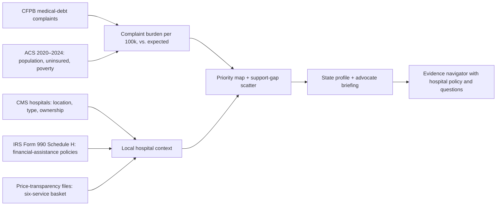

# Community medical-debt priority map

The **Community map** workspace helps legal-aid groups, hospital financial counselors,
and patient advocates answer two questions:

1. Where is *reported* medical-debt collection pressure high after accounting for
   population and insurance coverage?
2. What financial-assistance information and next steps apply to a person there?

It links public data to the existing evidence navigator. A state profile ends with
**Advocate briefing** (printable HTML) and **Open evidence navigator**, which carries
the state and a chosen hospital into the upload and case views.



## Guardrails

- Complaints are consumer reports to the CFPB, not verified findings. The database is
  not a statistical sample, and volume reflects CFPB awareness as well as problems.
  [CFPB database limitations](https://www.consumerfinance.gov/data-research/consumer-complaints/)
- Most complaints name a **debt collector**, not the hospital that billed. Hospitals
  appear as context. The map does not rank or score hospitals and makes no causal claim.
- Schedule H answers are self-reported filings, not audited practice.
- Posted prices are not what a given patient owes.
- The atlas never reads, stores, or sends case records. It is built offline from
  public files and served as static JSON in `public/atlas/`.

## Sources

| Source | Used for | Retrieval |
| --- | --- | --- |
| [CFPB Consumer Complaint Database](https://www.consumerfinance.gov/data-research/consumer-complaints/) (`product=Debt collection•Medical debt`) | State/month/issue/response/company counts; ZIP for county placement | Search API, paged with `search_after`, 1,000 records per page, January 2021 – August 2026. Narratives are not requested. |
| [ACS 2020–2024 5-year table-based summary file](https://www2.census.gov/programs-surveys/acs/summary_file/2024/table-based-SF/) | Population (B01003), uninsured (B27010), poverty (B17001), median income (B19013), disability (B18101), rent ≥30% of income (B25070) | Streamed and filtered to state and county rows; no API key needed |
| [CMS Hospital General Information](https://data.cms.gov/provider-data/dataset/xubh-q36u) | Hospital name, ZIP, type, ownership, emergency services | CSV download |
| [IRS Form 990 e-file XML](https://www.irs.gov/charities-non-profits/form-990-series-downloads), [Schedule H instructions](https://www.irs.gov/instructions/i990sh) | Financial-assistance income limits, publicity, collection actions permitted before eligibility is checked, bad debt, community benefit | 2025 and 2026 indexes; single returns read from batch ZIPs with HTTP range requests (Deflate64) |
| [Hospital price-transparency files](https://www.cms.gov/priorities/key-initiatives/hospital-price-transparency/hospitals) | Gross, discounted cash, and payer-negotiated rates for six CPT codes | Each site's `cms-hpt.txt` index, found from the website reported on Schedule H |
| [Census ZCTA gazetteer and ZCTA–county relationship file](https://www.census.gov/geographies/reference-files/time-series/geo/relationship-files.html) | Approximate hospital points; ZIP → county | Largest land-area overlap |
| [us-atlas](https://github.com/topojson/us-atlas) (ISC) | State and county outlines (Census 1:10m, pre-projected Albers) | Copied into `public/atlas/` |

`public/atlas/manifest.json` records retrieval windows, per-window CFPB counts,
SHA-256 hashes of every raw input and output, the model, and coverage counts.

## Methods

**Complaint burden.** 2025 complaints ÷ ACS population × 100,000, with Byar's
approximation to the exact 95% Poisson interval. States are also shown per 10,000
uninsured residents.

**Compared with expected.** A Poisson regression of 2025 state complaint counts
with a log-population offset and standardized uninsured and poverty rates (50 states
and DC; Puerto Rico excluded). The ratio is observed ÷ fitted. It is descriptive:
Pearson dispersion is 38.2, so states vary far more than two covariates explain.
Small states have wide intervals (Wyoming: 40 complaints), so the headline tile only
lists states with at least 100 complaints.

**Bivariate view.** Terciles of uninsured rate and complaints per 100k across the
50 states and DC, drawn on a 3×3 color grid.

**Counties.** 2023–2025 complaints pooled and annualized. A complaint is placed in
a county only when it has a full five-digit ZIP that maps to a Census ZCTA; masked
three-digit ZIPs stay unplaced and are counted per state. Counties with fewer than
10 complaints show no rate; the "highest county" lists require 20. Connecticut's
2022 planning regions do not match the 2017 county outlines, so its counties are
not drawn.

**Schedule H.** Candidate filers are Form 990 returns whose name matches a hospital
pattern (excluding foundations, auxiliaries, and similar) or equals a CMS nonprofit
or government hospital name. The latest return per EIN is used. Part V Section B is
attached to facilities by facility number, or by reporting-group letter for group
sections. Line 18 is read strictly: it lists extraordinary collection actions a
policy **permitted before reasonable efforts to determine eligibility**. It does not
say whether such actions happen afterward. Missing answers remain "Not reported."

**Facility linkage.** A Schedule H facility links to a CMS hospital in the same ZIP
when core-name token overlap (Jaccard, after removing generic words such as
"hospital" and "saint") is at least 0.34. A lone same-ZIP candidate needs 0.2, and a
same-city fallback needs more than 0.5. Facility types must agree (NICU, rehab,
behavioral), and a CMS hospital is claimed at most once per filing.

**Prices.** For up to four linked nonprofit hospitals per state (lowest CMS IDs),
the refresh reads `cms-hpt.txt` from the facility's reported website or policy
domain, matches the listed location by name, and streams the file (≤300 MB). It
parses CMS CSV templates (tall and wide) and JSON. Modifier rows are skipped.
Amounts are stored as integer cents: median gross and cash price, and min/median/max
of payer-negotiated dollars. Basket: 99283, 70553, 73721, 45378, 80053, 71046.

## Measured results

These are counts from the build on September 27, 2026. They are not accuracy
estimates for any downstream decision.

| Item | Result |
| --- | --- |
| CFPB medical-debt records, Jan 2021 – Aug 2026 | 48,468. Every yearly window's received count equals the API total. 2025: 8,843, matching `data/research`. |
| National 2025 rate | 2.64 per 100k; 1,005 "Debt was paid" complaints |
| State correlation with complaints per 100k (50 + DC) | Uninsured rate r = 0.67; poverty rate r = 0.27 |
| Poisson model rate ratios per SD | Uninsured 1.28, poverty 1.12; dispersion 38.2 |
| 2023–2025 complaints placed in a county | 19,772 of 23,518 (84%) |
| CMS hospitals placed on the map | 5,283 of 5,419 |
| Returns with Schedule H | 1,936 filers listing 2,941 facilities |
| Schedule H facilities linked to a CMS hospital | 2,254 |
| CMS nonprofit hospitals with a linked policy | 1,808 of 2,939 (62%) |
| Price basket | 92 of 200 attempted hospitals yielded at least one basket price. They span 43 states; 30 states have two or more. Failures: 63 had no `cms-hpt.txt` on the tried domains, 16 had no matching location, 17 files were too large, slow, or unreachable, and 12 were in an unrecognized format. |
| Posted cash-price range across sampled hospitals | Comprehensive metabolic panel $14.48 – $571.05 (n = 88); brain MRI $280.80 – $6,312.60 (n = 80); moderate ED visit $38.85 – $1,839.32 (n = 86) |

**Linkage review.** One reviewer (the AI coding assistant) checked a random 50
facility links by name, city, and ZIP: 48 were plausible matches. The two errors,
a children's-hospital NICU linked to its host hospital and a rehab hospital linked
to a behavioral-health hospital, led to the facility-type rule. A fresh random
sample of 50 after the change found no implausible links on the same review. This
is a small self-review, not an independent audit. It did not check the Schedule
H values against the original filings.

## Refresh

```sh
uv sync --extra dev --extra atlas
uv run python scripts/refresh_atlas.py            # reuse cached raw inputs in data/raw/atlas
uv run python scripts/refresh_atlas.py --refresh  # re-download everything
```

A cached rebuild takes seconds. A cold run downloads the CFPB records (about 50
requests) and about 500 MB of ACS tables (streamed and filtered). It also reads
about 5,500 IRS returns by range request and fetches up to four price files per
state. Unit tests in `tests/test_atlas.py` cover parsing, linkage rules,
denominators, and the published artifacts.
