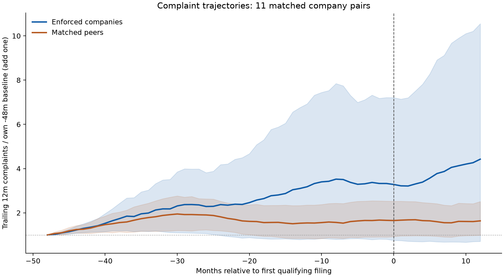

# Mortgage complaint backtest · 2026-09-26

Model A is the shipped live anomaly ranking. Model B remains the planned primary statistical model; Model C is the Cox comparison. Model choice never changes the live ranking.

This is a retrospective screening evaluation, not evidence of wrongdoing or an accuracy claim about enforcement after August 2025.

## Findings and practical limits

The primary window ends 2024-12-31; the secondary ends 2025-08-31. Each is reported with all filings and after excluding independently documented complete-case dismissals. The at-risk population is reconstructed for each policy, allowing a company whose first filing is dropped to remain at risk.

**The verified size-normalized baseline is unavailable at every historical cutoff.** M3 deliberately does not backdate revised FDIC/HMDA files. It appears as N/A, with no fabricated rate or confidence interval. A separately labeled self-normalized-count reference is included. Size-adjustment superiority (H2) cannot be established from these archived vintages.

Only a small number of first-company events support fitting. The ADR-008 budget reserves one baseline degree; folds below ten training events are not fit, folds with 10–19 events use baseline-only B/C, and folds with at least 20 permit one predictor. A baseline-only statistical model is explicitly identified in fit diagnostics, not presented as a learned complaint effect.

Entity identities were curated retrospectively in 2026. Validity dates and all feature publication cutoffs are enforced, but historical availability of those exact mapping versions is unverified. Current complaint-response versions also cannot be reconstructed from the bulk snapshot. These limitations prevent a claim of a completely reconstructed contemporaneous deployment.

## Reproduction and provenance

```bash
make backtest
make test lint
```

Seed: 20260926; bootstrap draws: 400. [Machine-readable audit](backtest_audit.json), [all metrics](backtest_results.csv), [predictions](score_snapshots.csv.gz), [fit diagnostics](model_diagnostics.json). The original enforcement-label checksum was checked before and after the run.

## Methods

January cutoffs 2016–2023 and horizons 6/12/18 months form the primary test. The secondary additionally permits 2024/2025 cutoffs with complete horizons by August 2025. Training feature months are at most T−h. All imputations, peer means/scales, and predictor/penalty choices are fit inside training folds. Existing contemporary M3 peer-z columns never enter training or historical scores.

Model A equally averages available standardized self-history, acceleration, exposure rate, severity, timeliness, issue mix, and bank-stress components. No invented servicing exposure is used. B fits L2 logistic next-month hazards with company-cluster sandwich standard errors; its first forecast month uses the previous feature snapshot and later months hold T's snapshot fixed. C uses lifelines time-varying Cox, training-only risk-set Schoenfeld diagnostics, and median-split strata when a detected violation requires them. C extrapolates its mean training baseline hazard beyond observed follow-up; probabilities depend on this assumption.

Two expanding, horizon-embargoed inner validation folds select from the anomaly composite/log complaint count and the prespecified penalty grid by Brier loss. Insufficient covariate-capable validation leaves the declared defaults unchanged. Details and all fold dates are in model_diagnostics.json.

PR-AUC is non-interpolated average precision, with ties grouped. Top-k ties use stable entity IDs; precision divides by the smaller of k and the eligible population. Recall/PR-AUC with no events and concordance without comparable pairs are undefined. Model and baseline comparisons use the same eligible cohort at a cutoff; missing size denominators are not imputed from another sector.

95% intervals resample company clusters, retaining the company's appearances across cutoffs. Pooled metrics are macro cutoff means per horizon; pooled lead time deduplicates company events and measures first annual top-20 alerts whose horizon covers the event. Annual observations make lead timing coarse. Bootstrap draws with no defined metric are excluded, and valid-draw counts are saved. These intervals condition on fitted models and do not include training-estimation, identity-review, or source-version uncertainty, or dependence from shared actions/calendar shocks.

## Pooled metrics and confidence intervals

Each value is estimate [95% company-cluster bootstrap interval]. Random-ranking prevalence appears in cutoff tables; the seeded random-rank baseline is separately measured.

### Primary 12-month comparison

The following differences compare each model with raw complaint count on its own shared cutoffs. Sparse-event B/C folds cannot be compared by subtracting their pooled scores from an eight-cutoff baseline.

| Model | Shared cutoffs | Δ PR-AUC [95% CI] |
| --- | --- | --- |
| A | 8 | -0.103 [-0.344, 0.055] |
| B | 6 | -0.138 [-0.500, -0.050] |
| C | 7 | -0.166 [-0.497, -0.115] |

**All three models have lower point-estimate PR-AUC than raw count in this comparison.** This run does not establish an improvement in enforcement prediction. Model A still drives live screening under ADR-010; its operational role is not a claim of superior validated accuracy.

### Primary · all filings

| H (months) | Model/baseline | Cutoffs | P@10 | P@20 | R@10 | R@20 | PR-AUC | Lead (months) | C-index | Brier |
| --- | --- | --- | --- | --- | --- | --- | --- | --- | --- | --- |
| 6 | A | 8 | 0.013 [0.000, 0.037] | 0.006 [0.000, 0.019] | 0.083 [0.000, 0.335] | 0.083 [0.000, 0.500] | 0.107 [0.017, 0.380] | 0.986 [0.986, 0.986] | 0.446 [0.128, 0.635] | N/A |
| 6 | B | 6 | 0.000 [0.000, 0.000] | 0.000 [0.000, 0.000] | 0.000 [0.000, 0.000] | 0.000 [0.000, 0.000] | 0.014 [0.009, 0.043] | N/A | 0.500 [0.500, 0.500] | 0.005 [0.000, 0.011] |
| 6 | C | 8 | 0.000 [0.000, 0.000] | 0.006 [0.000, 0.019] | 0.000 [0.000, 0.000] | 0.083 [0.000, 0.500] | 0.022 [0.012, 0.053] | 2.398 [2.398, 2.398] | 0.502 [0.477, 0.520] | 0.008 [0.002, 0.014] |
| 6 | prior_action | 8 | 0.050 [0.013, 0.112] | 0.025 [0.006, 0.056] | 0.667 [0.167, 1.000] | 0.667 [0.249, 1.000] | 0.323 [0.137, 0.800] | 3.943 [2.398, 5.092] | 0.902 [0.779, 0.982] | N/A |
| 6 | random | 8 | 0.025 [0.000, 0.050] | 0.013 [0.000, 0.031] | 0.250 [0.000, 0.667] | 0.250 [0.000, 0.750] | 0.064 [0.017, 0.291] | 4.337 [3.581, 5.092] | 0.391 [0.139, 0.783] | N/A |
| 6 | raw_count | 8 | 0.050 [0.013, 0.112] | 0.025 [0.006, 0.056] | 0.667 [0.167, 1.000] | 0.667 [0.249, 1.000] | 0.281 [0.127, 0.800] | 3.943 [2.398, 5.092] | 0.901 [0.779, 0.982] | N/A |
| 6 | self_normalized | 8 | 0.025 [0.000, 0.050] | 0.013 [0.000, 0.031] | 0.417 [0.000, 0.667] | 0.417 [0.000, 0.700] | 0.090 [0.018, 0.314] | 2.645 [0.986, 4.304] | 0.534 [0.078, 0.739] | N/A |
| 6 | size_normalized | 0 | N/A | N/A | N/A | N/A | N/A | N/A | N/A | N/A |
| 12 | A | 8 | 0.013 [0.000, 0.037] | 0.006 [0.000, 0.025] | 0.036 [0.000, 0.200] | 0.036 [0.000, 0.292] | 0.062 [0.025, 0.226] | 0.986 [0.986, 0.986] | 0.502 [0.360, 0.621] | N/A |
| 12 | B | 6 | 0.017 [0.000, 0.050] | 0.017 [0.000, 0.034] | 0.100 [0.000, 0.500] | 0.300 [0.000, 0.667] | 0.018 [0.012, 0.041] | 11.318 [11.072, 11.565] | 0.532 [0.497, 0.569] | 0.011 [0.004, 0.019] |
| 12 | C | 7 | 0.014 [0.000, 0.043] | 0.029 [0.000, 0.043] | 0.083 [0.000, 0.333] | 0.333 [0.000, 0.601] | 0.021 [0.014, 0.042] | 6.735 [0.986, 11.565] | 0.531 [0.495, 0.562] | 0.014 [0.007, 0.023] |
| 12 | prior_action | 8 | 0.062 [0.013, 0.125] | 0.038 [0.013, 0.069] | 0.357 [0.125, 0.667] | 0.500 [0.200, 0.800] | 0.183 [0.123, 0.428] | 4.698 [2.990, 10.703] | 0.729 [0.599, 0.891] | N/A |
| 12 | random | 8 | 0.025 [0.000, 0.050] | 0.013 [0.000, 0.044] | 0.107 [0.000, 0.267] | 0.107 [0.000, 0.500] | 0.047 [0.030, 0.155] | 4.337 [3.581, 5.092] | 0.529 [0.331, 0.700] | N/A |
| 12 | raw_count | 8 | 0.062 [0.013, 0.125] | 0.038 [0.013, 0.069] | 0.357 [0.125, 0.667] | 0.500 [0.200, 0.800] | 0.165 [0.120, 0.427] | 4.698 [2.990, 10.703] | 0.728 [0.599, 0.891] | N/A |
| 12 | self_normalized | 8 | 0.038 [0.000, 0.075] | 0.019 [0.000, 0.044] | 0.179 [0.000, 0.400] | 0.179 [0.000, 0.459] | 0.051 [0.030, 0.178] | 4.304 [0.986, 11.203] | 0.480 [0.322, 0.644] | N/A |
| 12 | size_normalized | 0 | N/A | N/A | N/A | N/A | N/A | N/A | N/A | N/A |
| 18 | A | 8 | 0.025 [0.000, 0.075] | 0.019 [0.000, 0.056] | 0.060 [0.000, 0.222] | 0.131 [0.000, 0.399] | 0.082 [0.029, 0.249] | 15.277 [13.010, 17.544] | 0.478 [0.327, 0.615] | N/A |
| 18 | B | 5 | 0.020 [0.000, 0.080] | 0.020 [0.000, 0.040] | 0.125 [0.000, 0.500] | 0.375 [0.000, 0.667] | 0.020 [0.010, 0.042] | 11.039 [10.513, 11.565] | 0.471 [0.372, 0.548] | 0.015 [0.005, 0.027] |
| 18 | C | 7 | 0.029 [0.000, 0.071] | 0.029 [0.000, 0.050] | 0.167 [0.000, 0.400] | 0.264 [0.000, 0.557] | 0.054 [0.021, 0.200] | 11.318 [2.398, 17.544] | 0.564 [0.503, 0.614] | 0.020 [0.011, 0.032] |
| 18 | prior_action | 8 | 0.100 [0.025, 0.212] | 0.062 [0.019, 0.119] | 0.357 [0.146, 0.687] | 0.548 [0.233, 0.818] | 0.238 [0.129, 0.534] | 15.014 [10.694, 17.084] | 0.806 [0.666, 0.903] | N/A |
| 18 | random | 8 | 0.050 [0.000, 0.100] | 0.025 [0.000, 0.069] | 0.155 [0.000, 0.383] | 0.155 [0.000, 0.500] | 0.061 [0.031, 0.206] | 16.345 [15.606, 17.084] | 0.467 [0.280, 0.683] | N/A |
| 18 | raw_count | 8 | 0.100 [0.025, 0.212] | 0.062 [0.019, 0.119] | 0.357 [0.146, 0.687] | 0.548 [0.233, 0.818] | 0.220 [0.129, 0.521] | 15.014 [10.694, 17.084] | 0.806 [0.666, 0.903] | N/A |
| 18 | self_normalized | 8 | 0.025 [0.000, 0.062] | 0.025 [0.000, 0.050] | 0.107 [0.000, 0.250] | 0.155 [0.000, 0.333] | 0.051 [0.030, 0.155] | 7.754 [0.986, 17.183] | 0.372 [0.201, 0.541] | N/A |
| 18 | size_normalized | 0 | N/A | N/A | N/A | N/A | N/A | N/A | N/A | N/A |

### Primary · confirmed dismissals excluded

| H (months) | Model/baseline | Cutoffs | P@10 | P@20 | R@10 | R@20 | PR-AUC | Lead (months) | C-index | Brier |
| --- | --- | --- | --- | --- | --- | --- | --- | --- | --- | --- |
| 6 | A | 8 | 0.013 [0.000, 0.037] | 0.006 [0.000, 0.019] | 0.111 [0.000, 0.500] | 0.111 [0.000, 0.500] | 0.134 [0.015, 0.506] | 0.986 [0.986, 0.986] | 0.495 [0.197, 0.725] | N/A |
| 6 | B | 6 | 0.000 [0.000, 0.000] | 0.000 [0.000, 0.000] | 0.000 [0.000, 0.000] | 0.000 [0.000, 0.000] | 0.013 [0.009, 0.038] | N/A | 0.500 [0.500, 0.500] | 0.005 [0.000, 0.010] |
| 6 | C | 6 | 0.000 [0.000, 0.000] | 0.000 [0.000, 0.000] | 0.000 [0.000, 0.000] | 0.000 [0.000, 0.000] | 0.014 [0.009, 0.041] | N/A | 0.520 [0.499, 0.549] | 0.005 [0.000, 0.010] |
| 6 | prior_action | 8 | 0.038 [0.000, 0.087] | 0.019 [0.006, 0.044] | 0.611 [0.000, 1.000] | 0.611 [0.125, 1.000] | 0.182 [0.067, 0.630] | 4.304 [2.398, 5.092] | 0.876 [0.744, 0.973] | N/A |
| 6 | random | 8 | 0.000 [0.000, 0.025] | 0.006 [0.000, 0.025] | 0.000 [0.000, 0.333] | 0.167 [0.000, 0.500] | 0.031 [0.011, 0.133] | 5.092 [5.092, 5.092] | 0.336 [0.084, 0.728] | N/A |
| 6 | raw_count | 8 | 0.038 [0.000, 0.087] | 0.019 [0.006, 0.044] | 0.611 [0.000, 1.000] | 0.611 [0.125, 1.000] | 0.182 [0.067, 0.630] | 4.304 [2.398, 5.092] | 0.876 [0.744, 0.973] | N/A |
| 6 | self_normalized | 8 | 0.025 [0.000, 0.062] | 0.013 [0.000, 0.031] | 0.444 [0.000, 0.750] | 0.444 [0.000, 0.750] | 0.097 [0.017, 0.368] | 2.645 [0.986, 4.304] | 0.573 [0.150, 0.854] | N/A |
| 6 | size_normalized | 0 | N/A | N/A | N/A | N/A | N/A | N/A | N/A | N/A |
| 12 | A | 8 | 0.013 [0.000, 0.037] | 0.006 [0.000, 0.025] | 0.048 [0.000, 0.167] | 0.048 [0.000, 0.286] | 0.073 [0.024, 0.213] | 0.986 [0.986, 0.986] | 0.521 [0.383, 0.652] | N/A |
| 12 | B | 6 | 0.017 [0.000, 0.067] | 0.025 [0.000, 0.050] | 0.100 [0.000, 0.500] | 0.500 [0.000, 0.750] | 0.013 [0.009, 0.030] | 11.072 [10.513, 11.565] | 0.500 [0.500, 0.500] | 0.011 [0.005, 0.018] |
| 12 | C | 6 | 0.017 [0.000, 0.067] | 0.025 [0.000, 0.050] | 0.100 [0.000, 0.500] | 0.500 [0.000, 0.750] | 0.013 [0.010, 0.031] | 11.072 [10.513, 11.565] | 0.514 [0.494, 0.532] | 0.011 [0.005, 0.018] |
| 12 | prior_action | 8 | 0.050 [0.013, 0.100] | 0.031 [0.013, 0.062] | 0.333 [0.080, 0.600] | 0.476 [0.187, 0.733] | 0.115 [0.071, 0.347] | 5.092 [2.398, 10.875] | 0.714 [0.570, 0.871] | N/A |
| 12 | random | 8 | 0.000 [0.000, 0.025] | 0.006 [0.000, 0.025] | 0.000 [0.000, 0.167] | 0.071 [0.000, 0.333] | 0.031 [0.024, 0.085] | 5.092 [5.092, 5.092] | 0.500 [0.291, 0.659] | N/A |
| 12 | raw_count | 8 | 0.050 [0.013, 0.100] | 0.031 [0.013, 0.062] | 0.333 [0.080, 0.600] | 0.476 [0.187, 0.733] | 0.115 [0.071, 0.347] | 5.092 [2.398, 10.875] | 0.714 [0.570, 0.871] | N/A |
| 12 | self_normalized | 8 | 0.038 [0.000, 0.075] | 0.019 [0.000, 0.044] | 0.190 [0.000, 0.417] | 0.190 [0.000, 0.479] | 0.055 [0.028, 0.188] | 4.304 [0.986, 11.203] | 0.507 [0.335, 0.688] | N/A |
| 12 | size_normalized | 0 | N/A | N/A | N/A | N/A | N/A | N/A | N/A | N/A |
| 18 | A | 8 | 0.025 [0.000, 0.088] | 0.019 [0.000, 0.056] | 0.076 [0.000, 0.232] | 0.148 [0.000, 0.370] | 0.096 [0.029, 0.248] | 15.277 [13.010, 17.544] | 0.513 [0.348, 0.658] | N/A |
| 18 | B | 5 | 0.020 [0.000, 0.080] | 0.020 [0.000, 0.050] | 0.125 [0.000, 0.500] | 0.375 [0.000, 0.667] | 0.018 [0.011, 0.039] | 11.039 [10.513, 11.565] | 0.500 [0.500, 0.500] | 0.015 [0.006, 0.026] |
| 18 | C | 5 | 0.040 [0.000, 0.100] | 0.030 [0.000, 0.070] | 0.250 [0.000, 0.518] | 0.500 [0.000, 0.751] | 0.058 [0.012, 0.266] | 11.565 [10.513, 17.544] | 0.555 [0.482, 0.659] | 0.015 [0.006, 0.026] |
| 18 | prior_action | 8 | 0.075 [0.025, 0.175] | 0.050 [0.019, 0.100] | 0.314 [0.083, 0.611] | 0.505 [0.167, 0.789] | 0.139 [0.080, 0.392] | 14.423 [10.513, 17.084] | 0.783 [0.650, 0.881] | N/A |
| 18 | random | 8 | 0.000 [0.000, 0.050] | 0.013 [0.000, 0.050] | 0.000 [0.000, 0.214] | 0.095 [0.000, 0.350] | 0.036 [0.023, 0.102] | 17.084 [17.084, 17.084] | 0.424 [0.236, 0.636] | N/A |
| 18 | raw_count | 8 | 0.075 [0.025, 0.175] | 0.050 [0.019, 0.100] | 0.314 [0.083, 0.611] | 0.505 [0.167, 0.789] | 0.139 [0.080, 0.392] | 14.423 [10.513, 17.084] | 0.783 [0.650, 0.881] | N/A |
| 18 | self_normalized | 8 | 0.025 [0.000, 0.062] | 0.025 [0.006, 0.050] | 0.119 [0.000, 0.250] | 0.176 [0.028, 0.326] | 0.055 [0.029, 0.163] | 7.754 [0.986, 17.183] | 0.408 [0.255, 0.567] | N/A |
| 18 | size_normalized | 0 | N/A | N/A | N/A | N/A | N/A | N/A | N/A | N/A |

### Secondary · all filings

| H (months) | Model/baseline | Cutoffs | P@10 | P@20 | R@10 | R@20 | PR-AUC | Lead (months) | C-index | Brier |
| --- | --- | --- | --- | --- | --- | --- | --- | --- | --- | --- |
| 6 | A | 10 | 0.020 [0.000, 0.050] | 0.010 [0.000, 0.025] | 0.250 [0.000, 0.500] | 0.250 [0.000, 0.500] | 0.096 [0.020, 0.318] | 0.575 [0.164, 0.986] | 0.539 [0.261, 0.693] | N/A |
| 6 | B | 8 | 0.013 [0.000, 0.037] | 0.006 [0.000, 0.019] | 0.250 [0.000, 0.500] | 0.250 [0.000, 0.500] | 0.047 [0.011, 0.180] | 0.164 [0.164, 0.164] | 0.593 [0.438, 0.729] | 0.006 [0.001, 0.011] |
| 6 | C | 10 | 0.010 [0.000, 0.030] | 0.010 [0.000, 0.030] | 0.200 [0.000, 0.333] | 0.250 [0.000, 0.500] | 0.215 [0.015, 0.366] | 3.975 [2.398, 5.552] | 0.525 [0.364, 0.678] | 0.008 [0.004, 0.014] |
| 6 | prior_action | 10 | 0.040 [0.010, 0.090] | 0.020 [0.005, 0.045] | 0.400 [0.111, 0.778] | 0.400 [0.133, 0.833] | 0.200 [0.093, 0.565] | 3.943 [2.398, 5.092] | 0.680 [0.512, 0.921] | N/A |
| 6 | random | 10 | 0.020 [0.000, 0.040] | 0.015 [0.000, 0.030] | 0.150 [0.000, 0.400] | 0.350 [0.000, 0.625] | 0.051 [0.022, 0.217] | 3.581 [0.164, 5.092] | 0.447 [0.183, 0.684] | N/A |
| 6 | raw_count | 10 | 0.040 [0.010, 0.090] | 0.020 [0.005, 0.045] | 0.400 [0.111, 0.778] | 0.400 [0.133, 0.833] | 0.175 [0.084, 0.554] | 3.943 [2.398, 5.092] | 0.679 [0.512, 0.920] | N/A |
| 6 | self_normalized | 10 | 0.030 [0.000, 0.060] | 0.015 [0.000, 0.030] | 0.450 [0.000, 0.668] | 0.450 [0.000, 0.750] | 0.081 [0.023, 0.245] | 0.986 [0.164, 4.304] | 0.545 [0.143, 0.742] | N/A |
| 6 | size_normalized | 0 | N/A | N/A | N/A | N/A | N/A | N/A | N/A | N/A |
| 12 | A | 9 | 0.011 [0.000, 0.033] | 0.006 [0.000, 0.022] | 0.031 [0.000, 0.167] | 0.031 [0.000, 0.250] | 0.058 [0.027, 0.197] | 0.986 [0.986, 0.986] | 0.504 [0.370, 0.606] | N/A |
| 12 | B | 7 | 0.014 [0.000, 0.043] | 0.014 [0.000, 0.029] | 0.083 [0.000, 0.333] | 0.250 [0.000, 0.500] | 0.019 [0.015, 0.042] | 11.318 [11.072, 11.565] | 0.522 [0.466, 0.561] | 0.012 [0.006, 0.019] |
| 12 | C | 8 | 0.025 [0.000, 0.062] | 0.031 [0.006, 0.050] | 0.143 [0.000, 0.400] | 0.357 [0.048, 0.600] | 0.057 [0.020, 0.218] | 5.552 [0.986, 11.565] | 0.568 [0.506, 0.643] | 0.015 [0.007, 0.022] |
| 12 | prior_action | 9 | 0.056 [0.011, 0.111] | 0.033 [0.011, 0.061] | 0.312 [0.100, 0.571] | 0.438 [0.167, 0.667] | 0.162 [0.113, 0.371] | 4.698 [2.990, 10.703] | 0.668 [0.534, 0.812] | N/A |
| 12 | random | 9 | 0.022 [0.000, 0.044] | 0.011 [0.000, 0.039] | 0.094 [0.000, 0.229] | 0.094 [0.000, 0.401] | 0.044 [0.028, 0.138] | 4.337 [3.581, 5.092] | 0.512 [0.321, 0.666] | N/A |
| 12 | raw_count | 9 | 0.056 [0.011, 0.111] | 0.033 [0.011, 0.061] | 0.312 [0.100, 0.571] | 0.438 [0.167, 0.667] | 0.146 [0.109, 0.368] | 4.698 [2.990, 10.703] | 0.668 [0.534, 0.812] | N/A |
| 12 | self_normalized | 9 | 0.033 [0.000, 0.067] | 0.017 [0.000, 0.039] | 0.156 [0.000, 0.333] | 0.156 [0.000, 0.389] | 0.047 [0.029, 0.162] | 4.304 [0.986, 11.203] | 0.461 [0.310, 0.600] | N/A |
| 12 | size_normalized | 0 | N/A | N/A | N/A | N/A | N/A | N/A | N/A | N/A |
| 18 | A | 9 | 0.022 [0.000, 0.067] | 0.017 [0.000, 0.050] | 0.052 [0.000, 0.191] | 0.115 [0.000, 0.325] | 0.076 [0.030, 0.220] | 15.277 [13.010, 17.544] | 0.478 [0.344, 0.601] | N/A |
| 18 | B | 6 | 0.017 [0.000, 0.067] | 0.017 [0.000, 0.033] | 0.100 [0.000, 0.400] | 0.300 [0.000, 0.500] | 0.023 [0.016, 0.049] | 11.039 [10.513, 11.565] | 0.479 [0.398, 0.548] | 0.017 [0.008, 0.030] |
| 18 | C | 8 | 0.038 [0.000, 0.100] | 0.031 [0.000, 0.056] | 0.190 [0.000, 0.417] | 0.274 [0.000, 0.533] | 0.099 [0.023, 0.256] | 11.318 [2.398, 17.544] | 0.580 [0.489, 0.661] | 0.021 [0.011, 0.033] |
| 18 | prior_action | 9 | 0.089 [0.022, 0.189] | 0.056 [0.017, 0.106] | 0.312 [0.121, 0.588] | 0.479 [0.200, 0.720] | 0.212 [0.114, 0.461] | 15.014 [10.694, 17.084] | 0.742 [0.605, 0.839] | N/A |
| 18 | random | 9 | 0.044 [0.000, 0.089] | 0.028 [0.000, 0.067] | 0.135 [0.000, 0.320] | 0.177 [0.000, 0.462] | 0.059 [0.032, 0.186] | 15.606 [12.189, 17.084] | 0.475 [0.296, 0.673] | N/A |
| 18 | raw_count | 9 | 0.089 [0.022, 0.189] | 0.056 [0.017, 0.106] | 0.312 [0.121, 0.588] | 0.479 [0.200, 0.720] | 0.196 [0.114, 0.456] | 15.014 [10.694, 17.084] | 0.741 [0.605, 0.839] | N/A |
| 18 | self_normalized | 9 | 0.022 [0.000, 0.056] | 0.022 [0.000, 0.044] | 0.094 [0.000, 0.214] | 0.135 [0.000, 0.278] | 0.048 [0.029, 0.139] | 7.754 [0.986, 17.183] | 0.354 [0.207, 0.500] | N/A |
| 18 | size_normalized | 0 | N/A | N/A | N/A | N/A | N/A | N/A | N/A | N/A |

### Secondary · confirmed dismissals excluded

| H (months) | Model/baseline | Cutoffs | P@10 | P@20 | R@10 | R@20 | PR-AUC | Lead (months) | C-index | Brier |
| --- | --- | --- | --- | --- | --- | --- | --- | --- | --- | --- |
| 6 | A | 10 | 0.010 [0.000, 0.030] | 0.005 [0.000, 0.015] | 0.083 [0.000, 0.333] | 0.083 [0.000, 0.333] | 0.104 [0.016, 0.356] | 0.986 [0.986, 0.986] | 0.454 [0.214, 0.674] | N/A |
| 6 | B | 8 | 0.000 [0.000, 0.000] | 0.000 [0.000, 0.000] | 0.000 [0.000, 0.000] | 0.000 [0.000, 0.000] | 0.014 [0.009, 0.037] | N/A | 0.450 [0.381, 0.500] | 0.005 [0.001, 0.009] |
| 6 | C | 8 | 0.013 [0.000, 0.050] | 0.006 [0.000, 0.025] | 0.333 [0.000, 1.000] | 0.333 [0.000, 1.000] | 0.343 [0.009, 1.000] | 5.552 [5.552, 5.552] | 0.680 [0.505, 1.000] | 0.005 [0.001, 0.009] |
| 6 | prior_action | 10 | 0.030 [0.000, 0.070] | 0.015 [0.005, 0.035] | 0.458 [0.000, 0.834] | 0.458 [0.111, 1.000] | 0.139 [0.050, 0.499] | 4.304 [2.398, 5.092] | 0.684 [0.491, 0.953] | N/A |
| 6 | random | 10 | 0.000 [0.000, 0.020] | 0.005 [0.000, 0.020] | 0.000 [0.000, 0.333] | 0.125 [0.000, 0.500] | 0.026 [0.013, 0.110] | 5.092 [5.092, 5.092] | 0.313 [0.116, 0.642] | N/A |
| 6 | raw_count | 10 | 0.030 [0.000, 0.070] | 0.015 [0.005, 0.035] | 0.458 [0.000, 0.834] | 0.458 [0.111, 1.000] | 0.139 [0.050, 0.499] | 4.304 [2.398, 5.092] | 0.684 [0.491, 0.953] | N/A |
| 6 | self_normalized | 10 | 0.020 [0.000, 0.050] | 0.010 [0.000, 0.025] | 0.333 [0.000, 0.667] | 0.333 [0.000, 0.667] | 0.076 [0.018, 0.309] | 2.645 [0.986, 4.304] | 0.488 [0.159, 0.770] | N/A |
| 6 | size_normalized | 0 | N/A | N/A | N/A | N/A | N/A | N/A | N/A | N/A |
| 12 | A | 9 | 0.011 [0.000, 0.033] | 0.006 [0.000, 0.022] | 0.042 [0.000, 0.167] | 0.042 [0.000, 0.250] | 0.067 [0.024, 0.189] | 0.986 [0.986, 0.986] | 0.516 [0.391, 0.630] | N/A |
| 12 | B | 7 | 0.014 [0.000, 0.057] | 0.021 [0.000, 0.043] | 0.083 [0.000, 0.400] | 0.417 [0.000, 0.625] | 0.015 [0.011, 0.035] | 11.072 [10.513, 11.565] | 0.496 [0.454, 0.536] | 0.012 [0.005, 0.020] |
| 12 | C | 7 | 0.029 [0.000, 0.086] | 0.029 [0.000, 0.057] | 0.167 [0.000, 0.500] | 0.500 [0.000, 0.750] | 0.097 [0.013, 0.269] | 10.793 [5.552, 11.565] | 0.546 [0.474, 0.641] | 0.012 [0.005, 0.020] |
| 12 | prior_action | 9 | 0.044 [0.011, 0.089] | 0.028 [0.011, 0.056] | 0.292 [0.066, 0.500] | 0.417 [0.150, 0.625] | 0.103 [0.063, 0.299] | 5.092 [2.398, 10.875] | 0.656 [0.515, 0.804] | N/A |
| 12 | random | 9 | 0.000 [0.000, 0.022] | 0.006 [0.000, 0.022] | 0.000 [0.000, 0.143] | 0.062 [0.000, 0.292] | 0.030 [0.024, 0.077] | 5.092 [5.092, 5.092] | 0.485 [0.299, 0.624] | N/A |
| 12 | raw_count | 9 | 0.044 [0.011, 0.089] | 0.028 [0.011, 0.056] | 0.292 [0.066, 0.500] | 0.417 [0.150, 0.625] | 0.103 [0.063, 0.299] | 5.092 [2.398, 10.875] | 0.656 [0.515, 0.804] | N/A |
| 12 | self_normalized | 9 | 0.033 [0.000, 0.067] | 0.017 [0.000, 0.039] | 0.167 [0.000, 0.350] | 0.167 [0.000, 0.417] | 0.050 [0.027, 0.169] | 4.304 [0.986, 11.203] | 0.489 [0.347, 0.641] | N/A |
| 12 | size_normalized | 0 | N/A | N/A | N/A | N/A | N/A | N/A | N/A | N/A |
| 18 | A | 9 | 0.022 [0.000, 0.078] | 0.017 [0.000, 0.050] | 0.067 [0.000, 0.214] | 0.129 [0.000, 0.333] | 0.088 [0.028, 0.230] | 15.277 [13.010, 17.544] | 0.509 [0.369, 0.641] | N/A |
| 18 | B | 6 | 0.017 [0.000, 0.067] | 0.017 [0.000, 0.050] | 0.100 [0.000, 0.400] | 0.300 [0.000, 0.601] | 0.018 [0.011, 0.037] | 11.039 [10.513, 11.565] | 0.500 [0.500, 0.500] | 0.016 [0.006, 0.027] |
| 18 | C | 6 | 0.050 [0.000, 0.150] | 0.033 [0.000, 0.083] | 0.300 [0.000, 0.625] | 0.500 [0.000, 0.751] | 0.099 [0.012, 0.401] | 11.565 [10.513, 17.544] | 0.595 [0.482, 0.742] | 0.015 [0.006, 0.027] |
| 18 | prior_action | 9 | 0.067 [0.022, 0.156] | 0.044 [0.017, 0.089] | 0.275 [0.071, 0.561] | 0.442 [0.143, 0.688] | 0.124 [0.073, 0.357] | 14.423 [10.513, 17.084] | 0.717 [0.583, 0.835] | N/A |
| 18 | random | 9 | 0.000 [0.000, 0.044] | 0.011 [0.000, 0.044] | 0.000 [0.000, 0.188] | 0.083 [0.000, 0.314] | 0.034 [0.023, 0.097] | 17.084 [17.084, 17.084] | 0.419 [0.249, 0.617] | N/A |
| 18 | raw_count | 9 | 0.067 [0.022, 0.156] | 0.044 [0.017, 0.089] | 0.275 [0.071, 0.561] | 0.442 [0.143, 0.688] | 0.124 [0.073, 0.357] | 14.423 [10.513, 17.084] | 0.717 [0.583, 0.835] | N/A |
| 18 | self_normalized | 9 | 0.022 [0.000, 0.056] | 0.022 [0.006, 0.044] | 0.104 [0.000, 0.217] | 0.154 [0.024, 0.286] | 0.051 [0.029, 0.147] | 7.754 [0.986, 17.183] | 0.402 [0.264, 0.555] | N/A |
| 18 | size_normalized | 0 | N/A | N/A | N/A | N/A | N/A | N/A | N/A | N/A |

## Paired baseline comparisons

Positive differences favor the model. Only shared, scoreable cutoffs enter each comparison. An interval spanning zero does not establish an improvement. N/A size comparisons are an explicit data gap.

| Window | Policy | H | Model | Baseline | Shared cutoffs | Δ PR-AUC [95% CI] |
| --- | --- | --- | --- | --- | --- | --- |
| primary | include | 6 | A | raw_count | 8 | -0.174 [-0.671, 0.216] |
| primary | include | 6 | A | size_normalized | 0 | N/A [N/A, N/A] |
| primary | include | 6 | A | prior_action | 8 | -0.216 [-0.715, 0.155] |
| primary | include | 6 | A | self_normalized | 8 | 0.017 [-0.146, 0.201] |
| primary | include | 6 | B | raw_count | 6 | -0.235 [-0.978, -0.035] |
| primary | include | 6 | B | size_normalized | 0 | N/A [N/A, N/A] |
| primary | include | 6 | B | prior_action | 6 | -0.235 [-0.978, -0.035] |
| primary | include | 6 | B | self_normalized | 6 | -0.069 [-0.282, -0.001] |
| primary | include | 6 | C | raw_count | 8 | -0.259 [-0.766, -0.106] |
| primary | include | 6 | C | size_normalized | 0 | N/A [N/A, N/A] |
| primary | include | 6 | C | prior_action | 8 | -0.301 [-0.766, -0.116] |
| primary | include | 6 | C | self_normalized | 8 | -0.068 [-0.286, 0.003] |
| primary | include | 12 | A | raw_count | 8 | -0.103 [-0.344, 0.055] |
| primary | include | 12 | A | size_normalized | 0 | N/A [N/A, N/A] |
| primary | include | 12 | A | prior_action | 8 | -0.120 [-0.362, 0.055] |
| primary | include | 12 | A | self_normalized | 8 | 0.011 [-0.068, 0.075] |
| primary | include | 12 | B | raw_count | 6 | -0.138 [-0.500, -0.050] |
| primary | include | 12 | B | size_normalized | 0 | N/A [N/A, N/A] |
| primary | include | 12 | B | prior_action | 6 | -0.138 [-0.500, -0.050] |
| primary | include | 12 | B | self_normalized | 6 | -0.013 [-0.096, 0.006] |
| primary | include | 12 | C | raw_count | 7 | -0.166 [-0.497, -0.115] |
| primary | include | 12 | C | size_normalized | 0 | N/A [N/A, N/A] |
| primary | include | 12 | C | prior_action | 7 | -0.187 [-0.501, -0.115] |
| primary | include | 12 | C | self_normalized | 7 | -0.022 [-0.151, 0.005] |
| primary | include | 18 | A | raw_count | 8 | -0.138 [-0.440, 0.071] |
| primary | include | 18 | A | size_normalized | 0 | N/A [N/A, N/A] |
| primary | include | 18 | A | prior_action | 8 | -0.156 [-0.444, 0.071] |
| primary | include | 18 | A | self_normalized | 8 | 0.031 [-0.042, 0.126] |
| primary | include | 18 | B | raw_count | 5 | -0.177 [-0.637, -0.058] |
| primary | include | 18 | B | size_normalized | 0 | N/A [N/A, N/A] |
| primary | include | 18 | B | prior_action | 5 | -0.177 [-0.637, -0.058] |
| primary | include | 18 | B | self_normalized | 5 | -0.015 [-0.091, 0.006] |
| primary | include | 18 | C | raw_count | 7 | -0.145 [-0.456, -0.038] |
| primary | include | 18 | C | size_normalized | 0 | N/A [N/A, N/A] |
| primary | include | 18 | C | prior_action | 7 | -0.166 [-0.471, -0.039] |
| primary | include | 18 | C | self_normalized | 7 | 0.008 [-0.113, 0.136] |
| primary | exclude_confirmed | 6 | A | raw_count | 8 | -0.048 [-0.509, 0.306] |
| primary | exclude_confirmed | 6 | A | size_normalized | 0 | N/A [N/A, N/A] |
| primary | exclude_confirmed | 6 | A | prior_action | 8 | -0.048 [-0.509, 0.306] |
| primary | exclude_confirmed | 6 | A | self_normalized | 8 | 0.037 [-0.122, 0.225] |
| primary | exclude_confirmed | 6 | B | raw_count | 6 | -0.180 [-0.708, -0.031] |
| primary | exclude_confirmed | 6 | B | size_normalized | 0 | N/A [N/A, N/A] |
| primary | exclude_confirmed | 6 | B | prior_action | 6 | -0.180 [-0.708, -0.031] |
| primary | exclude_confirmed | 6 | B | self_normalized | 6 | -0.069 [-0.320, -0.001] |
| primary | exclude_confirmed | 6 | C | raw_count | 6 | -0.179 [-0.705, -0.030] |
| primary | exclude_confirmed | 6 | C | size_normalized | 0 | N/A [N/A, N/A] |
| primary | exclude_confirmed | 6 | C | prior_action | 6 | -0.179 [-0.705, -0.030] |
| primary | exclude_confirmed | 6 | C | self_normalized | 6 | -0.068 [-0.318, 0.000] |
| primary | exclude_confirmed | 12 | A | raw_count | 8 | -0.042 [-0.277, 0.120] |
| primary | exclude_confirmed | 12 | A | size_normalized | 0 | N/A [N/A, N/A] |
| primary | exclude_confirmed | 12 | A | prior_action | 8 | -0.042 [-0.277, 0.120] |
| primary | exclude_confirmed | 12 | A | self_normalized | 8 | 0.019 [-0.055, 0.097] |
| primary | exclude_confirmed | 12 | B | raw_count | 6 | -0.111 [-0.402, -0.032] |
| primary | exclude_confirmed | 12 | B | size_normalized | 0 | N/A [N/A, N/A] |
| primary | exclude_confirmed | 12 | B | prior_action | 6 | -0.111 [-0.402, -0.032] |
| primary | exclude_confirmed | 12 | B | self_normalized | 6 | -0.019 [-0.119, -0.005] |
| primary | exclude_confirmed | 12 | C | raw_count | 6 | -0.110 [-0.400, -0.031] |
| primary | exclude_confirmed | 12 | C | size_normalized | 0 | N/A [N/A, N/A] |
| primary | exclude_confirmed | 12 | C | prior_action | 6 | -0.110 [-0.400, -0.031] |
| primary | exclude_confirmed | 12 | C | self_normalized | 6 | -0.018 [-0.117, -0.004] |
| primary | exclude_confirmed | 18 | A | raw_count | 8 | -0.043 [-0.316, 0.128] |
| primary | exclude_confirmed | 18 | A | size_normalized | 0 | N/A [N/A, N/A] |
| primary | exclude_confirmed | 18 | A | prior_action | 8 | -0.043 [-0.316, 0.128] |
| primary | exclude_confirmed | 18 | A | self_normalized | 8 | 0.041 [-0.033, 0.146] |
| primary | exclude_confirmed | 18 | B | raw_count | 5 | -0.139 [-0.453, -0.042] |
| primary | exclude_confirmed | 18 | B | size_normalized | 0 | N/A [N/A, N/A] |
| primary | exclude_confirmed | 18 | B | prior_action | 5 | -0.139 [-0.453, -0.042] |
| primary | exclude_confirmed | 18 | B | self_normalized | 5 | -0.016 [-0.107, -0.000] |
| primary | exclude_confirmed | 18 | C | raw_count | 5 | -0.099 [-0.450, 0.125] |
| primary | exclude_confirmed | 18 | C | size_normalized | 0 | N/A [N/A, N/A] |
| primary | exclude_confirmed | 18 | C | prior_action | 5 | -0.099 [-0.450, 0.125] |
| primary | exclude_confirmed | 18 | C | self_normalized | 5 | 0.024 [-0.101, 0.241] |
| secondary | include | 6 | A | raw_count | 10 | -0.079 [-0.441, 0.158] |
| secondary | include | 6 | A | size_normalized | 0 | N/A [N/A, N/A] |
| secondary | include | 6 | A | prior_action | 10 | -0.104 [-0.465, 0.142] |
| secondary | include | 6 | A | self_normalized | 10 | 0.015 [-0.111, 0.140] |
| secondary | include | 6 | B | raw_count | 8 | -0.086 [-0.492, 0.101] |
| secondary | include | 6 | B | size_normalized | 0 | N/A [N/A, N/A] |
| secondary | include | 6 | B | prior_action | 8 | -0.086 [-0.492, 0.101] |
| secondary | include | 6 | B | self_normalized | 8 | -0.029 [-0.187, 0.066] |
| secondary | include | 6 | C | raw_count | 10 | 0.040 [-0.512, 0.262] |
| secondary | include | 6 | C | size_normalized | 0 | N/A [N/A, N/A] |
| secondary | include | 6 | C | prior_action | 10 | 0.015 [-0.512, 0.215] |
| secondary | include | 6 | C | self_normalized | 10 | 0.134 [-0.207, 0.327] |
| secondary | include | 12 | A | raw_count | 9 | -0.088 [-0.294, 0.049] |
| secondary | include | 12 | A | size_normalized | 0 | N/A [N/A, N/A] |
| secondary | include | 12 | A | prior_action | 9 | -0.104 [-0.314, 0.049] |
| secondary | include | 12 | A | self_normalized | 9 | 0.011 [-0.055, 0.062] |
| secondary | include | 12 | B | raw_count | 7 | -0.114 [-0.389, -0.031] |
| secondary | include | 12 | B | size_normalized | 0 | N/A [N/A, N/A] |
| secondary | include | 12 | B | prior_action | 7 | -0.114 [-0.389, -0.031] |
| secondary | include | 12 | B | self_normalized | 7 | -0.010 [-0.080, 0.008] |
| secondary | include | 12 | C | raw_count | 8 | -0.106 [-0.370, 0.022] |
| secondary | include | 12 | C | size_normalized | 0 | N/A [N/A, N/A] |
| secondary | include | 12 | C | prior_action | 8 | -0.124 [-0.382, 0.004] |
| secondary | include | 12 | C | self_normalized | 8 | 0.017 [-0.107, 0.168] |
| secondary | include | 18 | A | raw_count | 9 | -0.120 [-0.375, 0.063] |
| secondary | include | 18 | A | size_normalized | 0 | N/A [N/A, N/A] |
| secondary | include | 18 | A | prior_action | 9 | -0.136 [-0.380, 0.063] |
| secondary | include | 18 | A | self_normalized | 9 | 0.029 [-0.033, 0.111] |
| secondary | include | 18 | B | raw_count | 6 | -0.140 [-0.505, -0.039] |
| secondary | include | 18 | B | size_normalized | 0 | N/A [N/A, N/A] |
| secondary | include | 18 | B | prior_action | 6 | -0.140 [-0.505, -0.039] |
| secondary | include | 18 | B | self_normalized | 6 | -0.009 [-0.075, 0.011] |
| secondary | include | 18 | C | raw_count | 8 | -0.077 [-0.380, 0.083] |
| secondary | include | 18 | C | size_normalized | 0 | N/A [N/A, N/A] |
| secondary | include | 18 | C | prior_action | 8 | -0.095 [-0.391, 0.080] |
| secondary | include | 18 | C | self_normalized | 8 | 0.056 [-0.086, 0.218] |
| secondary | exclude_confirmed | 6 | A | raw_count | 10 | -0.035 [-0.439, 0.252] |
| secondary | exclude_confirmed | 6 | A | size_normalized | 0 | N/A [N/A, N/A] |
| secondary | exclude_confirmed | 6 | A | prior_action | 10 | -0.035 [-0.439, 0.252] |
| secondary | exclude_confirmed | 6 | A | self_normalized | 10 | 0.028 [-0.090, 0.168] |
| secondary | exclude_confirmed | 6 | B | raw_count | 8 | -0.119 [-0.484, 0.002] |
| secondary | exclude_confirmed | 6 | B | size_normalized | 0 | N/A [N/A, N/A] |
| secondary | exclude_confirmed | 6 | B | prior_action | 8 | -0.119 [-0.484, 0.002] |
| secondary | exclude_confirmed | 6 | B | self_normalized | 8 | -0.046 [-0.216, 0.002] |
| secondary | exclude_confirmed | 6 | C | raw_count | 8 | 0.210 [-0.461, 0.978] |
| secondary | exclude_confirmed | 6 | C | size_normalized | 0 | N/A [N/A, N/A] |
| secondary | exclude_confirmed | 6 | C | prior_action | 8 | 0.210 [-0.461, 0.978] |
| secondary | exclude_confirmed | 6 | C | self_normalized | 8 | 0.284 [-0.202, 0.974] |
| secondary | exclude_confirmed | 12 | A | raw_count | 9 | -0.036 [-0.253, 0.105] |
| secondary | exclude_confirmed | 12 | A | size_normalized | 0 | N/A [N/A, N/A] |
| secondary | exclude_confirmed | 12 | A | prior_action | 9 | -0.036 [-0.253, 0.105] |
| secondary | exclude_confirmed | 12 | A | self_normalized | 9 | 0.017 [-0.046, 0.076] |
| secondary | exclude_confirmed | 12 | B | raw_count | 7 | -0.091 [-0.305, -0.020] |
| secondary | exclude_confirmed | 12 | B | size_normalized | 0 | N/A [N/A, N/A] |
| secondary | exclude_confirmed | 12 | B | prior_action | 7 | -0.091 [-0.305, -0.020] |
| secondary | exclude_confirmed | 12 | B | self_normalized | 7 | -0.015 [-0.099, -0.002] |
| secondary | exclude_confirmed | 12 | C | raw_count | 7 | -0.009 [-0.284, 0.205] |
| secondary | exclude_confirmed | 12 | C | size_normalized | 0 | N/A [N/A, N/A] |
| secondary | exclude_confirmed | 12 | C | prior_action | 7 | -0.009 [-0.284, 0.205] |
| secondary | exclude_confirmed | 12 | C | self_normalized | 7 | 0.067 [-0.075, 0.242] |
| secondary | exclude_confirmed | 18 | A | raw_count | 9 | -0.037 [-0.288, 0.116] |
| secondary | exclude_confirmed | 18 | A | size_normalized | 0 | N/A [N/A, N/A] |
| secondary | exclude_confirmed | 18 | A | prior_action | 9 | -0.037 [-0.288, 0.116] |
| secondary | exclude_confirmed | 18 | A | self_normalized | 9 | 0.037 [-0.028, 0.125] |
| secondary | exclude_confirmed | 18 | B | raw_count | 6 | -0.111 [-0.381, -0.031] |
| secondary | exclude_confirmed | 18 | B | size_normalized | 0 | N/A [N/A, N/A] |
| secondary | exclude_confirmed | 18 | B | prior_action | 6 | -0.111 [-0.381, -0.031] |
| secondary | exclude_confirmed | 18 | B | self_normalized | 6 | -0.013 [-0.087, -0.001] |
| secondary | exclude_confirmed | 18 | C | raw_count | 6 | -0.031 [-0.378, 0.302] |
| secondary | exclude_confirmed | 18 | C | size_normalized | 0 | N/A [N/A, N/A] |
| secondary | exclude_confirmed | 18 | C | prior_action | 6 | -0.031 [-0.378, 0.302] |
| secondary | exclude_confirmed | 18 | C | self_normalized | 6 | 0.067 [-0.081, 0.370] |

0 paired comparisons have a lower interval above zero. These are exploratory comparisons across multiple overlapping horizons, not adjusted confirmatory tests. Model A always ships irrespective of this count.

## Dismissal evidence and sensitivity

The reviewed mortgage-action table contains 8 confirmed full-case dismissals and 1 unresolved disposition(s). Order expiry or termination alone is retained. The unresolved Borders litigation does not contribute an observed model-universe event; it is disclosed rather than guessed. PHH's dismissal is supported by the Bureau's administrative docket. Later 2025/2026 dismissals are a retrospective label sensitivity, not historically available model features.

Evidence is kept in data/reference/enforcement_dismissals.csv; source hashes are verified. Dismissal-filtering never edits the original filing labels.

## Event-aligned matched-peer chart



11 company pairs have an observable positive complaint baseline 48 months before filing and an eligible peer. Matching uses the same peer group and baseline log count; size is used only if available. The y-axis is complaints relative to each company's own −48m baseline, with add-one smoothing. It is **self-normalized**, not an unavailable size-normalized rate. Shading is a matched-company bootstrap interval.

Early filings without a −48m baseline are excluded and listed in the audit. The unrestricted feature grid retains post-event complaints for the +12m descriptive trajectory; these never enter a prediction of that filing. Later descriptive complaint observations are not post-August-2025 accuracy claims. Controls have no qualifying filing within the evaluation window, not a claim of lifetime absence of enforcement. [Matched pairs](event_matched_pairs.csv), [monthly series](event_aligned_series.csv).

## Error review

The following categories describe observable structured signals in primary 12-month forecasts, using each available model's top 20. They do not infer why the agency did or did not act. A future filing outside the evaluated horizon is not silently relabeled as a true positive. [All company-level reviews](error_review.csv).

| Model/baseline | Error type | Observable category | Rows |
| --- | --- | --- | --- |
| A | false_positive | Complaint surge without a filing in the horizon | 39 |
| A | false_positive | Elevated structured signal without a filing | 54 |
| A | false_positive | Persistent high complaint volume | 7 |
| A | false_positive | Sparse complaint history or rank tie | 59 |
| A | miss | No strong contemporaneous complaint anomaly | 8 |
| A | miss | Signal present but ranked below top 20 | 3 |
| A | miss | Sparse complaint signal before filing | 1 |
| B | false_positive | Baseline-only hazard; no fitted complaint predictor | 78 |
| B | false_positive | Elevated structured signal without a filing | 23 |
| B | false_positive | Persistent high complaint volume | 13 |
| B | false_positive | Sparse complaint history or rank tie | 4 |
| B | miss | Baseline-only hazard; no fitted complaint predictor | 3 |
| B | miss | No strong contemporaneous complaint anomaly | 2 |
| C | false_positive | Baseline-only hazard; no fitted complaint predictor | 96 |
| C | false_positive | Complaint surge without a filing in the horizon | 2 |
| C | false_positive | Elevated structured signal without a filing | 22 |
| C | false_positive | Persistent high complaint volume | 11 |
| C | false_positive | Sparse complaint history or rank tie | 5 |
| C | miss | Baseline-only hazard; no fitted complaint predictor | 5 |
| C | miss | No strong contemporaneous complaint anomaly | 2 |
| prior_action | false_positive | Complaint surge without a filing in the horizon | 11 |
| prior_action | false_positive | Persistent high complaint volume | 143 |
| prior_action | miss | No strong contemporaneous complaint anomaly | 3 |
| prior_action | miss | Signal present but ranked below top 20 | 3 |
| prior_action | miss | Sparse complaint signal before filing | 1 |
| random | false_positive | Complaint surge without a filing in the horizon | 20 |
| random | false_positive | Elevated structured signal without a filing | 68 |
| random | false_positive | Persistent high complaint volume | 30 |
| random | false_positive | Sparse complaint history or rank tie | 40 |
| random | miss | No strong contemporaneous complaint anomaly | 6 |
| random | miss | Signal present but ranked below top 20 | 4 |
| random | miss | Sparse complaint signal before filing | 1 |
| raw_count | false_positive | Complaint surge without a filing in the horizon | 11 |
| raw_count | false_positive | Persistent high complaint volume | 143 |
| raw_count | miss | No strong contemporaneous complaint anomaly | 3 |
| raw_count | miss | Signal present but ranked below top 20 | 3 |
| raw_count | miss | Sparse complaint signal before filing | 1 |
| self_normalized | false_positive | Complaint surge without a filing in the horizon | 62 |
| self_normalized | false_positive | Elevated structured signal without a filing | 54 |
| self_normalized | false_positive | Persistent high complaint volume | 21 |
| self_normalized | false_positive | Sparse complaint history or rank tie | 20 |
| self_normalized | miss | No strong contemporaneous complaint anomaly | 8 |
| self_normalized | miss | Signal present but ranked below top 20 | 1 |
| self_normalized | miss | Sparse complaint signal before filing | 1 |

Examples below use the earliest scoreable cutoff and highest-ranked error of each type. They illustrate the categories without claiming that complaints caused a filing or that an unfiled company was compliant.

| Model | Error | Cutoff | Company | Rank | 12m complaints | Review |
| --- | --- | --- | --- | --- | --- | --- |
| A | false_positive | 2016-01-01 | DHI Mortgage Company | 1 | 9.0 | Sparse complaint history or rank tie |
| A | miss | 2016-01-01 | Reverse Mortgage Solutions, Inc. | 23 | 73.0 | Signal present but ranked below top 20 |
| B | false_positive | 2018-01-01 | PENNYMAC LOAN SERVICES, LLC. | 1 | 291.0 | Baseline-only hazard; no fitted complaint predictor |
| B | miss | 2019-01-01 | Freedom Mortgage Company | 91 | 580.0 | Baseline-only hazard; no fitted complaint predictor |
| C | false_positive | 2017-01-01 | MidFirst Bank / Records family | 1 | 54.0 | Baseline-only hazard; no fitted complaint predictor |
| C | miss | 2017-01-01 | Ocwen Financial Corporation | 41 | 3372.0 | Baseline-only hazard; no fitted complaint predictor |

## Calibration

Probability bins are fixed at 0–1%, 1–3%, 3–10%, and 10–100%. The table pools company-cutoff forecasts within each window/policy/horizon; intervals resample companies. Empty bins are omitted. Probabilities are noisy historical-regime estimates.

| Window | Policy | H | Model | Bin | N | Predicted | Observed [95% CI] |
| --- | --- | --- | --- | --- | --- | --- | --- |
| primary | exclude_confirmed | 6 | B | 0 | 108 | 0.010 | 0.000 [0.000, 0.000] |
| primary | exclude_confirmed | 6 | B | 1 | 555 | 0.013 | 0.005 [0.000, 0.013] |
| primary | exclude_confirmed | 6 | C | 0 | 136 | 0.007 | 0.000 [0.000, 0.000] |
| primary | exclude_confirmed | 6 | C | 1 | 521 | 0.013 | 0.006 [0.000, 0.012] |
| primary | exclude_confirmed | 6 | C | 2 | 6 | 0.034 | 0.000 [0.000, 0.000] |
| primary | exclude_confirmed | 12 | B | 1 | 550 | 0.025 | 0.011 [0.004, 0.021] |
| primary | exclude_confirmed | 12 | B | 2 | 112 | 0.033 | 0.009 [0.000, 0.027] |
| primary | exclude_confirmed | 12 | C | 0 | 16 | 0.005 | 0.000 [0.000, 0.000] |
| primary | exclude_confirmed | 12 | C | 1 | 524 | 0.024 | 0.011 [0.004, 0.021] |
| primary | exclude_confirmed | 12 | C | 2 | 122 | 0.035 | 0.008 [0.000, 0.025] |
| primary | exclude_confirmed | 18 | B | 2 | 547 | 0.039 | 0.015 [0.005, 0.028] |
| primary | exclude_confirmed | 18 | C | 0 | 1 | 0.009 | 0.000 [0.000, 0.000] |
| primary | exclude_confirmed | 18 | C | 1 | 12 | 0.022 | 0.000 [0.000, 0.000] |
| primary | exclude_confirmed | 18 | C | 2 | 534 | 0.039 | 0.015 [0.005, 0.027] |
| primary | include | 6 | B | 0 | 13 | 0.009 | 0.000 [0.000, 0.000] |
| primary | include | 6 | B | 1 | 638 | 0.014 | 0.005 [0.000, 0.011] |
| primary | include | 6 | C | 0 | 50 | 0.004 | 0.000 [0.000, 0.000] |
| primary | include | 6 | C | 1 | 818 | 0.016 | 0.009 [0.003, 0.015] |
| primary | include | 6 | C | 2 | 11 | 0.038 | 0.000 [0.000, 0.000] |
| primary | include | 12 | B | 1 | 425 | 0.026 | 0.009 [0.002, 0.019] |
| primary | include | 12 | B | 2 | 225 | 0.033 | 0.013 [0.000, 0.031] |
| primary | include | 12 | C | 0 | 12 | 0.003 | 0.000 [0.000, 0.000] |
| primary | include | 12 | C | 1 | 415 | 0.025 | 0.010 [0.000, 0.020] |
| primary | include | 12 | C | 2 | 337 | 0.037 | 0.021 [0.009, 0.036] |
| primary | include | 18 | B | 1 | 3 | 0.026 | 0.000 [0.000, 0.000] |
| primary | include | 18 | B | 2 | 534 | 0.043 | 0.015 [0.005, 0.027] |
| primary | include | 18 | C | 0 | 1 | 0.009 | 0.000 [0.000, 0.000] |
| primary | include | 18 | C | 1 | 12 | 0.024 | 0.000 [0.000, 0.000] |
| primary | include | 18 | C | 2 | 748 | 0.050 | 0.020 [0.010, 0.032] |
| secondary | exclude_confirmed | 6 | B | 0 | 305 | 0.009 | 0.003 [0.000, 0.013] |
| secondary | exclude_confirmed | 6 | B | 1 | 569 | 0.013 | 0.005 [0.000, 0.013] |
| secondary | exclude_confirmed | 6 | C | 0 | 338 | 0.008 | 0.000 [0.000, 0.000] |
| secondary | exclude_confirmed | 6 | C | 1 | 529 | 0.013 | 0.006 [0.000, 0.012] |
| secondary | exclude_confirmed | 6 | C | 2 | 7 | 0.034 | 0.143 [0.000, 0.376] |
| secondary | exclude_confirmed | 12 | B | 1 | 657 | 0.024 | 0.012 [0.004, 0.023] |
| secondary | exclude_confirmed | 12 | B | 2 | 112 | 0.033 | 0.009 [0.000, 0.027] |
| secondary | exclude_confirmed | 12 | C | 0 | 20 | 0.004 | 0.000 [0.000, 0.000] |
| secondary | exclude_confirmed | 12 | C | 1 | 625 | 0.023 | 0.011 [0.003, 0.021] |
| secondary | exclude_confirmed | 12 | C | 2 | 124 | 0.035 | 0.016 [0.000, 0.040] |
| secondary | exclude_confirmed | 18 | B | 1 | 106 | 0.029 | 0.019 [0.000, 0.048] |
| secondary | exclude_confirmed | 18 | B | 2 | 547 | 0.039 | 0.015 [0.005, 0.027] |
| secondary | exclude_confirmed | 18 | C | 0 | 4 | 0.009 | 0.000 [0.000, 0.000] |
| secondary | exclude_confirmed | 18 | C | 1 | 113 | 0.027 | 0.009 [0.000, 0.030] |
| secondary | exclude_confirmed | 18 | C | 2 | 536 | 0.039 | 0.017 [0.005, 0.031] |
| secondary | include | 6 | B | 0 | 207 | 0.010 | 0.010 [0.000, 0.023] |
| secondary | include | 6 | B | 1 | 651 | 0.014 | 0.005 [0.000, 0.011] |
| secondary | include | 6 | C | 0 | 246 | 0.008 | 0.004 [0.000, 0.013] |
| secondary | include | 6 | C | 1 | 828 | 0.016 | 0.008 [0.002, 0.014] |
| secondary | include | 6 | C | 2 | 12 | 0.038 | 0.083 [0.000, 0.250] |
| secondary | include | 12 | B | 1 | 530 | 0.025 | 0.011 [0.004, 0.022] |
| secondary | include | 12 | B | 2 | 225 | 0.033 | 0.013 [0.000, 0.027] |
| secondary | include | 12 | C | 0 | 17 | 0.003 | 0.000 [0.000, 0.000] |
| secondary | include | 12 | C | 1 | 513 | 0.024 | 0.010 [0.002, 0.018] |
| secondary | include | 12 | C | 2 | 339 | 0.037 | 0.024 [0.009, 0.042] |
| secondary | include | 18 | B | 1 | 18 | 0.028 | 0.000 [0.000, 0.000] |
| secondary | include | 18 | B | 2 | 623 | 0.041 | 0.018 [0.008, 0.031] |
| secondary | include | 18 | C | 0 | 4 | 0.009 | 0.000 [0.000, 0.000] |
| secondary | include | 18 | C | 1 | 26 | 0.026 | 0.000 [0.000, 0.000] |
| secondary | include | 18 | C | 2 | 835 | 0.048 | 0.022 [0.011, 0.035] |

## Per-cutoff metrics and confidence intervals

Every eligible cutoff, horizon, model, and baseline appears below, including non-estimable rows with their reason. No outcome endpoint is later than 2025-08-31.

| Window | Policy | Cutoff | H | Model/baseline | N | Events | Prevalence | P@10 | P@20 | R@10 | R@20 | PR-AUC | Lead (months) | C-index | Brier | Status |
| --- | --- | --- | --- | --- | --- | --- | --- | --- | --- | --- | --- | --- | --- | --- | --- | --- |
| primary | exclude_confirmed | 2016-01-01 | 6 | A | 115.0 | 0.0 | 0.000 | 0.000 [0.000, 0.000] | 0.000 [0.000, 0.000] | N/A | N/A | N/A | N/A | N/A | N/A | scored |
| primary | exclude_confirmed | 2016-01-01 | 6 | B | 115.0 | 0.0 | 0.000 | N/A | N/A | N/A | N/A | N/A | N/A | N/A | N/A | Unavailable: 9 training events; zero parameter budget |
| primary | exclude_confirmed | 2016-01-01 | 6 | C | 115.0 | 0.0 | 0.000 | N/A | N/A | N/A | N/A | N/A | N/A | N/A | N/A | Unavailable: 9 training events; zero parameter budget |
| primary | exclude_confirmed | 2016-01-01 | 6 | prior_action | 115.0 | 0.0 | 0.000 | 0.000 [0.000, 0.000] | 0.000 [0.000, 0.000] | N/A | N/A | N/A | N/A | N/A | N/A | scored |
| primary | exclude_confirmed | 2016-01-01 | 6 | random | 115.0 | 0.0 | 0.000 | 0.000 [0.000, 0.000] | 0.000 [0.000, 0.000] | N/A | N/A | N/A | N/A | N/A | N/A | scored |
| primary | exclude_confirmed | 2016-01-01 | 6 | raw_count | 115.0 | 0.0 | 0.000 | 0.000 [0.000, 0.000] | 0.000 [0.000, 0.000] | N/A | N/A | N/A | N/A | N/A | N/A | scored |
| primary | exclude_confirmed | 2016-01-01 | 6 | self_normalized | 115.0 | 0.0 | 0.000 | 0.000 [0.000, 0.000] | 0.000 [0.000, 0.000] | N/A | N/A | N/A | N/A | N/A | N/A | scored |
| primary | exclude_confirmed | 2016-01-01 | 6 | size_normalized | 115.0 | 0.0 | 0.000 | N/A | N/A | N/A | N/A | N/A | N/A | N/A | N/A | Unavailable: no verified denominator/transform |
| primary | exclude_confirmed | 2017-01-01 | 6 | A | 115.0 | 3.0 | 0.026 | 0.100 [0.000, 0.300] | 0.050 [0.000, 0.150] | 0.333 [0.000, 1.000] | 0.333 [0.000, 1.000] | 0.351 [0.009, 1.000] | 0.986 [0.986, 0.986] | 0.469 [0.033, 1.000] | N/A | scored |
| primary | exclude_confirmed | 2017-01-01 | 6 | B | 115.0 | 3.0 | 0.026 | N/A | N/A | N/A | N/A | N/A | N/A | N/A | N/A | Unavailable: 9 training events; zero parameter budget |
| primary | exclude_confirmed | 2017-01-01 | 6 | C | 115.0 | 3.0 | 0.026 | N/A | N/A | N/A | N/A | N/A | N/A | N/A | N/A | Unavailable: 9 training events; zero parameter budget |
| primary | exclude_confirmed | 2017-01-01 | 6 | prior_action | 115.0 | 3.0 | 0.026 | 0.100 [0.000, 0.300] | 0.050 [0.000, 0.150] | 0.333 [0.000, 1.000] | 0.333 [0.000, 1.000] | 0.159 [0.022, 0.667] | 2.398 [2.398, 5.158] | 0.791 [0.589, 0.991] | N/A | scored |
| primary | exclude_confirmed | 2017-01-01 | 6 | random | 115.0 | 3.0 | 0.026 | 0.000 [0.000, 0.000] | 0.000 [0.000, 0.100] | 0.000 [0.000, 0.000] | 0.000 [0.000, 0.500] | 0.031 [0.009, 0.107] | N/A | 0.378 [0.031, 0.801] | N/A | scored |
| primary | exclude_confirmed | 2017-01-01 | 6 | raw_count | 115.0 | 3.0 | 0.026 | 0.100 [0.000, 0.300] | 0.050 [0.000, 0.150] | 0.333 [0.000, 1.000] | 0.333 [0.000, 1.000] | 0.159 [0.022, 0.667] | 2.398 [2.398, 5.158] | 0.791 [0.589, 0.991] | N/A | scored |
| primary | exclude_confirmed | 2017-01-01 | 6 | self_normalized | 115.0 | 3.0 | 0.026 | 0.100 [0.000, 0.300] | 0.050 [0.000, 0.150] | 0.333 [0.000, 1.000] | 0.333 [0.000, 1.000] | 0.127 [0.009, 0.659] | 0.986 [0.986, 0.986] | 0.392 [0.000, 0.983] | N/A | scored |
| primary | exclude_confirmed | 2017-01-01 | 6 | size_normalized | 115.0 | 3.0 | 0.026 | N/A | N/A | N/A | N/A | N/A | N/A | N/A | N/A | Unavailable: no verified denominator/transform |
| primary | exclude_confirmed | 2018-01-01 | 6 | A | 112.0 | 0.0 | 0.000 | 0.000 [0.000, 0.000] | 0.000 [0.000, 0.000] | N/A | N/A | N/A | N/A | N/A | N/A | scored |
| primary | exclude_confirmed | 2018-01-01 | 6 | B | 112.0 | 0.0 | 0.000 | 0.000 [0.000, 0.000] | 0.000 [0.000, 0.000] | N/A | N/A | N/A | N/A | N/A | 0.000 [0.000, 0.000] | scored |
| primary | exclude_confirmed | 2018-01-01 | 6 | C | 112.0 | 0.0 | 0.000 | 0.000 [0.000, 0.000] | 0.000 [0.000, 0.000] | N/A | N/A | N/A | N/A | N/A | 0.000 [0.000, 0.000] | scored |
| primary | exclude_confirmed | 2018-01-01 | 6 | prior_action | 112.0 | 0.0 | 0.000 | 0.000 [0.000, 0.000] | 0.000 [0.000, 0.000] | N/A | N/A | N/A | N/A | N/A | N/A | scored |
| primary | exclude_confirmed | 2018-01-01 | 6 | random | 112.0 | 0.0 | 0.000 | 0.000 [0.000, 0.000] | 0.000 [0.000, 0.000] | N/A | N/A | N/A | N/A | N/A | N/A | scored |
| primary | exclude_confirmed | 2018-01-01 | 6 | raw_count | 112.0 | 0.0 | 0.000 | 0.000 [0.000, 0.000] | 0.000 [0.000, 0.000] | N/A | N/A | N/A | N/A | N/A | N/A | scored |
| primary | exclude_confirmed | 2018-01-01 | 6 | self_normalized | 112.0 | 0.0 | 0.000 | 0.000 [0.000, 0.000] | 0.000 [0.000, 0.000] | N/A | N/A | N/A | N/A | N/A | N/A | scored |
| primary | exclude_confirmed | 2018-01-01 | 6 | size_normalized | 112.0 | 0.0 | 0.000 | N/A | N/A | N/A | N/A | N/A | N/A | N/A | N/A | Unavailable: no verified denominator/transform |
| primary | exclude_confirmed | 2019-01-01 | 6 | A | 112.0 | 2.0 | 0.018 | 0.000 [0.000, 0.000] | 0.000 [0.000, 0.000] | 0.000 [0.000, 0.000] | 0.000 [0.000, 0.000] | 0.018 [0.010, 0.054] | N/A | 0.290 [0.116, 0.484] | N/A | scored |
| primary | exclude_confirmed | 2019-01-01 | 6 | B | 112.0 | 2.0 | 0.018 | 0.000 [0.000, 0.000] | 0.000 [0.000, 0.000] | 0.000 [0.000, 0.000] | 0.000 [0.000, 0.000] | 0.018 [0.009, 0.052] | N/A | 0.500 [0.500, 0.500] | 0.018 [0.000, 0.047] | scored |
| primary | exclude_confirmed | 2019-01-01 | 6 | C | 112.0 | 2.0 | 0.018 | 0.000 [0.000, 0.000] | 0.000 [0.000, 0.000] | 0.000 [0.000, 0.000] | 0.000 [0.000, 0.000] | 0.019 [0.009, 0.055] | N/A | 0.523 [0.491, 0.554] | 0.018 [0.000, 0.047] | scored |
| primary | exclude_confirmed | 2019-01-01 | 6 | prior_action | 112.0 | 2.0 | 0.018 | 0.100 [0.000, 0.300] | 0.050 [0.000, 0.200] | 0.500 [0.000, 1.000] | 0.500 [0.000, 1.000] | 0.137 [0.034, 0.510] | 5.092 [4.862, 5.092] | 0.864 [0.720, 0.983] | N/A | scored |
| primary | exclude_confirmed | 2019-01-01 | 6 | random | 112.0 | 2.0 | 0.018 | 0.000 [0.000, 0.200] | 0.050 [0.000, 0.150] | 0.000 [0.000, 1.000] | 0.500 [0.000, 1.000] | 0.051 [0.009, 0.252] | 5.092 [5.092, 5.092] | 0.457 [0.009, 0.935] | N/A | scored |
| primary | exclude_confirmed | 2019-01-01 | 6 | raw_count | 112.0 | 2.0 | 0.018 | 0.100 [0.000, 0.300] | 0.050 [0.000, 0.200] | 0.500 [0.000, 1.000] | 0.500 [0.000, 1.000] | 0.137 [0.034, 0.510] | 5.092 [4.862, 5.092] | 0.864 [0.720, 0.983] | N/A | scored |
| primary | exclude_confirmed | 2019-01-01 | 6 | self_normalized | 112.0 | 2.0 | 0.018 | 0.000 [0.000, 0.000] | 0.000 [0.000, 0.000] | 0.000 [0.000, 0.000] | 0.000 [0.000, 0.000] | 0.023 [0.010, 0.083] | N/A | 0.380 [0.088, 0.708] | N/A | scored |
| primary | exclude_confirmed | 2019-01-01 | 6 | size_normalized | 112.0 | 2.0 | 0.018 | N/A | N/A | N/A | N/A | N/A | N/A | N/A | N/A | Unavailable: no verified denominator/transform |
| primary | exclude_confirmed | 2020-01-01 | 6 | A | 111.0 | 1.0 | 0.009 | 0.000 [0.000, 0.000] | 0.000 [0.000, 0.000] | 0.000 [0.000, 0.000] | 0.000 [0.000, 0.000] | 0.032 [0.025, 0.127] | N/A | 0.727 [0.653, 0.808] | N/A | scored |
| primary | exclude_confirmed | 2020-01-01 | 6 | B | 111.0 | 1.0 | 0.009 | 0.000 [0.000, 0.000] | 0.000 [0.000, 0.000] | 0.000 [0.000, 0.000] | 0.000 [0.000, 0.000] | 0.009 [0.009, 0.036] | N/A | 0.500 [0.500, 0.500] | 0.009 [0.000, 0.035] | scored |
| primary | exclude_confirmed | 2020-01-01 | 6 | C | 111.0 | 1.0 | 0.009 | 0.000 [0.000, 0.000] | 0.000 [0.000, 0.000] | 0.000 [0.000, 0.000] | 0.000 [0.000, 0.000] | 0.010 [0.009, 0.040] | N/A | 0.518 [0.486, 0.544] | 0.009 [0.000, 0.035] | scored |
| primary | exclude_confirmed | 2020-01-01 | 6 | prior_action | 111.0 | 1.0 | 0.009 | 0.100 [0.000, 0.400] | 0.050 [0.000, 0.200] | 1.000 [1.000, 1.000] | 1.000 [1.000, 1.000] | 0.250 [0.143, 1.000] | 4.304 [4.304, 4.304] | 0.973 [0.938, 1.000] | N/A | scored |
| primary | exclude_confirmed | 2020-01-01 | 6 | random | 111.0 | 1.0 | 0.009 | 0.000 [0.000, 0.000] | 0.000 [0.000, 0.000] | 0.000 [0.000, 0.000] | 0.000 [0.000, 0.000] | 0.011 [0.010, 0.045] | N/A | 0.173 [0.107, 0.252] | N/A | scored |
| primary | exclude_confirmed | 2020-01-01 | 6 | raw_count | 111.0 | 1.0 | 0.009 | 0.100 [0.000, 0.400] | 0.050 [0.000, 0.200] | 1.000 [1.000, 1.000] | 1.000 [1.000, 1.000] | 0.250 [0.143, 1.000] | 4.304 [4.304, 4.304] | 0.973 [0.938, 1.000] | N/A | scored |
| primary | exclude_confirmed | 2020-01-01 | 6 | self_normalized | 111.0 | 1.0 | 0.009 | 0.100 [0.000, 0.300] | 0.050 [0.000, 0.200] | 1.000 [0.000, 1.000] | 1.000 [1.000, 1.000] | 0.143 [0.091, 0.500] | 4.304 [4.304, 4.304] | 0.945 [0.901, 0.982] | N/A | scored |
| primary | exclude_confirmed | 2020-01-01 | 6 | size_normalized | 111.0 | 1.0 | 0.009 | N/A | N/A | N/A | N/A | N/A | N/A | N/A | N/A | Unavailable: no verified denominator/transform |
| primary | exclude_confirmed | 2021-01-01 | 6 | A | 110.0 | 0.0 | 0.000 | 0.000 [0.000, 0.000] | 0.000 [0.000, 0.000] | N/A | N/A | N/A | N/A | N/A | N/A | scored |
| primary | exclude_confirmed | 2021-01-01 | 6 | B | 110.0 | 0.0 | 0.000 | 0.000 [0.000, 0.000] | 0.000 [0.000, 0.000] | N/A | N/A | N/A | N/A | N/A | 0.000 [0.000, 0.000] | scored |
| primary | exclude_confirmed | 2021-01-01 | 6 | C | 110.0 | 0.0 | 0.000 | 0.000 [0.000, 0.000] | 0.000 [0.000, 0.000] | N/A | N/A | N/A | N/A | N/A | 0.000 [0.000, 0.000] | scored |
| primary | exclude_confirmed | 2021-01-01 | 6 | prior_action | 110.0 | 0.0 | 0.000 | 0.000 [0.000, 0.000] | 0.000 [0.000, 0.000] | N/A | N/A | N/A | N/A | N/A | N/A | scored |
| primary | exclude_confirmed | 2021-01-01 | 6 | random | 110.0 | 0.0 | 0.000 | 0.000 [0.000, 0.000] | 0.000 [0.000, 0.000] | N/A | N/A | N/A | N/A | N/A | N/A | scored |
| primary | exclude_confirmed | 2021-01-01 | 6 | raw_count | 110.0 | 0.0 | 0.000 | 0.000 [0.000, 0.000] | 0.000 [0.000, 0.000] | N/A | N/A | N/A | N/A | N/A | N/A | scored |
| primary | exclude_confirmed | 2021-01-01 | 6 | self_normalized | 110.0 | 0.0 | 0.000 | 0.000 [0.000, 0.000] | 0.000 [0.000, 0.000] | N/A | N/A | N/A | N/A | N/A | N/A | scored |
| primary | exclude_confirmed | 2021-01-01 | 6 | size_normalized | 110.0 | 0.0 | 0.000 | N/A | N/A | N/A | N/A | N/A | N/A | N/A | N/A | Unavailable: no verified denominator/transform |
| primary | exclude_confirmed | 2022-01-01 | 6 | A | 110.0 | 0.0 | 0.000 | 0.000 [0.000, 0.000] | 0.000 [0.000, 0.000] | N/A | N/A | N/A | N/A | N/A | N/A | scored |
| primary | exclude_confirmed | 2022-01-01 | 6 | B | 110.0 | 0.0 | 0.000 | 0.000 [0.000, 0.000] | 0.000 [0.000, 0.000] | N/A | N/A | N/A | N/A | N/A | 0.000 [0.000, 0.000] | scored |
| primary | exclude_confirmed | 2022-01-01 | 6 | C | 110.0 | 0.0 | 0.000 | 0.000 [0.000, 0.000] | 0.000 [0.000, 0.000] | N/A | N/A | N/A | N/A | N/A | 0.000 [0.000, 0.000] | scored |
| primary | exclude_confirmed | 2022-01-01 | 6 | prior_action | 110.0 | 0.0 | 0.000 | 0.000 [0.000, 0.000] | 0.000 [0.000, 0.000] | N/A | N/A | N/A | N/A | N/A | N/A | scored |
| primary | exclude_confirmed | 2022-01-01 | 6 | random | 110.0 | 0.0 | 0.000 | 0.000 [0.000, 0.000] | 0.000 [0.000, 0.000] | N/A | N/A | N/A | N/A | N/A | N/A | scored |
| primary | exclude_confirmed | 2022-01-01 | 6 | raw_count | 110.0 | 0.0 | 0.000 | 0.000 [0.000, 0.000] | 0.000 [0.000, 0.000] | N/A | N/A | N/A | N/A | N/A | N/A | scored |
| primary | exclude_confirmed | 2022-01-01 | 6 | self_normalized | 110.0 | 0.0 | 0.000 | 0.000 [0.000, 0.000] | 0.000 [0.000, 0.000] | N/A | N/A | N/A | N/A | N/A | N/A | scored |
| primary | exclude_confirmed | 2022-01-01 | 6 | size_normalized | 110.0 | 0.0 | 0.000 | N/A | N/A | N/A | N/A | N/A | N/A | N/A | N/A | Unavailable: no verified denominator/transform |
| primary | exclude_confirmed | 2023-01-01 | 6 | A | 108.0 | 0.0 | 0.000 | 0.000 [0.000, 0.000] | 0.000 [0.000, 0.000] | N/A | N/A | N/A | N/A | N/A | N/A | scored |
| primary | exclude_confirmed | 2023-01-01 | 6 | B | 108.0 | 0.0 | 0.000 | 0.000 [0.000, 0.000] | 0.000 [0.000, 0.000] | N/A | N/A | N/A | N/A | N/A | 0.000 [0.000, 0.000] | scored |
| primary | exclude_confirmed | 2023-01-01 | 6 | C | 108.0 | 0.0 | 0.000 | 0.000 [0.000, 0.000] | 0.000 [0.000, 0.000] | N/A | N/A | N/A | N/A | N/A | 0.000 [0.000, 0.000] | scored |
| primary | exclude_confirmed | 2023-01-01 | 6 | prior_action | 108.0 | 0.0 | 0.000 | 0.000 [0.000, 0.000] | 0.000 [0.000, 0.000] | N/A | N/A | N/A | N/A | N/A | N/A | scored |
| primary | exclude_confirmed | 2023-01-01 | 6 | random | 108.0 | 0.0 | 0.000 | 0.000 [0.000, 0.000] | 0.000 [0.000, 0.000] | N/A | N/A | N/A | N/A | N/A | N/A | scored |
| primary | exclude_confirmed | 2023-01-01 | 6 | raw_count | 108.0 | 0.0 | 0.000 | 0.000 [0.000, 0.000] | 0.000 [0.000, 0.000] | N/A | N/A | N/A | N/A | N/A | N/A | scored |
| primary | exclude_confirmed | 2023-01-01 | 6 | self_normalized | 108.0 | 0.0 | 0.000 | 0.000 [0.000, 0.000] | 0.000 [0.000, 0.000] | N/A | N/A | N/A | N/A | N/A | N/A | scored |
| primary | exclude_confirmed | 2023-01-01 | 6 | size_normalized | 108.0 | 0.0 | 0.000 | N/A | N/A | N/A | N/A | N/A | N/A | N/A | N/A | Unavailable: no verified denominator/transform |
| primary | exclude_confirmed | 2016-01-01 | 12 | A | 115.0 | 2.0 | 0.017 | 0.000 [0.000, 0.000] | 0.000 [0.000, 0.100] | 0.000 [0.000, 0.000] | 0.000 [0.000, 1.000] | 0.039 [0.015, 0.140] | N/A | 0.637 [0.404, 0.850] | N/A | scored |
| primary | exclude_confirmed | 2016-01-01 | 12 | B | 115.0 | 2.0 | 0.017 | N/A | N/A | N/A | N/A | N/A | N/A | N/A | N/A | Unavailable: 5 training events; zero parameter budget |
| primary | exclude_confirmed | 2016-01-01 | 12 | C | 115.0 | 2.0 | 0.017 | N/A | N/A | N/A | N/A | N/A | N/A | N/A | N/A | Unavailable: 5 training events; zero parameter budget |
| primary | exclude_confirmed | 2016-01-01 | 12 | prior_action | 115.0 | 2.0 | 0.017 | 0.000 [0.000, 0.000] | 0.000 [0.000, 0.000] | 0.000 [0.000, 0.000] | 0.000 [0.000, 0.000] | 0.029 [0.016, 0.088] | N/A | 0.580 [0.453, 0.703] | N/A | scored |
| primary | exclude_confirmed | 2016-01-01 | 12 | random | 115.0 | 2.0 | 0.017 | 0.000 [0.000, 0.000] | 0.000 [0.000, 0.000] | 0.000 [0.000, 0.000] | 0.000 [0.000, 0.000] | 0.022 [0.009, 0.072] | N/A | 0.350 [0.017, 0.708] | N/A | scored |
| primary | exclude_confirmed | 2016-01-01 | 12 | raw_count | 115.0 | 2.0 | 0.017 | 0.000 [0.000, 0.000] | 0.000 [0.000, 0.000] | 0.000 [0.000, 0.000] | 0.000 [0.000, 0.000] | 0.029 [0.016, 0.088] | N/A | 0.580 [0.453, 0.703] | N/A | scored |
| primary | exclude_confirmed | 2016-01-01 | 12 | self_normalized | 115.0 | 2.0 | 0.017 | 0.100 [0.000, 0.300] | 0.050 [0.000, 0.200] | 0.500 [0.000, 1.000] | 0.500 [0.000, 1.000] | 0.097 [0.036, 0.336] | 11.203 [11.203, 11.203] | 0.867 [0.751, 0.964] | N/A | scored |
| primary | exclude_confirmed | 2016-01-01 | 12 | size_normalized | 115.0 | 2.0 | 0.017 | N/A | N/A | N/A | N/A | N/A | N/A | N/A | N/A | Unavailable: no verified denominator/transform |
| primary | exclude_confirmed | 2017-01-01 | 12 | A | 115.0 | 3.0 | 0.026 | 0.100 [0.000, 0.300] | 0.050 [0.000, 0.150] | 0.333 [0.000, 1.000] | 0.333 [0.000, 1.000] | 0.352 [0.009, 1.000] | 0.986 [0.986, 0.986] | 0.472 [0.041, 1.000] | N/A | scored |
| primary | exclude_confirmed | 2017-01-01 | 12 | B | 115.0 | 3.0 | 0.026 | N/A | N/A | N/A | N/A | N/A | N/A | N/A | N/A | Unavailable: 9 training events; zero parameter budget |
| primary | exclude_confirmed | 2017-01-01 | 12 | C | 115.0 | 3.0 | 0.026 | N/A | N/A | N/A | N/A | N/A | N/A | N/A | N/A | Unavailable: 9 training events; zero parameter budget |
| primary | exclude_confirmed | 2017-01-01 | 12 | prior_action | 115.0 | 3.0 | 0.026 | 0.100 [0.000, 0.300] | 0.050 [0.000, 0.150] | 0.333 [0.000, 1.000] | 0.333 [0.000, 1.000] | 0.159 [0.022, 0.667] | 2.398 [2.398, 5.158] | 0.791 [0.589, 0.991] | N/A | scored |
| primary | exclude_confirmed | 2017-01-01 | 12 | random | 115.0 | 3.0 | 0.026 | 0.000 [0.000, 0.000] | 0.000 [0.000, 0.100] | 0.000 [0.000, 0.000] | 0.000 [0.000, 0.500] | 0.031 [0.009, 0.107] | N/A | 0.378 [0.031, 0.801] | N/A | scored |
| primary | exclude_confirmed | 2017-01-01 | 12 | raw_count | 115.0 | 3.0 | 0.026 | 0.100 [0.000, 0.300] | 0.050 [0.000, 0.150] | 0.333 [0.000, 1.000] | 0.333 [0.000, 1.000] | 0.159 [0.022, 0.667] | 2.398 [2.398, 5.158] | 0.791 [0.589, 0.991] | N/A | scored |
| primary | exclude_confirmed | 2017-01-01 | 12 | self_normalized | 115.0 | 3.0 | 0.026 | 0.100 [0.000, 0.300] | 0.050 [0.000, 0.150] | 0.333 [0.000, 1.000] | 0.333 [0.000, 1.000] | 0.127 [0.009, 0.659] | 0.986 [0.986, 0.986] | 0.389 [0.000, 0.983] | N/A | scored |
| primary | exclude_confirmed | 2017-01-01 | 12 | size_normalized | 115.0 | 3.0 | 0.026 | N/A | N/A | N/A | N/A | N/A | N/A | N/A | N/A | Unavailable: no verified denominator/transform |
| primary | exclude_confirmed | 2018-01-01 | 12 | A | 112.0 | 1.0 | 0.009 | 0.000 [0.000, 0.000] | 0.000 [0.000, 0.051] | 0.000 [0.000, 0.000] | 0.000 [0.000, 1.000] | 0.040 [0.032, 0.144] | N/A | 0.784 [0.704, 0.847] | N/A | scored |
| primary | exclude_confirmed | 2018-01-01 | 12 | B | 112.0 | 1.0 | 0.009 | 0.000 [0.000, 0.100] | 0.050 [0.000, 0.150] | 0.000 [0.000, 1.000] | 1.000 [0.000, 1.000] | 0.009 [0.008, 0.035] | 11.072 [11.072, 11.072] | 0.500 [0.500, 0.500] | 0.009 [0.001, 0.033] | scored |
| primary | exclude_confirmed | 2018-01-01 | 12 | C | 112.0 | 1.0 | 0.009 | 0.000 [0.000, 0.000] | 0.050 [0.000, 0.150] | 0.000 [0.000, 0.000] | 1.000 [0.000, 1.000] | 0.009 [0.009, 0.037] | 11.072 [11.072, 11.072] | 0.505 [0.480, 0.528] | 0.009 [0.001, 0.033] | scored |
| primary | exclude_confirmed | 2018-01-01 | 12 | prior_action | 112.0 | 1.0 | 0.009 | 0.000 [0.000, 0.000] | 0.000 [0.000, 0.000] | 0.000 [0.000, 0.000] | 0.000 [0.000, 0.000] | 0.010 [0.009, 0.039] | N/A | 0.090 [0.045, 0.145] | N/A | scored |
| primary | exclude_confirmed | 2018-01-01 | 12 | random | 112.0 | 1.0 | 0.009 | 0.000 [0.000, 0.000] | 0.000 [0.000, 0.050] | 0.000 [0.000, 0.000] | 0.000 [0.000, 1.000] | 0.040 [0.031, 0.145] | N/A | 0.784 [0.705, 0.857] | N/A | scored |
| primary | exclude_confirmed | 2018-01-01 | 12 | raw_count | 112.0 | 1.0 | 0.009 | 0.000 [0.000, 0.000] | 0.000 [0.000, 0.000] | 0.000 [0.000, 0.000] | 0.000 [0.000, 0.000] | 0.010 [0.009, 0.039] | N/A | 0.090 [0.045, 0.145] | N/A | scored |
| primary | exclude_confirmed | 2018-01-01 | 12 | self_normalized | 112.0 | 1.0 | 0.009 | 0.000 [0.000, 0.000] | 0.000 [0.000, 0.000] | 0.000 [0.000, 0.000] | 0.000 [0.000, 0.000] | 0.025 [0.020, 0.086] | N/A | 0.649 [0.564, 0.730] | N/A | scored |
| primary | exclude_confirmed | 2018-01-01 | 12 | size_normalized | 112.0 | 1.0 | 0.009 | N/A | N/A | N/A | N/A | N/A | N/A | N/A | N/A | Unavailable: no verified denominator/transform |
| primary | exclude_confirmed | 2019-01-01 | 12 | A | 112.0 | 2.0 | 0.018 | 0.000 [0.000, 0.000] | 0.000 [0.000, 0.000] | 0.000 [0.000, 0.000] | 0.000 [0.000, 0.000] | 0.019 [0.010, 0.056] | N/A | 0.299 [0.099, 0.516] | N/A | scored |
| primary | exclude_confirmed | 2019-01-01 | 12 | B | 112.0 | 2.0 | 0.018 | 0.000 [0.000, 0.000] | 0.000 [0.000, 0.000] | 0.000 [0.000, 0.000] | 0.000 [0.000, 0.000] | 0.018 [0.009, 0.052] | N/A | 0.500 [0.500, 0.500] | 0.018 [0.001, 0.046] | scored |
| primary | exclude_confirmed | 2019-01-01 | 12 | C | 112.0 | 2.0 | 0.018 | 0.000 [0.000, 0.000] | 0.000 [0.000, 0.000] | 0.000 [0.000, 0.000] | 0.000 [0.000, 0.000] | 0.019 [0.009, 0.053] | N/A | 0.509 [0.486, 0.532] | 0.018 [0.001, 0.046] | scored |
| primary | exclude_confirmed | 2019-01-01 | 12 | prior_action | 112.0 | 2.0 | 0.018 | 0.100 [0.000, 0.300] | 0.050 [0.000, 0.200] | 0.500 [0.000, 1.000] | 0.500 [0.000, 1.000] | 0.137 [0.034, 0.510] | 5.092 [4.862, 5.092] | 0.864 [0.720, 0.983] | N/A | scored |
| primary | exclude_confirmed | 2019-01-01 | 12 | random | 112.0 | 2.0 | 0.018 | 0.000 [0.000, 0.200] | 0.050 [0.000, 0.150] | 0.000 [0.000, 1.000] | 0.500 [0.000, 1.000] | 0.051 [0.009, 0.252] | 5.092 [5.092, 5.092] | 0.457 [0.009, 0.935] | N/A | scored |
| primary | exclude_confirmed | 2019-01-01 | 12 | raw_count | 112.0 | 2.0 | 0.018 | 0.100 [0.000, 0.300] | 0.050 [0.000, 0.200] | 0.500 [0.000, 1.000] | 0.500 [0.000, 1.000] | 0.137 [0.034, 0.510] | 5.092 [4.862, 5.092] | 0.864 [0.720, 0.983] | N/A | scored |
| primary | exclude_confirmed | 2019-01-01 | 12 | self_normalized | 112.0 | 2.0 | 0.018 | 0.000 [0.000, 0.000] | 0.000 [0.000, 0.000] | 0.000 [0.000, 0.000] | 0.000 [0.000, 0.000] | 0.022 [0.010, 0.083] | N/A | 0.376 [0.074, 0.708] | N/A | scored |
| primary | exclude_confirmed | 2019-01-01 | 12 | size_normalized | 112.0 | 2.0 | 0.018 | N/A | N/A | N/A | N/A | N/A | N/A | N/A | N/A | Unavailable: no verified denominator/transform |
| primary | exclude_confirmed | 2020-01-01 | 12 | A | 111.0 | 2.0 | 0.018 | 0.000 [0.000, 0.000] | 0.000 [0.000, 0.000] | 0.000 [0.000, 0.000] | 0.000 [0.000, 0.000] | 0.034 [0.017, 0.108] | N/A | 0.616 [0.471, 0.767] | N/A | scored |
| primary | exclude_confirmed | 2020-01-01 | 12 | B | 111.0 | 2.0 | 0.018 | 0.100 [0.000, 0.302] | 0.050 [0.000, 0.151] | 0.500 [0.000, 1.000] | 0.500 [0.000, 1.000] | 0.018 [0.009, 0.046] | 11.565 [11.565, 11.565] | 0.500 [0.500, 0.500] | 0.018 [0.001, 0.045] | scored |
| primary | exclude_confirmed | 2020-01-01 | 12 | C | 111.0 | 2.0 | 0.018 | 0.100 [0.000, 0.300] | 0.050 [0.000, 0.151] | 0.500 [0.000, 1.000] | 0.500 [0.000, 1.000] | 0.019 [0.009, 0.050] | 11.565 [11.565, 11.565] | 0.505 [0.478, 0.530] | 0.018 [0.001, 0.045] | scored |
| primary | exclude_confirmed | 2020-01-01 | 12 | prior_action | 111.0 | 2.0 | 0.018 | 0.100 [0.000, 0.400] | 0.050 [0.000, 0.200] | 0.500 [0.000, 1.000] | 0.500 [0.000, 1.000] | 0.151 [0.023, 0.667] | 4.304 [4.304, 4.304] | 0.817 [0.607, 0.991] | N/A | scored |
| primary | exclude_confirmed | 2020-01-01 | 12 | random | 111.0 | 2.0 | 0.018 | 0.000 [0.000, 0.000] | 0.000 [0.000, 0.000] | 0.000 [0.000, 0.000] | 0.000 [0.000, 0.000] | 0.028 [0.010, 0.106] | N/A | 0.452 [0.131, 0.785] | N/A | scored |
| primary | exclude_confirmed | 2020-01-01 | 12 | raw_count | 111.0 | 2.0 | 0.018 | 0.100 [0.000, 0.400] | 0.050 [0.000, 0.200] | 0.500 [0.000, 1.000] | 0.500 [0.000, 1.000] | 0.151 [0.023, 0.667] | 4.304 [4.304, 4.304] | 0.817 [0.607, 0.991] | N/A | scored |
| primary | exclude_confirmed | 2020-01-01 | 12 | self_normalized | 111.0 | 2.0 | 0.018 | 0.100 [0.000, 0.300] | 0.050 [0.000, 0.200] | 0.500 [0.000, 1.000] | 0.500 [0.000, 1.000] | 0.081 [0.009, 0.400] | 4.304 [4.304, 4.304] | 0.498 [0.028, 0.972] | N/A | scored |
| primary | exclude_confirmed | 2020-01-01 | 12 | size_normalized | 111.0 | 2.0 | 0.018 | N/A | N/A | N/A | N/A | N/A | N/A | N/A | N/A | Unavailable: no verified denominator/transform |
| primary | exclude_confirmed | 2021-01-01 | 12 | A | 109.0 | 0.0 | 0.000 | 0.000 [0.000, 0.000] | 0.000 [0.000, 0.000] | N/A | N/A | N/A | N/A | N/A | N/A | scored |
| primary | exclude_confirmed | 2021-01-01 | 12 | B | 109.0 | 0.0 | 0.000 | 0.000 [0.000, 0.000] | 0.000 [0.000, 0.000] | N/A | N/A | N/A | N/A | N/A | 0.001 [0.001, 0.001] | scored |
| primary | exclude_confirmed | 2021-01-01 | 12 | C | 109.0 | 0.0 | 0.000 | 0.000 [0.000, 0.000] | 0.000 [0.000, 0.000] | N/A | N/A | N/A | N/A | N/A | 0.001 [0.001, 0.001] | scored |
| primary | exclude_confirmed | 2021-01-01 | 12 | prior_action | 109.0 | 0.0 | 0.000 | 0.000 [0.000, 0.000] | 0.000 [0.000, 0.000] | N/A | N/A | N/A | N/A | N/A | N/A | scored |
| primary | exclude_confirmed | 2021-01-01 | 12 | random | 109.0 | 0.0 | 0.000 | 0.000 [0.000, 0.000] | 0.000 [0.000, 0.000] | N/A | N/A | N/A | N/A | N/A | N/A | scored |
| primary | exclude_confirmed | 2021-01-01 | 12 | raw_count | 109.0 | 0.0 | 0.000 | 0.000 [0.000, 0.000] | 0.000 [0.000, 0.000] | N/A | N/A | N/A | N/A | N/A | N/A | scored |
| primary | exclude_confirmed | 2021-01-01 | 12 | self_normalized | 109.0 | 0.0 | 0.000 | 0.000 [0.000, 0.000] | 0.000 [0.000, 0.000] | N/A | N/A | N/A | N/A | N/A | N/A | scored |
| primary | exclude_confirmed | 2021-01-01 | 12 | size_normalized | 109.0 | 0.0 | 0.000 | N/A | N/A | N/A | N/A | N/A | N/A | N/A | N/A | Unavailable: no verified denominator/transform |
| primary | exclude_confirmed | 2022-01-01 | 12 | A | 110.0 | 1.0 | 0.009 | 0.000 [0.000, 0.000] | 0.000 [0.000, 0.000] | 0.000 [0.000, 0.000] | 0.000 [0.000, 0.000] | 0.016 [0.014, 0.056] | N/A | 0.440 [0.346, 0.533] | N/A | scored |
| primary | exclude_confirmed | 2022-01-01 | 12 | B | 110.0 | 1.0 | 0.009 | 0.000 [0.000, 0.200] | 0.050 [0.000, 0.150] | 0.000 [0.000, 1.000] | 1.000 [1.000, 1.000] | 0.009 [0.009, 0.029] | 10.513 [10.513, 10.513] | 0.500 [0.500, 0.500] | 0.009 [0.001, 0.027] | scored |
| primary | exclude_confirmed | 2022-01-01 | 12 | C | 110.0 | 1.0 | 0.009 | 0.000 [0.000, 0.000] | 0.050 [0.000, 0.150] | 0.000 [0.000, 1.000] | 1.000 [0.000, 1.000] | 0.010 [0.009, 0.031] | 10.513 [10.513, 10.513] | 0.514 [0.486, 0.546] | 0.009 [0.001, 0.027] | scored |
| primary | exclude_confirmed | 2022-01-01 | 12 | prior_action | 110.0 | 1.0 | 0.009 | 0.000 [0.000, 0.102] | 0.050 [0.000, 0.150] | 0.000 [0.000, 1.000] | 1.000 [0.725, 1.000] | 0.071 [0.050, 0.250] | 10.513 [10.513, 10.513] | 0.885 [0.832, 0.946] | N/A | scored |
| primary | exclude_confirmed | 2022-01-01 | 12 | random | 110.0 | 1.0 | 0.009 | 0.000 [0.000, 0.000] | 0.000 [0.000, 0.000] | 0.000 [0.000, 0.000] | 0.000 [0.000, 0.000] | 0.014 [0.013, 0.047] | N/A | 0.358 [0.273, 0.437] | N/A | scored |
| primary | exclude_confirmed | 2022-01-01 | 12 | raw_count | 110.0 | 1.0 | 0.009 | 0.000 [0.000, 0.102] | 0.050 [0.000, 0.150] | 0.000 [0.000, 1.000] | 1.000 [0.725, 1.000] | 0.071 [0.050, 0.250] | 10.513 [10.513, 10.513] | 0.885 [0.832, 0.946] | N/A | scored |
| primary | exclude_confirmed | 2022-01-01 | 12 | self_normalized | 110.0 | 1.0 | 0.009 | 0.000 [0.000, 0.000] | 0.000 [0.000, 0.000] | 0.000 [0.000, 0.000] | 0.000 [0.000, 0.000] | 0.015 [0.013, 0.051] | N/A | 0.385 [0.300, 0.489] | N/A | scored |
| primary | exclude_confirmed | 2022-01-01 | 12 | size_normalized | 110.0 | 1.0 | 0.009 | N/A | N/A | N/A | N/A | N/A | N/A | N/A | N/A | Unavailable: no verified denominator/transform |
| primary | exclude_confirmed | 2023-01-01 | 12 | A | 108.0 | 1.0 | 0.009 | 0.000 [0.000, 0.000] | 0.000 [0.000, 0.000] | 0.000 [0.000, 0.000] | 0.000 [0.000, 0.000] | 0.015 [0.013, 0.049] | N/A | 0.402 [0.310, 0.500] | N/A | scored |
| primary | exclude_confirmed | 2023-01-01 | 12 | B | 108.0 | 1.0 | 0.009 | 0.000 [0.000, 0.000] | 0.000 [0.000, 0.000] | 0.000 [0.000, 0.000] | 0.000 [0.000, 0.000] | 0.009 [0.009, 0.029] | N/A | 0.500 [0.500, 0.500] | 0.009 [0.000, 0.027] | scored |
| primary | exclude_confirmed | 2023-01-01 | 12 | C | 108.0 | 1.0 | 0.009 | 0.000 [0.000, 0.000] | 0.000 [0.000, 0.000] | 0.000 [0.000, 0.000] | 0.000 [0.000, 0.000] | 0.010 [0.010, 0.033] | N/A | 0.537 [0.501, 0.570] | 0.009 [0.000, 0.027] | scored |
| primary | exclude_confirmed | 2023-01-01 | 12 | prior_action | 108.0 | 1.0 | 0.009 | 0.100 [0.000, 0.300] | 0.050 [0.000, 0.150] | 1.000 [1.000, 1.000] | 1.000 [1.000, 1.000] | 0.250 [0.143, 1.000] | 10.875 [10.875, 10.875] | 0.972 [0.936, 1.000] | N/A | scored |
| primary | exclude_confirmed | 2023-01-01 | 12 | random | 108.0 | 1.0 | 0.009 | 0.000 [0.000, 0.000] | 0.000 [0.000, 0.000] | 0.000 [0.000, 0.000] | 0.000 [0.000, 0.000] | 0.032 [0.027, 0.114] | N/A | 0.720 [0.636, 0.802] | N/A | scored |
| primary | exclude_confirmed | 2023-01-01 | 12 | raw_count | 108.0 | 1.0 | 0.009 | 0.100 [0.000, 0.300] | 0.050 [0.000, 0.150] | 1.000 [1.000, 1.000] | 1.000 [1.000, 1.000] | 0.250 [0.143, 1.000] | 10.875 [10.875, 10.875] | 0.972 [0.936, 1.000] | N/A | scored |
| primary | exclude_confirmed | 2023-01-01 | 12 | self_normalized | 108.0 | 1.0 | 0.009 | 0.000 [0.000, 0.000] | 0.000 [0.000, 0.000] | 0.000 [0.000, 0.000] | 0.000 [0.000, 0.000] | 0.015 [0.013, 0.046] | N/A | 0.383 [0.285, 0.484] | N/A | scored |
| primary | exclude_confirmed | 2023-01-01 | 12 | size_normalized | 108.0 | 1.0 | 0.009 | N/A | N/A | N/A | N/A | N/A | N/A | N/A | N/A | Unavailable: no verified denominator/transform |
| primary | exclude_confirmed | 2016-01-01 | 18 | A | 115.0 | 5.0 | 0.043 | 0.100 [0.000, 0.300] | 0.050 [0.000, 0.200] | 0.200 [0.000, 0.572] | 0.200 [0.000, 0.800] | 0.165 [0.027, 0.546] | 13.010 [11.203, 17.183] | 0.644 [0.310, 0.902] | N/A | scored |
| primary | exclude_confirmed | 2016-01-01 | 18 | B | 115.0 | 5.0 | 0.043 | N/A | N/A | N/A | N/A | N/A | N/A | N/A | N/A | Unavailable: 2 training events; zero parameter budget |
| primary | exclude_confirmed | 2016-01-01 | 18 | C | 115.0 | 5.0 | 0.043 | N/A | N/A | N/A | N/A | N/A | N/A | N/A | N/A | Unavailable: 1 training events; zero parameter budget |
| primary | exclude_confirmed | 2016-01-01 | 18 | prior_action | 115.0 | 5.0 | 0.043 | 0.100 [0.000, 0.300] | 0.050 [0.000, 0.150] | 0.200 [0.000, 0.667] | 0.200 [0.000, 0.667] | 0.125 [0.028, 0.498] | 14.423 [14.423, 15.803] | 0.678 [0.512, 0.863] | N/A | scored |
| primary | exclude_confirmed | 2016-01-01 | 18 | random | 115.0 | 5.0 | 0.043 | 0.000 [0.000, 0.000] | 0.000 [0.000, 0.100] | 0.000 [0.000, 0.000] | 0.000 [0.000, 0.333] | 0.042 [0.014, 0.110] | N/A | 0.367 [0.047, 0.703] | N/A | scored |
| primary | exclude_confirmed | 2016-01-01 | 18 | raw_count | 115.0 | 5.0 | 0.043 | 0.100 [0.000, 0.300] | 0.050 [0.000, 0.150] | 0.200 [0.000, 0.667] | 0.200 [0.000, 0.667] | 0.125 [0.028, 0.498] | 14.423 [14.423, 15.803] | 0.678 [0.512, 0.863] | N/A | scored |
| primary | exclude_confirmed | 2016-01-01 | 18 | self_normalized | 115.0 | 5.0 | 0.043 | 0.000 [0.000, 0.100] | 0.100 [0.000, 0.250] | 0.000 [0.000, 0.252] | 0.400 [0.000, 1.000] | 0.087 [0.028, 0.215] | 14.193 [11.203, 17.183] | 0.658 [0.356, 0.867] | N/A | scored |
| primary | exclude_confirmed | 2016-01-01 | 18 | size_normalized | 115.0 | 5.0 | 0.043 | N/A | N/A | N/A | N/A | N/A | N/A | N/A | N/A | Unavailable: no verified denominator/transform |
| primary | exclude_confirmed | 2017-01-01 | 18 | A | 115.0 | 3.0 | 0.026 | 0.100 [0.000, 0.300] | 0.050 [0.000, 0.150] | 0.333 [0.000, 1.000] | 0.333 [0.000, 1.000] | 0.352 [0.009, 1.000] | 0.986 [0.986, 0.986] | 0.478 [0.041, 1.000] | N/A | scored |
| primary | exclude_confirmed | 2017-01-01 | 18 | B | 115.0 | 3.0 | 0.026 | N/A | N/A | N/A | N/A | N/A | N/A | N/A | N/A | Unavailable: 9 training events; zero parameter budget |
| primary | exclude_confirmed | 2017-01-01 | 18 | C | 115.0 | 3.0 | 0.026 | N/A | N/A | N/A | N/A | N/A | N/A | N/A | N/A | Unavailable: 9 training events; zero parameter budget |
| primary | exclude_confirmed | 2017-01-01 | 18 | prior_action | 115.0 | 3.0 | 0.026 | 0.100 [0.000, 0.300] | 0.050 [0.000, 0.150] | 0.333 [0.000, 1.000] | 0.333 [0.000, 1.000] | 0.159 [0.022, 0.667] | 2.398 [2.398, 5.158] | 0.791 [0.589, 0.991] | N/A | scored |
| primary | exclude_confirmed | 2017-01-01 | 18 | random | 115.0 | 3.0 | 0.026 | 0.000 [0.000, 0.000] | 0.000 [0.000, 0.100] | 0.000 [0.000, 0.000] | 0.000 [0.000, 0.500] | 0.031 [0.009, 0.107] | N/A | 0.378 [0.031, 0.801] | N/A | scored |
| primary | exclude_confirmed | 2017-01-01 | 18 | raw_count | 115.0 | 3.0 | 0.026 | 0.100 [0.000, 0.300] | 0.050 [0.000, 0.150] | 0.333 [0.000, 1.000] | 0.333 [0.000, 1.000] | 0.159 [0.022, 0.667] | 2.398 [2.398, 5.158] | 0.791 [0.589, 0.991] | N/A | scored |
| primary | exclude_confirmed | 2017-01-01 | 18 | self_normalized | 115.0 | 3.0 | 0.026 | 0.100 [0.000, 0.300] | 0.050 [0.000, 0.150] | 0.333 [0.000, 1.000] | 0.333 [0.000, 1.000] | 0.127 [0.009, 0.659] | 0.986 [0.986, 0.986] | 0.392 [0.000, 0.983] | N/A | scored |
| primary | exclude_confirmed | 2017-01-01 | 18 | size_normalized | 115.0 | 3.0 | 0.026 | N/A | N/A | N/A | N/A | N/A | N/A | N/A | N/A | Unavailable: no verified denominator/transform |
| primary | exclude_confirmed | 2018-01-01 | 18 | A | 112.0 | 3.0 | 0.027 | 0.000 [0.000, 0.000] | 0.000 [0.000, 0.100] | 0.000 [0.000, 0.000] | 0.000 [0.000, 0.825] | 0.039 [0.010, 0.134] | N/A | 0.509 [0.120, 0.836] | N/A | scored |
| primary | exclude_confirmed | 2018-01-01 | 18 | B | 112.0 | 3.0 | 0.027 | N/A | N/A | N/A | N/A | N/A | N/A | N/A | N/A | Unavailable: 9 training events; zero parameter budget |
| primary | exclude_confirmed | 2018-01-01 | 18 | C | 112.0 | 3.0 | 0.027 | N/A | N/A | N/A | N/A | N/A | N/A | N/A | N/A | Unavailable: 9 training events; zero parameter budget |
| primary | exclude_confirmed | 2018-01-01 | 18 | prior_action | 112.0 | 3.0 | 0.027 | 0.000 [0.000, 0.200] | 0.050 [0.000, 0.200] | 0.000 [0.000, 0.500] | 0.333 [0.000, 1.000] | 0.062 [0.010, 0.232] | 17.084 [16.854, 17.084] | 0.585 [0.073, 0.908] | N/A | scored |
| primary | exclude_confirmed | 2018-01-01 | 18 | random | 112.0 | 3.0 | 0.027 | 0.000 [0.000, 0.200] | 0.050 [0.000, 0.200] | 0.000 [0.000, 0.667] | 0.333 [0.000, 1.000] | 0.064 [0.009, 0.252] | 17.084 [11.072, 17.084] | 0.567 [0.018, 0.909] | N/A | scored |
| primary | exclude_confirmed | 2018-01-01 | 18 | raw_count | 112.0 | 3.0 | 0.027 | 0.000 [0.000, 0.200] | 0.050 [0.000, 0.200] | 0.000 [0.000, 0.500] | 0.333 [0.000, 1.000] | 0.062 [0.010, 0.232] | 17.084 [16.854, 17.084] | 0.585 [0.073, 0.908] | N/A | scored |
| primary | exclude_confirmed | 2018-01-01 | 18 | self_normalized | 112.0 | 3.0 | 0.027 | 0.000 [0.000, 0.000] | 0.000 [0.000, 0.000] | 0.000 [0.000, 0.000] | 0.000 [0.000, 0.000] | 0.035 [0.009, 0.104] | N/A | 0.448 [0.010, 0.722] | N/A | scored |
| primary | exclude_confirmed | 2018-01-01 | 18 | size_normalized | 112.0 | 3.0 | 0.027 | N/A | N/A | N/A | N/A | N/A | N/A | N/A | N/A | Unavailable: no verified denominator/transform |
| primary | exclude_confirmed | 2019-01-01 | 18 | A | 112.0 | 3.0 | 0.027 | 0.000 [0.000, 0.000] | 0.000 [0.000, 0.000] | 0.000 [0.000, 0.000] | 0.000 [0.000, 0.000] | 0.024 [0.010, 0.065] | N/A | 0.291 [0.115, 0.494] | N/A | scored |
| primary | exclude_confirmed | 2019-01-01 | 18 | B | 112.0 | 3.0 | 0.027 | 0.000 [0.000, 0.000] | 0.000 [0.000, 0.000] | 0.000 [0.000, 0.000] | 0.000 [0.000, 0.000] | 0.027 [0.009, 0.062] | N/A | 0.500 [0.500, 0.500] | 0.027 [0.002, 0.059] | scored |
| primary | exclude_confirmed | 2019-01-01 | 18 | C | 112.0 | 3.0 | 0.027 | 0.000 [0.000, 0.000] | 0.000 [0.000, 0.000] | 0.000 [0.000, 0.000] | 0.000 [0.000, 0.000] | 0.027 [0.009, 0.063] | N/A | 0.486 [0.463, 0.505] | 0.027 [0.002, 0.059] | scored |
| primary | exclude_confirmed | 2019-01-01 | 18 | prior_action | 112.0 | 3.0 | 0.027 | 0.200 [0.000, 0.600] | 0.100 [0.000, 0.300] | 0.667 [0.000, 1.000] | 0.667 [0.000, 1.000] | 0.254 [0.039, 0.799] | 10.694 [4.862, 16.296] | 0.900 [0.757, 0.990] | N/A | scored |
| primary | exclude_confirmed | 2019-01-01 | 18 | random | 112.0 | 3.0 | 0.027 | 0.000 [0.000, 0.200] | 0.050 [0.000, 0.150] | 0.000 [0.000, 0.667] | 0.333 [0.000, 1.000] | 0.044 [0.009, 0.214] | 5.092 [5.092, 5.092] | 0.361 [0.010, 0.909] | N/A | scored |
| primary | exclude_confirmed | 2019-01-01 | 18 | raw_count | 112.0 | 3.0 | 0.027 | 0.200 [0.000, 0.600] | 0.100 [0.000, 0.300] | 0.667 [0.000, 1.000] | 0.667 [0.000, 1.000] | 0.254 [0.039, 0.799] | 10.694 [4.862, 16.296] | 0.900 [0.757, 0.990] | N/A | scored |
| primary | exclude_confirmed | 2019-01-01 | 18 | self_normalized | 112.0 | 3.0 | 0.027 | 0.000 [0.000, 0.000] | 0.000 [0.000, 0.000] | 0.000 [0.000, 0.000] | 0.000 [0.000, 0.000] | 0.025 [0.010, 0.080] | N/A | 0.294 [0.048, 0.661] | N/A | scored |
| primary | exclude_confirmed | 2019-01-01 | 18 | size_normalized | 112.0 | 3.0 | 0.027 | N/A | N/A | N/A | N/A | N/A | N/A | N/A | N/A | Unavailable: no verified denominator/transform |
| primary | exclude_confirmed | 2020-01-01 | 18 | A | 110.0 | 2.0 | 0.018 | 0.000 [0.000, 0.000] | 0.000 [0.000, 0.000] | 0.000 [0.000, 0.000] | 0.000 [0.000, 0.000] | 0.034 [0.016, 0.116] | N/A | 0.608 [0.434, 0.783] | N/A | scored |
| primary | exclude_confirmed | 2020-01-01 | 18 | B | 110.0 | 2.0 | 0.018 | 0.100 [0.000, 0.302] | 0.050 [0.000, 0.151] | 0.500 [0.000, 1.000] | 0.500 [0.000, 1.000] | 0.018 [0.009, 0.047] | 11.565 [11.565, 11.565] | 0.500 [0.500, 0.500] | 0.018 [0.002, 0.045] | scored |
| primary | exclude_confirmed | 2020-01-01 | 18 | C | 110.0 | 2.0 | 0.018 | 0.100 [0.000, 0.300] | 0.050 [0.000, 0.151] | 0.500 [0.000, 1.000] | 0.500 [0.000, 1.000] | 0.019 [0.009, 0.050] | 11.565 [11.565, 11.565] | 0.491 [0.459, 0.520] | 0.018 [0.001, 0.045] | scored |
| primary | exclude_confirmed | 2020-01-01 | 18 | prior_action | 110.0 | 2.0 | 0.018 | 0.100 [0.000, 0.400] | 0.050 [0.000, 0.200] | 0.500 [0.000, 1.000] | 0.500 [0.000, 1.000] | 0.151 [0.023, 0.667] | 4.304 [4.304, 4.304] | 0.816 [0.604, 0.991] | N/A | scored |
| primary | exclude_confirmed | 2020-01-01 | 18 | random | 110.0 | 2.0 | 0.018 | 0.000 [0.000, 0.000] | 0.000 [0.000, 0.000] | 0.000 [0.000, 0.000] | 0.000 [0.000, 0.000] | 0.028 [0.011, 0.106] | N/A | 0.452 [0.134, 0.783] | N/A | scored |
| primary | exclude_confirmed | 2020-01-01 | 18 | raw_count | 110.0 | 2.0 | 0.018 | 0.100 [0.000, 0.400] | 0.050 [0.000, 0.200] | 0.500 [0.000, 1.000] | 0.500 [0.000, 1.000] | 0.151 [0.023, 0.667] | 4.304 [4.304, 4.304] | 0.816 [0.604, 0.991] | N/A | scored |
| primary | exclude_confirmed | 2020-01-01 | 18 | self_normalized | 110.0 | 2.0 | 0.018 | 0.100 [0.000, 0.300] | 0.050 [0.000, 0.200] | 0.500 [0.000, 1.000] | 0.500 [0.000, 1.000] | 0.081 [0.009, 0.400] | 4.304 [4.304, 4.304] | 0.498 [0.028, 0.972] | N/A | scored |
| primary | exclude_confirmed | 2020-01-01 | 18 | size_normalized | 110.0 | 2.0 | 0.018 | N/A | N/A | N/A | N/A | N/A | N/A | N/A | N/A | Unavailable: no verified denominator/transform |
| primary | exclude_confirmed | 2021-01-01 | 18 | A | 108.0 | 0.0 | 0.000 | 0.000 [0.000, 0.000] | 0.000 [0.000, 0.000] | N/A | N/A | N/A | N/A | N/A | N/A | scored |
| primary | exclude_confirmed | 2021-01-01 | 18 | B | 108.0 | 0.0 | 0.000 | 0.000 [0.000, 0.000] | 0.000 [0.000, 0.000] | N/A | N/A | N/A | N/A | N/A | 0.002 [0.002, 0.002] | scored |
| primary | exclude_confirmed | 2021-01-01 | 18 | C | 108.0 | 0.0 | 0.000 | 0.000 [0.000, 0.000] | 0.000 [0.000, 0.000] | N/A | N/A | N/A | N/A | N/A | 0.002 [0.001, 0.002] | scored |
| primary | exclude_confirmed | 2021-01-01 | 18 | prior_action | 108.0 | 0.0 | 0.000 | 0.000 [0.000, 0.000] | 0.000 [0.000, 0.000] | N/A | N/A | N/A | N/A | N/A | N/A | scored |
| primary | exclude_confirmed | 2021-01-01 | 18 | random | 108.0 | 0.0 | 0.000 | 0.000 [0.000, 0.000] | 0.000 [0.000, 0.000] | N/A | N/A | N/A | N/A | N/A | N/A | scored |
| primary | exclude_confirmed | 2021-01-01 | 18 | raw_count | 108.0 | 0.0 | 0.000 | 0.000 [0.000, 0.000] | 0.000 [0.000, 0.000] | N/A | N/A | N/A | N/A | N/A | N/A | scored |
| primary | exclude_confirmed | 2021-01-01 | 18 | self_normalized | 108.0 | 0.0 | 0.000 | 0.000 [0.000, 0.000] | 0.000 [0.000, 0.000] | N/A | N/A | N/A | N/A | N/A | N/A | scored |
| primary | exclude_confirmed | 2021-01-01 | 18 | size_normalized | 108.0 | 0.0 | 0.000 | N/A | N/A | N/A | N/A | N/A | N/A | N/A | N/A | Unavailable: no verified denominator/transform |
| primary | exclude_confirmed | 2022-01-01 | 18 | A | 109.0 | 1.0 | 0.009 | 0.000 [0.000, 0.000] | 0.000 [0.000, 0.000] | 0.000 [0.000, 0.000] | 0.000 [0.000, 0.000] | 0.016 [0.014, 0.056] | N/A | 0.435 [0.341, 0.524] | N/A | scored |
| primary | exclude_confirmed | 2022-01-01 | 18 | B | 109.0 | 1.0 | 0.009 | 0.000 [0.000, 0.200] | 0.050 [0.000, 0.150] | 0.000 [0.000, 1.000] | 1.000 [1.000, 1.000] | 0.009 [0.009, 0.029] | 10.513 [10.513, 10.513] | 0.500 [0.500, 0.500] | 0.010 [0.001, 0.027] | scored |
| primary | exclude_confirmed | 2022-01-01 | 18 | C | 109.0 | 1.0 | 0.009 | 0.000 [0.000, 0.002] | 0.050 [0.000, 0.150] | 0.000 [0.000, 1.000] | 1.000 [0.000, 1.000] | 0.010 [0.009, 0.031] | 10.513 [10.513, 10.513] | 0.505 [0.474, 0.540] | 0.010 [0.001, 0.027] | scored |
| primary | exclude_confirmed | 2022-01-01 | 18 | prior_action | 109.0 | 1.0 | 0.009 | 0.000 [0.000, 0.102] | 0.050 [0.000, 0.150] | 0.000 [0.000, 1.000] | 1.000 [0.725, 1.000] | 0.071 [0.050, 0.250] | 10.513 [10.513, 10.513] | 0.884 [0.830, 0.946] | N/A | scored |
| primary | exclude_confirmed | 2022-01-01 | 18 | random | 109.0 | 1.0 | 0.009 | 0.000 [0.000, 0.000] | 0.000 [0.000, 0.000] | 0.000 [0.000, 0.000] | 0.000 [0.000, 0.000] | 0.014 [0.013, 0.048] | N/A | 0.361 [0.273, 0.444] | N/A | scored |
| primary | exclude_confirmed | 2022-01-01 | 18 | raw_count | 109.0 | 1.0 | 0.009 | 0.000 [0.000, 0.102] | 0.050 [0.000, 0.150] | 0.000 [0.000, 1.000] | 1.000 [0.725, 1.000] | 0.071 [0.050, 0.250] | 10.513 [10.513, 10.513] | 0.884 [0.830, 0.946] | N/A | scored |
| primary | exclude_confirmed | 2022-01-01 | 18 | self_normalized | 109.0 | 1.0 | 0.009 | 0.000 [0.000, 0.000] | 0.000 [0.000, 0.000] | 0.000 [0.000, 0.000] | 0.000 [0.000, 0.000] | 0.014 [0.013, 0.050] | N/A | 0.352 [0.276, 0.459] | N/A | scored |
| primary | exclude_confirmed | 2022-01-01 | 18 | size_normalized | 109.0 | 1.0 | 0.009 | N/A | N/A | N/A | N/A | N/A | N/A | N/A | N/A | Unavailable: no verified denominator/transform |
| primary | exclude_confirmed | 2023-01-01 | 18 | A | 108.0 | 2.0 | 0.019 | 0.000 [0.000, 0.002] | 0.050 [0.000, 0.150] | 0.000 [0.000, 0.265] | 0.500 [0.000, 1.000] | 0.045 [0.014, 0.204] | 17.544 [17.544, 17.544] | 0.624 [0.335, 0.895] | N/A | scored |
| primary | exclude_confirmed | 2023-01-01 | 18 | B | 108.0 | 2.0 | 0.019 | 0.000 [0.000, 0.000] | 0.000 [0.000, 0.000] | 0.000 [0.000, 0.000] | 0.000 [0.000, 0.000] | 0.019 [0.009, 0.048] | N/A | 0.500 [0.500, 0.500] | 0.018 [0.001, 0.046] | scored |
| primary | exclude_confirmed | 2023-01-01 | 18 | C | 108.0 | 2.0 | 0.019 | 0.100 [0.000, 0.400] | 0.050 [0.000, 0.200] | 0.500 [0.000, 1.000] | 0.500 [0.000, 1.000] | 0.177 [0.010, 1.000] | 17.544 [17.544, 17.544] | 0.737 [0.472, 1.000] | 0.018 [0.001, 0.046] | scored |
| primary | exclude_confirmed | 2023-01-01 | 18 | prior_action | 108.0 | 2.0 | 0.019 | 0.100 [0.000, 0.300] | 0.050 [0.000, 0.150] | 0.500 [0.000, 1.000] | 0.500 [0.000, 1.000] | 0.154 [0.027, 0.699] | 10.875 [10.875, 10.875] | 0.831 [0.620, 0.991] | N/A | scored |
| primary | exclude_confirmed | 2023-01-01 | 18 | random | 108.0 | 2.0 | 0.019 | 0.000 [0.000, 0.000] | 0.000 [0.000, 0.000] | 0.000 [0.000, 0.000] | 0.000 [0.000, 0.000] | 0.028 [0.012, 0.099] | N/A | 0.484 [0.187, 0.769] | N/A | scored |
| primary | exclude_confirmed | 2023-01-01 | 18 | raw_count | 108.0 | 2.0 | 0.019 | 0.100 [0.000, 0.300] | 0.050 [0.000, 0.150] | 0.500 [0.000, 1.000] | 0.500 [0.000, 1.000] | 0.154 [0.027, 0.699] | 10.875 [10.875, 10.875] | 0.831 [0.620, 0.991] | N/A | scored |
| primary | exclude_confirmed | 2023-01-01 | 18 | self_normalized | 108.0 | 2.0 | 0.019 | 0.000 [0.000, 0.000] | 0.000 [0.000, 0.000] | 0.000 [0.000, 0.000] | 0.000 [0.000, 0.000] | 0.017 [0.009, 0.051] | N/A | 0.216 [0.010, 0.443] | N/A | scored |
| primary | exclude_confirmed | 2023-01-01 | 18 | size_normalized | 108.0 | 2.0 | 0.019 | N/A | N/A | N/A | N/A | N/A | N/A | N/A | N/A | Unavailable: no verified denominator/transform |
| primary | include | 2016-01-01 | 6 | A | 114.0 | 0.0 | 0.000 | 0.000 [0.000, 0.000] | 0.000 [0.000, 0.000] | N/A | N/A | N/A | N/A | N/A | N/A | scored |
| primary | include | 2016-01-01 | 6 | B | 114.0 | 0.0 | 0.000 | N/A | N/A | N/A | N/A | N/A | N/A | N/A | N/A | Unavailable: 9 training events; zero parameter budget |
| primary | include | 2016-01-01 | 6 | C | 114.0 | 0.0 | 0.000 | 0.000 [0.000, 0.000] | 0.000 [0.000, 0.000] | N/A | N/A | N/A | N/A | N/A | 0.001 [0.001, 0.001] | scored |
| primary | include | 2016-01-01 | 6 | prior_action | 114.0 | 0.0 | 0.000 | 0.000 [0.000, 0.000] | 0.000 [0.000, 0.000] | N/A | N/A | N/A | N/A | N/A | N/A | scored |
| primary | include | 2016-01-01 | 6 | random | 114.0 | 0.0 | 0.000 | 0.000 [0.000, 0.000] | 0.000 [0.000, 0.000] | N/A | N/A | N/A | N/A | N/A | N/A | scored |
| primary | include | 2016-01-01 | 6 | raw_count | 114.0 | 0.0 | 0.000 | 0.000 [0.000, 0.000] | 0.000 [0.000, 0.000] | N/A | N/A | N/A | N/A | N/A | N/A | scored |
| primary | include | 2016-01-01 | 6 | self_normalized | 114.0 | 0.0 | 0.000 | 0.000 [0.000, 0.000] | 0.000 [0.000, 0.000] | N/A | N/A | N/A | N/A | N/A | N/A | scored |
| primary | include | 2016-01-01 | 6 | size_normalized | 114.0 | 0.0 | 0.000 | N/A | N/A | N/A | N/A | N/A | N/A | N/A | N/A | Unavailable: no verified denominator/transform |
| primary | include | 2017-01-01 | 6 | A | 114.0 | 4.0 | 0.035 | 0.100 [0.000, 0.300] | 0.050 [0.000, 0.150] | 0.250 [0.000, 1.000] | 0.250 [0.000, 1.000] | 0.273 [0.009, 1.000] | 0.986 [0.986, 0.986] | 0.359 [0.024, 1.000] | N/A | scored |
| primary | include | 2017-01-01 | 6 | B | 114.0 | 4.0 | 0.035 | N/A | N/A | N/A | N/A | N/A | N/A | N/A | N/A | Unavailable: 9 training events; zero parameter budget |
| primary | include | 2017-01-01 | 6 | C | 114.0 | 4.0 | 0.035 | 0.000 [0.000, 0.000] | 0.050 [0.000, 0.151] | 0.000 [0.000, 0.000] | 0.250 [0.000, 1.000] | 0.036 [0.009, 0.074] | 2.398 [0.986, 2.398] | 0.491 [0.459, 0.519] | 0.034 [0.009, 0.069] | scored |
| primary | include | 2017-01-01 | 6 | prior_action | 114.0 | 4.0 | 0.035 | 0.200 [0.000, 0.500] | 0.100 [0.000, 0.300] | 0.500 [0.000, 1.000] | 0.500 [0.000, 1.000] | 0.470 [0.043, 1.000] | 2.990 [2.398, 5.158] | 0.848 [0.645, 1.000] | N/A | scored |
| primary | include | 2017-01-01 | 6 | random | 114.0 | 4.0 | 0.035 | 0.100 [0.000, 0.300] | 0.050 [0.000, 0.200] | 0.250 [0.000, 1.000] | 0.250 [0.000, 1.000] | 0.123 [0.014, 0.547] | 3.581 [2.398, 3.581] | 0.531 [0.068, 0.963] | N/A | scored |
| primary | include | 2017-01-01 | 6 | raw_count | 114.0 | 4.0 | 0.035 | 0.200 [0.000, 0.500] | 0.100 [0.000, 0.300] | 0.500 [0.000, 1.000] | 0.500 [0.000, 1.000] | 0.345 [0.043, 1.000] | 2.990 [2.398, 5.158] | 0.845 [0.645, 0.993] | N/A | scored |
| primary | include | 2017-01-01 | 6 | self_normalized | 114.0 | 4.0 | 0.035 | 0.100 [0.000, 0.300] | 0.050 [0.000, 0.150] | 0.250 [0.000, 1.000] | 0.250 [0.000, 1.000] | 0.104 [0.009, 0.504] | 0.986 [0.986, 0.986] | 0.289 [0.000, 0.973] | N/A | scored |
| primary | include | 2017-01-01 | 6 | size_normalized | 114.0 | 4.0 | 0.035 | N/A | N/A | N/A | N/A | N/A | N/A | N/A | N/A | Unavailable: no verified denominator/transform |
| primary | include | 2018-01-01 | 6 | A | 110.0 | 0.0 | 0.000 | 0.000 [0.000, 0.000] | 0.000 [0.000, 0.000] | N/A | N/A | N/A | N/A | N/A | N/A | scored |
| primary | include | 2018-01-01 | 6 | B | 110.0 | 0.0 | 0.000 | 0.000 [0.000, 0.000] | 0.000 [0.000, 0.000] | N/A | N/A | N/A | N/A | N/A | 0.000 [0.000, 0.000] | scored |
| primary | include | 2018-01-01 | 6 | C | 110.0 | 0.0 | 0.000 | 0.000 [0.000, 0.000] | 0.000 [0.000, 0.000] | N/A | N/A | N/A | N/A | N/A | 0.000 [0.000, 0.000] | scored |
| primary | include | 2018-01-01 | 6 | prior_action | 110.0 | 0.0 | 0.000 | 0.000 [0.000, 0.000] | 0.000 [0.000, 0.000] | N/A | N/A | N/A | N/A | N/A | N/A | scored |
| primary | include | 2018-01-01 | 6 | random | 110.0 | 0.0 | 0.000 | 0.000 [0.000, 0.000] | 0.000 [0.000, 0.000] | N/A | N/A | N/A | N/A | N/A | N/A | scored |
| primary | include | 2018-01-01 | 6 | raw_count | 110.0 | 0.0 | 0.000 | 0.000 [0.000, 0.000] | 0.000 [0.000, 0.000] | N/A | N/A | N/A | N/A | N/A | N/A | scored |
| primary | include | 2018-01-01 | 6 | self_normalized | 110.0 | 0.0 | 0.000 | 0.000 [0.000, 0.000] | 0.000 [0.000, 0.000] | N/A | N/A | N/A | N/A | N/A | N/A | scored |
| primary | include | 2018-01-01 | 6 | size_normalized | 110.0 | 0.0 | 0.000 | N/A | N/A | N/A | N/A | N/A | N/A | N/A | N/A | Unavailable: no verified denominator/transform |
| primary | include | 2019-01-01 | 6 | A | 110.0 | 2.0 | 0.018 | 0.000 [0.000, 0.000] | 0.000 [0.000, 0.000] | 0.000 [0.000, 0.000] | 0.000 [0.000, 0.000] | 0.018 [0.010, 0.057] | N/A | 0.276 [0.099, 0.482] | N/A | scored |
| primary | include | 2019-01-01 | 6 | B | 110.0 | 2.0 | 0.018 | 0.000 [0.000, 0.000] | 0.000 [0.000, 0.000] | 0.000 [0.000, 0.000] | 0.000 [0.000, 0.000] | 0.018 [0.009, 0.048] | N/A | 0.500 [0.500, 0.500] | 0.018 [0.000, 0.046] | scored |
| primary | include | 2019-01-01 | 6 | C | 110.0 | 2.0 | 0.018 | 0.000 [0.000, 0.000] | 0.000 [0.000, 0.000] | 0.000 [0.000, 0.000] | 0.000 [0.000, 0.000] | 0.019 [0.009, 0.050] | N/A | 0.505 [0.476, 0.533] | 0.018 [0.000, 0.046] | scored |
| primary | include | 2019-01-01 | 6 | prior_action | 110.0 | 2.0 | 0.018 | 0.100 [0.000, 0.300] | 0.050 [0.000, 0.151] | 0.500 [0.000, 1.000] | 0.500 [0.000, 1.000] | 0.165 [0.036, 0.750] | 5.092 [4.862, 5.092] | 0.876 [0.737, 0.991] | N/A | scored |
| primary | include | 2019-01-01 | 6 | random | 110.0 | 2.0 | 0.018 | 0.100 [0.000, 0.300] | 0.050 [0.000, 0.150] | 0.500 [0.000, 1.000] | 0.500 [0.000, 1.000] | 0.059 [0.009, 0.300] | 5.092 [5.092, 5.092] | 0.465 [0.000, 0.954] | N/A | scored |
| primary | include | 2019-01-01 | 6 | raw_count | 110.0 | 2.0 | 0.018 | 0.100 [0.000, 0.300] | 0.050 [0.000, 0.151] | 0.500 [0.000, 1.000] | 0.500 [0.000, 1.000] | 0.165 [0.036, 0.750] | 5.092 [4.862, 5.092] | 0.876 [0.737, 0.991] | N/A | scored |
| primary | include | 2019-01-01 | 6 | self_normalized | 110.0 | 2.0 | 0.018 | 0.000 [0.000, 0.000] | 0.000 [0.000, 0.000] | 0.000 [0.000, 0.000] | 0.000 [0.000, 0.000] | 0.023 [0.010, 0.084] | N/A | 0.369 [0.068, 0.698] | N/A | scored |
| primary | include | 2019-01-01 | 6 | size_normalized | 110.0 | 2.0 | 0.018 | N/A | N/A | N/A | N/A | N/A | N/A | N/A | N/A | Unavailable: no verified denominator/transform |
| primary | include | 2020-01-01 | 6 | A | 109.0 | 1.0 | 0.009 | 0.000 [0.000, 0.000] | 0.000 [0.000, 0.000] | 0.000 [0.000, 0.000] | 0.000 [0.000, 0.000] | 0.030 [0.024, 0.103] | N/A | 0.704 [0.619, 0.785] | N/A | scored |
| primary | include | 2020-01-01 | 6 | B | 109.0 | 1.0 | 0.009 | 0.000 [0.000, 0.000] | 0.000 [0.000, 0.000] | 0.000 [0.000, 0.000] | 0.000 [0.000, 0.000] | 0.009 [0.009, 0.028] | N/A | 0.500 [0.500, 0.500] | 0.009 [0.000, 0.027] | scored |
| primary | include | 2020-01-01 | 6 | C | 109.0 | 1.0 | 0.009 | 0.000 [0.000, 0.000] | 0.000 [0.000, 0.000] | 0.000 [0.000, 0.000] | 0.000 [0.000, 0.000] | 0.010 [0.009, 0.030] | N/A | 0.509 [0.479, 0.539] | 0.009 [0.000, 0.027] | scored |
| primary | include | 2020-01-01 | 6 | prior_action | 109.0 | 1.0 | 0.009 | 0.100 [0.000, 0.300] | 0.050 [0.000, 0.150] | 1.000 [1.000, 1.000] | 1.000 [1.000, 1.000] | 0.333 [0.167, 1.000] | 4.304 [4.304, 4.304] | 0.981 [0.953, 1.000] | N/A | scored |
| primary | include | 2020-01-01 | 6 | random | 109.0 | 1.0 | 0.009 | 0.000 [0.000, 0.000] | 0.000 [0.000, 0.000] | 0.000 [0.000, 0.000] | 0.000 [0.000, 0.000] | 0.011 [0.010, 0.034] | N/A | 0.176 [0.105, 0.252] | N/A | scored |
| primary | include | 2020-01-01 | 6 | raw_count | 109.0 | 1.0 | 0.009 | 0.100 [0.000, 0.300] | 0.050 [0.000, 0.150] | 1.000 [1.000, 1.000] | 1.000 [1.000, 1.000] | 0.333 [0.167, 1.000] | 4.304 [4.304, 4.304] | 0.981 [0.953, 1.000] | N/A | scored |
| primary | include | 2020-01-01 | 6 | self_normalized | 109.0 | 1.0 | 0.009 | 0.100 [0.000, 0.300] | 0.050 [0.000, 0.150] | 1.000 [0.000, 1.000] | 1.000 [1.000, 1.000] | 0.143 [0.083, 0.500] | 4.304 [4.304, 4.304] | 0.944 [0.898, 0.982] | N/A | scored |
| primary | include | 2020-01-01 | 6 | size_normalized | 109.0 | 1.0 | 0.009 | N/A | N/A | N/A | N/A | N/A | N/A | N/A | N/A | Unavailable: no verified denominator/transform |
| primary | include | 2021-01-01 | 6 | A | 108.0 | 0.0 | 0.000 | 0.000 [0.000, 0.000] | 0.000 [0.000, 0.000] | N/A | N/A | N/A | N/A | N/A | N/A | scored |
| primary | include | 2021-01-01 | 6 | B | 108.0 | 0.0 | 0.000 | 0.000 [0.000, 0.000] | 0.000 [0.000, 0.000] | N/A | N/A | N/A | N/A | N/A | 0.000 [0.000, 0.000] | scored |
| primary | include | 2021-01-01 | 6 | C | 108.0 | 0.0 | 0.000 | 0.000 [0.000, 0.000] | 0.000 [0.000, 0.000] | N/A | N/A | N/A | N/A | N/A | 0.000 [0.000, 0.000] | scored |
| primary | include | 2021-01-01 | 6 | prior_action | 108.0 | 0.0 | 0.000 | 0.000 [0.000, 0.000] | 0.000 [0.000, 0.000] | N/A | N/A | N/A | N/A | N/A | N/A | scored |
| primary | include | 2021-01-01 | 6 | random | 108.0 | 0.0 | 0.000 | 0.000 [0.000, 0.000] | 0.000 [0.000, 0.000] | N/A | N/A | N/A | N/A | N/A | N/A | scored |
| primary | include | 2021-01-01 | 6 | raw_count | 108.0 | 0.0 | 0.000 | 0.000 [0.000, 0.000] | 0.000 [0.000, 0.000] | N/A | N/A | N/A | N/A | N/A | N/A | scored |
| primary | include | 2021-01-01 | 6 | self_normalized | 108.0 | 0.0 | 0.000 | 0.000 [0.000, 0.000] | 0.000 [0.000, 0.000] | N/A | N/A | N/A | N/A | N/A | N/A | scored |
| primary | include | 2021-01-01 | 6 | size_normalized | 108.0 | 0.0 | 0.000 | N/A | N/A | N/A | N/A | N/A | N/A | N/A | N/A | Unavailable: no verified denominator/transform |
| primary | include | 2022-01-01 | 6 | A | 108.0 | 0.0 | 0.000 | 0.000 [0.000, 0.000] | 0.000 [0.000, 0.000] | N/A | N/A | N/A | N/A | N/A | N/A | scored |
| primary | include | 2022-01-01 | 6 | B | 108.0 | 0.0 | 0.000 | 0.000 [0.000, 0.000] | 0.000 [0.000, 0.000] | N/A | N/A | N/A | N/A | N/A | 0.000 [0.000, 0.000] | scored |
| primary | include | 2022-01-01 | 6 | C | 108.0 | 0.0 | 0.000 | 0.000 [0.000, 0.000] | 0.000 [0.000, 0.000] | N/A | N/A | N/A | N/A | N/A | 0.000 [0.000, 0.000] | scored |
| primary | include | 2022-01-01 | 6 | prior_action | 108.0 | 0.0 | 0.000 | 0.000 [0.000, 0.000] | 0.000 [0.000, 0.000] | N/A | N/A | N/A | N/A | N/A | N/A | scored |
| primary | include | 2022-01-01 | 6 | random | 108.0 | 0.0 | 0.000 | 0.000 [0.000, 0.000] | 0.000 [0.000, 0.000] | N/A | N/A | N/A | N/A | N/A | N/A | scored |
| primary | include | 2022-01-01 | 6 | raw_count | 108.0 | 0.0 | 0.000 | 0.000 [0.000, 0.000] | 0.000 [0.000, 0.000] | N/A | N/A | N/A | N/A | N/A | N/A | scored |
| primary | include | 2022-01-01 | 6 | self_normalized | 108.0 | 0.0 | 0.000 | 0.000 [0.000, 0.000] | 0.000 [0.000, 0.000] | N/A | N/A | N/A | N/A | N/A | N/A | scored |
| primary | include | 2022-01-01 | 6 | size_normalized | 108.0 | 0.0 | 0.000 | N/A | N/A | N/A | N/A | N/A | N/A | N/A | N/A | Unavailable: no verified denominator/transform |
| primary | include | 2023-01-01 | 6 | A | 106.0 | 0.0 | 0.000 | 0.000 [0.000, 0.000] | 0.000 [0.000, 0.000] | N/A | N/A | N/A | N/A | N/A | N/A | scored |
| primary | include | 2023-01-01 | 6 | B | 106.0 | 0.0 | 0.000 | 0.000 [0.000, 0.000] | 0.000 [0.000, 0.000] | N/A | N/A | N/A | N/A | N/A | 0.000 [0.000, 0.000] | scored |
| primary | include | 2023-01-01 | 6 | C | 106.0 | 0.0 | 0.000 | 0.000 [0.000, 0.000] | 0.000 [0.000, 0.000] | N/A | N/A | N/A | N/A | N/A | 0.000 [0.000, 0.000] | scored |
| primary | include | 2023-01-01 | 6 | prior_action | 106.0 | 0.0 | 0.000 | 0.000 [0.000, 0.000] | 0.000 [0.000, 0.000] | N/A | N/A | N/A | N/A | N/A | N/A | scored |
| primary | include | 2023-01-01 | 6 | random | 106.0 | 0.0 | 0.000 | 0.000 [0.000, 0.000] | 0.000 [0.000, 0.000] | N/A | N/A | N/A | N/A | N/A | N/A | scored |
| primary | include | 2023-01-01 | 6 | raw_count | 106.0 | 0.0 | 0.000 | 0.000 [0.000, 0.000] | 0.000 [0.000, 0.000] | N/A | N/A | N/A | N/A | N/A | N/A | scored |
| primary | include | 2023-01-01 | 6 | self_normalized | 106.0 | 0.0 | 0.000 | 0.000 [0.000, 0.000] | 0.000 [0.000, 0.000] | N/A | N/A | N/A | N/A | N/A | N/A | scored |
| primary | include | 2023-01-01 | 6 | size_normalized | 106.0 | 0.0 | 0.000 | N/A | N/A | N/A | N/A | N/A | N/A | N/A | N/A | Unavailable: no verified denominator/transform |
| primary | include | 2016-01-01 | 12 | A | 114.0 | 2.0 | 0.018 | 0.000 [0.000, 0.000] | 0.000 [0.000, 0.100] | 0.000 [0.000, 0.000] | 0.000 [0.000, 1.000] | 0.038 [0.015, 0.144] | N/A | 0.629 [0.386, 0.840] | N/A | scored |
| primary | include | 2016-01-01 | 12 | B | 114.0 | 2.0 | 0.018 | N/A | N/A | N/A | N/A | N/A | N/A | N/A | N/A | Unavailable: 5 training events; zero parameter budget |
| primary | include | 2016-01-01 | 12 | C | 114.0 | 2.0 | 0.018 | N/A | N/A | N/A | N/A | N/A | N/A | N/A | N/A | Unavailable: 6 training events; zero parameter budget |
| primary | include | 2016-01-01 | 12 | prior_action | 114.0 | 2.0 | 0.018 | 0.000 [0.000, 0.000] | 0.000 [0.000, 0.000] | 0.000 [0.000, 0.000] | 0.000 [0.000, 0.000] | 0.030 [0.016, 0.092] | N/A | 0.585 [0.449, 0.708] | N/A | scored |
| primary | include | 2016-01-01 | 12 | random | 114.0 | 2.0 | 0.018 | 0.000 [0.000, 0.000] | 0.000 [0.000, 0.000] | 0.000 [0.000, 0.000] | 0.000 [0.000, 0.000] | 0.022 [0.009, 0.089] | N/A | 0.353 [0.017, 0.723] | N/A | scored |
| primary | include | 2016-01-01 | 12 | raw_count | 114.0 | 2.0 | 0.018 | 0.000 [0.000, 0.000] | 0.000 [0.000, 0.000] | 0.000 [0.000, 0.000] | 0.000 [0.000, 0.000] | 0.030 [0.016, 0.092] | N/A | 0.585 [0.449, 0.708] | N/A | scored |
| primary | include | 2016-01-01 | 12 | self_normalized | 114.0 | 2.0 | 0.018 | 0.100 [0.000, 0.300] | 0.050 [0.000, 0.200] | 0.500 [0.000, 1.000] | 0.500 [0.000, 1.000] | 0.097 [0.036, 0.394] | 11.203 [11.203, 11.203] | 0.866 [0.741, 0.965] | N/A | scored |
| primary | include | 2016-01-01 | 12 | size_normalized | 114.0 | 2.0 | 0.018 | N/A | N/A | N/A | N/A | N/A | N/A | N/A | N/A | Unavailable: no verified denominator/transform |
| primary | include | 2017-01-01 | 12 | A | 114.0 | 4.0 | 0.035 | 0.100 [0.000, 0.300] | 0.050 [0.000, 0.150] | 0.250 [0.000, 1.000] | 0.250 [0.000, 1.000] | 0.273 [0.009, 1.000] | 0.986 [0.986, 0.986] | 0.361 [0.028, 1.000] | N/A | scored |
| primary | include | 2017-01-01 | 12 | B | 114.0 | 4.0 | 0.035 | N/A | N/A | N/A | N/A | N/A | N/A | N/A | N/A | Unavailable: 9 training events; zero parameter budget |
| primary | include | 2017-01-01 | 12 | C | 114.0 | 4.0 | 0.035 | 0.000 [0.000, 0.100] | 0.100 [0.000, 0.200] | 0.000 [0.000, 0.269] | 0.500 [0.000, 1.000] | 0.037 [0.009, 0.075] | 1.692 [0.986, 2.398] | 0.513 [0.491, 0.536] | 0.034 [0.010, 0.067] | scored |
| primary | include | 2017-01-01 | 12 | prior_action | 114.0 | 4.0 | 0.035 | 0.200 [0.000, 0.500] | 0.100 [0.000, 0.300] | 0.500 [0.000, 1.000] | 0.500 [0.000, 1.000] | 0.470 [0.043, 1.000] | 2.990 [2.398, 5.158] | 0.848 [0.645, 1.000] | N/A | scored |
| primary | include | 2017-01-01 | 12 | random | 114.0 | 4.0 | 0.035 | 0.100 [0.000, 0.300] | 0.050 [0.000, 0.200] | 0.250 [0.000, 1.000] | 0.250 [0.000, 1.000] | 0.123 [0.014, 0.547] | 3.581 [2.398, 3.581] | 0.531 [0.068, 0.963] | N/A | scored |
| primary | include | 2017-01-01 | 12 | raw_count | 114.0 | 4.0 | 0.035 | 0.200 [0.000, 0.500] | 0.100 [0.000, 0.300] | 0.500 [0.000, 1.000] | 0.500 [0.000, 1.000] | 0.345 [0.043, 1.000] | 2.990 [2.398, 5.158] | 0.845 [0.645, 0.993] | N/A | scored |
| primary | include | 2017-01-01 | 12 | self_normalized | 114.0 | 4.0 | 0.035 | 0.100 [0.000, 0.300] | 0.050 [0.000, 0.150] | 0.250 [0.000, 1.000] | 0.250 [0.000, 1.000] | 0.104 [0.009, 0.504] | 0.986 [0.986, 0.986] | 0.289 [0.000, 0.973] | N/A | scored |
| primary | include | 2017-01-01 | 12 | size_normalized | 114.0 | 4.0 | 0.035 | N/A | N/A | N/A | N/A | N/A | N/A | N/A | N/A | Unavailable: no verified denominator/transform |
| primary | include | 2018-01-01 | 12 | A | 110.0 | 1.0 | 0.009 | 0.000 [0.000, 0.000] | 0.000 [0.000, 0.100] | 0.000 [0.000, 0.000] | 0.000 [0.000, 1.000] | 0.042 [0.031, 0.139] | N/A | 0.789 [0.710, 0.855] | N/A | scored |
| primary | include | 2018-01-01 | 12 | B | 110.0 | 1.0 | 0.009 | 0.000 [0.000, 0.100] | 0.050 [0.000, 0.150] | 0.000 [0.000, 1.000] | 1.000 [0.000, 1.000] | 0.009 [0.009, 0.028] | 11.072 [11.072, 11.072] | 0.500 [0.500, 0.500] | 0.010 [0.001, 0.027] | scored |
| primary | include | 2018-01-01 | 12 | C | 110.0 | 1.0 | 0.009 | 0.000 [0.000, 0.000] | 0.050 [0.000, 0.150] | 0.000 [0.000, 0.000] | 1.000 [0.000, 1.000] | 0.009 [0.009, 0.029] | 11.072 [11.072, 11.072] | 0.491 [0.468, 0.514] | 0.010 [0.001, 0.027] | scored |
| primary | include | 2018-01-01 | 12 | prior_action | 110.0 | 1.0 | 0.009 | 0.000 [0.000, 0.000] | 0.000 [0.000, 0.000] | 0.000 [0.000, 0.000] | 0.000 [0.000, 0.000] | 0.010 [0.009, 0.032] | N/A | 0.092 [0.039, 0.154] | N/A | scored |
| primary | include | 2018-01-01 | 12 | random | 110.0 | 1.0 | 0.009 | 0.000 [0.000, 0.000] | 0.000 [0.000, 0.100] | 0.000 [0.000, 0.000] | 0.000 [0.000, 1.000] | 0.043 [0.034, 0.146] | N/A | 0.798 [0.726, 0.856] | N/A | scored |
| primary | include | 2018-01-01 | 12 | raw_count | 110.0 | 1.0 | 0.009 | 0.000 [0.000, 0.000] | 0.000 [0.000, 0.000] | 0.000 [0.000, 0.000] | 0.000 [0.000, 0.000] | 0.010 [0.009, 0.032] | N/A | 0.092 [0.039, 0.154] | N/A | scored |
| primary | include | 2018-01-01 | 12 | self_normalized | 110.0 | 1.0 | 0.009 | 0.000 [0.000, 0.000] | 0.000 [0.000, 0.000] | 0.000 [0.000, 0.000] | 0.000 [0.000, 0.000] | 0.025 [0.020, 0.083] | N/A | 0.642 [0.545, 0.727] | N/A | scored |
| primary | include | 2018-01-01 | 12 | size_normalized | 110.0 | 1.0 | 0.009 | N/A | N/A | N/A | N/A | N/A | N/A | N/A | N/A | Unavailable: no verified denominator/transform |
| primary | include | 2019-01-01 | 12 | A | 110.0 | 2.0 | 0.018 | 0.000 [0.000, 0.000] | 0.000 [0.000, 0.000] | 0.000 [0.000, 0.000] | 0.000 [0.000, 0.000] | 0.019 [0.010, 0.059] | N/A | 0.290 [0.099, 0.506] | N/A | scored |
| primary | include | 2019-01-01 | 12 | B | 110.0 | 2.0 | 0.018 | 0.000 [0.000, 0.000] | 0.000 [0.000, 0.000] | 0.000 [0.000, 0.000] | 0.000 [0.000, 0.000] | 0.018 [0.009, 0.048] | N/A | 0.500 [0.500, 0.500] | 0.018 [0.001, 0.045] | scored |
| primary | include | 2019-01-01 | 12 | C | 110.0 | 2.0 | 0.018 | 0.000 [0.000, 0.000] | 0.000 [0.000, 0.000] | 0.000 [0.000, 0.000] | 0.000 [0.000, 0.000] | 0.020 [0.009, 0.051] | N/A | 0.523 [0.495, 0.553] | 0.018 [0.001, 0.045] | scored |
| primary | include | 2019-01-01 | 12 | prior_action | 110.0 | 2.0 | 0.018 | 0.100 [0.000, 0.300] | 0.050 [0.000, 0.151] | 0.500 [0.000, 1.000] | 0.500 [0.000, 1.000] | 0.165 [0.036, 0.750] | 5.092 [4.862, 5.092] | 0.876 [0.737, 0.991] | N/A | scored |
| primary | include | 2019-01-01 | 12 | random | 110.0 | 2.0 | 0.018 | 0.100 [0.000, 0.300] | 0.050 [0.000, 0.150] | 0.500 [0.000, 1.000] | 0.500 [0.000, 1.000] | 0.059 [0.009, 0.300] | 5.092 [5.092, 5.092] | 0.465 [0.000, 0.954] | N/A | scored |
| primary | include | 2019-01-01 | 12 | raw_count | 110.0 | 2.0 | 0.018 | 0.100 [0.000, 0.300] | 0.050 [0.000, 0.151] | 0.500 [0.000, 1.000] | 0.500 [0.000, 1.000] | 0.165 [0.036, 0.750] | 5.092 [4.862, 5.092] | 0.876 [0.737, 0.991] | N/A | scored |
| primary | include | 2019-01-01 | 12 | self_normalized | 110.0 | 2.0 | 0.018 | 0.000 [0.000, 0.000] | 0.000 [0.000, 0.000] | 0.000 [0.000, 0.000] | 0.000 [0.000, 0.000] | 0.022 [0.009, 0.084] | N/A | 0.350 [0.033, 0.698] | N/A | scored |
| primary | include | 2019-01-01 | 12 | size_normalized | 110.0 | 2.0 | 0.018 | N/A | N/A | N/A | N/A | N/A | N/A | N/A | N/A | Unavailable: no verified denominator/transform |
| primary | include | 2020-01-01 | 12 | A | 109.0 | 2.0 | 0.018 | 0.000 [0.000, 0.000] | 0.000 [0.000, 0.000] | 0.000 [0.000, 0.000] | 0.000 [0.000, 0.000] | 0.033 [0.016, 0.096] | N/A | 0.595 [0.444, 0.736] | N/A | scored |
| primary | include | 2020-01-01 | 12 | B | 109.0 | 2.0 | 0.018 | 0.100 [0.000, 0.300] | 0.050 [0.000, 0.150] | 0.500 [0.000, 1.000] | 0.500 [0.000, 1.000] | 0.018 [0.009, 0.047] | 11.565 [11.565, 11.565] | 0.500 [0.500, 0.500] | 0.018 [0.001, 0.044] | scored |
| primary | include | 2020-01-01 | 12 | C | 109.0 | 2.0 | 0.018 | 0.100 [0.000, 0.300] | 0.050 [0.000, 0.150] | 0.500 [0.000, 1.000] | 0.500 [0.000, 1.000] | 0.019 [0.009, 0.049] | 11.565 [11.565, 11.565] | 0.505 [0.479, 0.533] | 0.018 [0.001, 0.044] | scored |
| primary | include | 2020-01-01 | 12 | prior_action | 109.0 | 2.0 | 0.018 | 0.100 [0.000, 0.300] | 0.050 [0.000, 0.150] | 0.500 [0.000, 1.000] | 0.500 [0.000, 1.000] | 0.194 [0.024, 1.000] | 4.304 [4.304, 4.304] | 0.828 [0.609, 1.000] | N/A | scored |
| primary | include | 2020-01-01 | 12 | random | 109.0 | 2.0 | 0.018 | 0.000 [0.000, 0.000] | 0.000 [0.000, 0.050] | 0.000 [0.000, 0.000] | 0.000 [0.000, 0.500] | 0.029 [0.011, 0.105] | N/A | 0.460 [0.135, 0.812] | N/A | scored |
| primary | include | 2020-01-01 | 12 | raw_count | 109.0 | 2.0 | 0.018 | 0.100 [0.000, 0.300] | 0.050 [0.000, 0.150] | 0.500 [0.000, 1.000] | 0.500 [0.000, 1.000] | 0.194 [0.024, 1.000] | 4.304 [4.304, 4.304] | 0.828 [0.609, 1.000] | N/A | scored |
| primary | include | 2020-01-01 | 12 | self_normalized | 109.0 | 2.0 | 0.018 | 0.100 [0.000, 0.300] | 0.050 [0.000, 0.150] | 0.500 [0.000, 1.000] | 0.500 [0.000, 1.000] | 0.081 [0.009, 0.374] | 4.304 [4.304, 4.304] | 0.493 [0.018, 0.968] | N/A | scored |
| primary | include | 2020-01-01 | 12 | size_normalized | 109.0 | 2.0 | 0.018 | N/A | N/A | N/A | N/A | N/A | N/A | N/A | N/A | Unavailable: no verified denominator/transform |
| primary | include | 2021-01-01 | 12 | A | 107.0 | 0.0 | 0.000 | 0.000 [0.000, 0.000] | 0.000 [0.000, 0.000] | N/A | N/A | N/A | N/A | N/A | N/A | scored |
| primary | include | 2021-01-01 | 12 | B | 107.0 | 0.0 | 0.000 | 0.000 [0.000, 0.000] | 0.000 [0.000, 0.000] | N/A | N/A | N/A | N/A | N/A | 0.001 [0.001, 0.001] | scored |
| primary | include | 2021-01-01 | 12 | C | 107.0 | 0.0 | 0.000 | 0.000 [0.000, 0.000] | 0.000 [0.000, 0.000] | N/A | N/A | N/A | N/A | N/A | 0.001 [0.001, 0.001] | scored |
| primary | include | 2021-01-01 | 12 | prior_action | 107.0 | 0.0 | 0.000 | 0.000 [0.000, 0.000] | 0.000 [0.000, 0.000] | N/A | N/A | N/A | N/A | N/A | N/A | scored |
| primary | include | 2021-01-01 | 12 | random | 107.0 | 0.0 | 0.000 | 0.000 [0.000, 0.000] | 0.000 [0.000, 0.000] | N/A | N/A | N/A | N/A | N/A | N/A | scored |
| primary | include | 2021-01-01 | 12 | raw_count | 107.0 | 0.0 | 0.000 | 0.000 [0.000, 0.000] | 0.000 [0.000, 0.000] | N/A | N/A | N/A | N/A | N/A | N/A | scored |
| primary | include | 2021-01-01 | 12 | self_normalized | 107.0 | 0.0 | 0.000 | 0.000 [0.000, 0.000] | 0.000 [0.000, 0.000] | N/A | N/A | N/A | N/A | N/A | N/A | scored |
| primary | include | 2021-01-01 | 12 | size_normalized | 107.0 | 0.0 | 0.000 | N/A | N/A | N/A | N/A | N/A | N/A | N/A | N/A | Unavailable: no verified denominator/transform |
| primary | include | 2022-01-01 | 12 | A | 108.0 | 1.0 | 0.009 | 0.000 [0.000, 0.000] | 0.000 [0.000, 0.000] | 0.000 [0.000, 0.000] | 0.000 [0.000, 0.000] | 0.017 [0.014, 0.057] | N/A | 0.449 [0.358, 0.546] | N/A | scored |
| primary | include | 2022-01-01 | 12 | B | 108.0 | 1.0 | 0.009 | 0.000 [0.000, 0.000] | 0.000 [0.000, 0.000] | 0.000 [0.000, 0.000] | 0.000 [0.000, 0.000] | 0.020 [0.017, 0.068] | N/A | 0.551 [0.454, 0.642] | 0.009 [0.001, 0.027] | scored |
| primary | include | 2022-01-01 | 12 | C | 108.0 | 1.0 | 0.009 | 0.000 [0.000, 0.000] | 0.000 [0.000, 0.000] | 0.000 [0.000, 0.000] | 0.000 [0.000, 0.000] | 0.020 [0.017, 0.062] | N/A | 0.533 [0.445, 0.626] | 0.009 [0.001, 0.027] | scored |
| primary | include | 2022-01-01 | 12 | prior_action | 108.0 | 1.0 | 0.009 | 0.000 [0.000, 0.200] | 0.050 [0.000, 0.150] | 0.000 [0.000, 1.000] | 1.000 [1.000, 1.000] | 0.077 [0.057, 0.286] | 10.513 [10.513, 10.513] | 0.893 [0.842, 0.947] | N/A | scored |
| primary | include | 2022-01-01 | 12 | random | 108.0 | 1.0 | 0.009 | 0.000 [0.000, 0.000] | 0.000 [0.000, 0.000] | 0.000 [0.000, 0.000] | 0.000 [0.000, 0.000] | 0.014 [0.013, 0.047] | N/A | 0.364 [0.276, 0.452] | N/A | scored |
| primary | include | 2022-01-01 | 12 | raw_count | 108.0 | 1.0 | 0.009 | 0.000 [0.000, 0.200] | 0.050 [0.000, 0.150] | 0.000 [0.000, 1.000] | 1.000 [1.000, 1.000] | 0.077 [0.057, 0.286] | 10.513 [10.513, 10.513] | 0.893 [0.842, 0.947] | N/A | scored |
| primary | include | 2022-01-01 | 12 | self_normalized | 108.0 | 1.0 | 0.009 | 0.000 [0.000, 0.000] | 0.000 [0.000, 0.000] | 0.000 [0.000, 0.000] | 0.000 [0.000, 0.000] | 0.014 [0.012, 0.046] | N/A | 0.336 [0.253, 0.425] | N/A | scored |
| primary | include | 2022-01-01 | 12 | size_normalized | 108.0 | 1.0 | 0.009 | N/A | N/A | N/A | N/A | N/A | N/A | N/A | N/A | Unavailable: no verified denominator/transform |
| primary | include | 2023-01-01 | 12 | A | 106.0 | 1.0 | 0.009 | 0.000 [0.000, 0.000] | 0.000 [0.000, 0.000] | 0.000 [0.000, 0.000] | 0.000 [0.000, 0.000] | 0.016 [0.014, 0.054] | N/A | 0.400 [0.312, 0.486] | N/A | scored |
| primary | include | 2023-01-01 | 12 | B | 106.0 | 1.0 | 0.009 | 0.000 [0.000, 0.000] | 0.000 [0.000, 0.000] | 0.000 [0.000, 0.000] | 0.000 [0.000, 0.000] | 0.024 [0.020, 0.083] | N/A | 0.610 [0.525, 0.696] | 0.010 [0.001, 0.028] | scored |
| primary | include | 2023-01-01 | 12 | C | 106.0 | 1.0 | 0.009 | 0.000 [0.000, 0.000] | 0.000 [0.000, 0.000] | 0.000 [0.000, 0.000] | 0.000 [0.000, 0.000] | 0.024 [0.021, 0.084] | N/A | 0.619 [0.528, 0.704] | 0.010 [0.000, 0.028] | scored |
| primary | include | 2023-01-01 | 12 | prior_action | 106.0 | 1.0 | 0.009 | 0.100 [0.000, 0.300] | 0.050 [0.000, 0.150] | 1.000 [1.000, 1.000] | 1.000 [1.000, 1.000] | 0.333 [0.167, 1.000] | 10.875 [10.875, 10.875] | 0.981 [0.952, 1.000] | N/A | scored |
| primary | include | 2023-01-01 | 12 | random | 106.0 | 1.0 | 0.009 | 0.000 [0.000, 0.000] | 0.000 [0.000, 0.001] | 0.000 [0.000, 0.000] | 0.000 [0.000, 1.000] | 0.034 [0.028, 0.118] | N/A | 0.733 [0.652, 0.818] | N/A | scored |
| primary | include | 2023-01-01 | 12 | raw_count | 106.0 | 1.0 | 0.009 | 0.100 [0.000, 0.300] | 0.050 [0.000, 0.150] | 1.000 [1.000, 1.000] | 1.000 [1.000, 1.000] | 0.333 [0.167, 1.000] | 10.875 [10.875, 10.875] | 0.981 [0.952, 1.000] | N/A | scored |
| primary | include | 2023-01-01 | 12 | self_normalized | 106.0 | 1.0 | 0.009 | 0.000 [0.000, 0.000] | 0.000 [0.000, 0.000] | 0.000 [0.000, 0.000] | 0.000 [0.000, 0.000] | 0.015 [0.014, 0.053] | N/A | 0.381 [0.287, 0.476] | N/A | scored |
| primary | include | 2023-01-01 | 12 | size_normalized | 106.0 | 1.0 | 0.009 | N/A | N/A | N/A | N/A | N/A | N/A | N/A | N/A | Unavailable: no verified denominator/transform |
| primary | include | 2016-01-01 | 18 | A | 114.0 | 6.0 | 0.053 | 0.100 [0.000, 0.300] | 0.050 [0.000, 0.200] | 0.167 [0.000, 0.500] | 0.167 [0.000, 0.626] | 0.147 [0.022, 0.488] | 13.010 [11.203, 17.183] | 0.554 [0.222, 0.816] | N/A | scored |
| primary | include | 2016-01-01 | 18 | B | 114.0 | 6.0 | 0.053 | N/A | N/A | N/A | N/A | N/A | N/A | N/A | N/A | Unavailable: 2 training events; zero parameter budget |
| primary | include | 2016-01-01 | 18 | C | 114.0 | 6.0 | 0.053 | N/A | N/A | N/A | N/A | N/A | N/A | N/A | N/A | Unavailable: 2 training events; zero parameter budget |
| primary | include | 2016-01-01 | 18 | prior_action | 114.0 | 6.0 | 0.053 | 0.200 [0.000, 0.500] | 0.100 [0.000, 0.250] | 0.333 [0.000, 0.805] | 0.333 [0.000, 1.000] | 0.344 [0.047, 0.773] | 15.014 [14.423, 16.394] | 0.736 [0.575, 0.956] | N/A | scored |
| primary | include | 2016-01-01 | 18 | random | 114.0 | 6.0 | 0.053 | 0.100 [0.000, 0.300] | 0.050 [0.000, 0.200] | 0.167 [0.000, 0.601] | 0.167 [0.000, 0.667] | 0.108 [0.024, 0.422] | 15.606 [14.423, 15.606] | 0.471 [0.149, 0.846] | N/A | scored |
| primary | include | 2016-01-01 | 18 | raw_count | 114.0 | 6.0 | 0.053 | 0.200 [0.000, 0.500] | 0.100 [0.000, 0.250] | 0.333 [0.000, 0.805] | 0.333 [0.000, 1.000] | 0.344 [0.047, 0.773] | 15.014 [14.423, 16.394] | 0.736 [0.575, 0.956] | N/A | scored |
| primary | include | 2016-01-01 | 18 | self_normalized | 114.0 | 6.0 | 0.053 | 0.000 [0.000, 0.100] | 0.100 [0.000, 0.250] | 0.000 [0.000, 0.252] | 0.333 [0.000, 0.857] | 0.082 [0.023, 0.234] | 14.193 [11.203, 17.183] | 0.553 [0.179, 0.853] | N/A | scored |
| primary | include | 2016-01-01 | 18 | size_normalized | 114.0 | 6.0 | 0.053 | N/A | N/A | N/A | N/A | N/A | N/A | N/A | N/A | Unavailable: no verified denominator/transform |
| primary | include | 2017-01-01 | 18 | A | 114.0 | 4.0 | 0.035 | 0.100 [0.000, 0.300] | 0.050 [0.000, 0.150] | 0.250 [0.000, 1.000] | 0.250 [0.000, 1.000] | 0.273 [0.009, 1.000] | 0.986 [0.986, 0.986] | 0.363 [0.028, 1.000] | N/A | scored |
| primary | include | 2017-01-01 | 18 | B | 114.0 | 4.0 | 0.035 | N/A | N/A | N/A | N/A | N/A | N/A | N/A | N/A | Unavailable: 9 training events; zero parameter budget |
| primary | include | 2017-01-01 | 18 | C | 114.0 | 4.0 | 0.035 | 0.000 [0.000, 0.000] | 0.050 [0.000, 0.200] | 0.000 [0.000, 0.000] | 0.250 [0.000, 1.000] | 0.036 [0.009, 0.073] | 2.398 [0.986, 2.398] | 0.491 [0.465, 0.514] | 0.036 [0.014, 0.066] | scored |
| primary | include | 2017-01-01 | 18 | prior_action | 114.0 | 4.0 | 0.035 | 0.200 [0.000, 0.500] | 0.100 [0.000, 0.300] | 0.500 [0.000, 1.000] | 0.500 [0.000, 1.000] | 0.470 [0.043, 1.000] | 2.990 [2.398, 5.158] | 0.848 [0.645, 1.000] | N/A | scored |
| primary | include | 2017-01-01 | 18 | random | 114.0 | 4.0 | 0.035 | 0.100 [0.000, 0.300] | 0.050 [0.000, 0.200] | 0.250 [0.000, 1.000] | 0.250 [0.000, 1.000] | 0.123 [0.014, 0.547] | 3.581 [2.398, 3.581] | 0.531 [0.068, 0.963] | N/A | scored |
| primary | include | 2017-01-01 | 18 | raw_count | 114.0 | 4.0 | 0.035 | 0.200 [0.000, 0.500] | 0.100 [0.000, 0.300] | 0.500 [0.000, 1.000] | 0.500 [0.000, 1.000] | 0.345 [0.043, 1.000] | 2.990 [2.398, 5.158] | 0.845 [0.645, 0.993] | N/A | scored |
| primary | include | 2017-01-01 | 18 | self_normalized | 114.0 | 4.0 | 0.035 | 0.100 [0.000, 0.300] | 0.050 [0.000, 0.150] | 0.250 [0.000, 1.000] | 0.250 [0.000, 1.000] | 0.104 [0.009, 0.504] | 0.986 [0.986, 0.986] | 0.289 [0.000, 0.973] | N/A | scored |
| primary | include | 2017-01-01 | 18 | size_normalized | 114.0 | 4.0 | 0.035 | N/A | N/A | N/A | N/A | N/A | N/A | N/A | N/A | Unavailable: no verified denominator/transform |
| primary | include | 2018-01-01 | 18 | A | 110.0 | 3.0 | 0.027 | 0.000 [0.000, 0.000] | 0.000 [0.000, 0.100] | 0.000 [0.000, 0.000] | 0.000 [0.000, 1.000] | 0.039 [0.010, 0.116] | N/A | 0.500 [0.110, 0.831] | N/A | scored |
| primary | include | 2018-01-01 | 18 | B | 110.0 | 3.0 | 0.027 | N/A | N/A | N/A | N/A | N/A | N/A | N/A | N/A | Unavailable: 9 training events; zero parameter budget |
| primary | include | 2018-01-01 | 18 | C | 110.0 | 3.0 | 0.027 | 0.000 [0.000, 0.000] | 0.050 [0.000, 0.150] | 0.000 [0.000, 0.000] | 0.333 [0.000, 1.000] | 0.028 [0.009, 0.065] | 11.072 [11.072, 11.072] | 0.495 [0.467, 0.521] | 0.027 [0.002, 0.058] | scored |
| primary | include | 2018-01-01 | 18 | prior_action | 110.0 | 3.0 | 0.027 | 0.000 [0.000, 0.200] | 0.050 [0.000, 0.200] | 0.000 [0.000, 1.000] | 0.333 [0.000, 1.000] | 0.067 [0.010, 0.250] | 17.084 [16.854, 17.084] | 0.593 [0.073, 0.922] | N/A | scored |
| primary | include | 2018-01-01 | 18 | random | 110.0 | 3.0 | 0.027 | 0.100 [0.000, 0.300] | 0.050 [0.000, 0.200] | 0.333 [0.000, 1.000] | 0.333 [0.000, 1.000] | 0.072 [0.009, 0.277] | 17.084 [11.072, 17.084] | 0.577 [0.009, 0.931] | N/A | scored |
| primary | include | 2018-01-01 | 18 | raw_count | 110.0 | 3.0 | 0.027 | 0.000 [0.000, 0.200] | 0.050 [0.000, 0.200] | 0.000 [0.000, 1.000] | 0.333 [0.000, 1.000] | 0.067 [0.010, 0.250] | 17.084 [16.854, 17.084] | 0.593 [0.073, 0.922] | N/A | scored |
| primary | include | 2018-01-01 | 18 | self_normalized | 110.0 | 3.0 | 0.027 | 0.000 [0.000, 0.000] | 0.000 [0.000, 0.000] | 0.000 [0.000, 0.000] | 0.000 [0.000, 0.000] | 0.035 [0.009, 0.106] | N/A | 0.444 [0.015, 0.710] | N/A | scored |
| primary | include | 2018-01-01 | 18 | size_normalized | 110.0 | 3.0 | 0.027 | N/A | N/A | N/A | N/A | N/A | N/A | N/A | N/A | Unavailable: no verified denominator/transform |
| primary | include | 2019-01-01 | 18 | A | 110.0 | 3.0 | 0.027 | 0.000 [0.000, 0.000] | 0.000 [0.000, 0.000] | 0.000 [0.000, 0.000] | 0.000 [0.000, 0.000] | 0.024 [0.010, 0.067] | N/A | 0.275 [0.117, 0.498] | N/A | scored |
| primary | include | 2019-01-01 | 18 | B | 110.0 | 3.0 | 0.027 | 0.000 [0.000, 0.000] | 0.000 [0.000, 0.000] | 0.000 [0.000, 0.000] | 0.000 [0.000, 0.000] | 0.027 [0.009, 0.065] | N/A | 0.500 [0.500, 0.500] | 0.027 [0.003, 0.060] | scored |
| primary | include | 2019-01-01 | 18 | C | 110.0 | 3.0 | 0.027 | 0.000 [0.000, 0.000] | 0.000 [0.000, 0.000] | 0.000 [0.000, 0.000] | 0.000 [0.000, 0.000] | 0.028 [0.009, 0.065] | N/A | 0.491 [0.468, 0.514] | 0.027 [0.003, 0.060] | scored |
| primary | include | 2019-01-01 | 18 | prior_action | 110.0 | 3.0 | 0.027 | 0.200 [0.000, 0.500] | 0.100 [0.000, 0.250] | 0.667 [0.000, 1.000] | 0.667 [0.000, 1.000] | 0.318 [0.044, 1.000] | 10.694 [4.862, 16.296] | 0.910 [0.779, 1.000] | N/A | scored |
| primary | include | 2019-01-01 | 18 | random | 110.0 | 3.0 | 0.027 | 0.100 [0.000, 0.300] | 0.050 [0.000, 0.150] | 0.333 [0.000, 1.000] | 0.333 [0.000, 1.000] | 0.050 [0.009, 0.263] | 5.092 [5.092, 5.092] | 0.367 [0.009, 0.936] | N/A | scored |
| primary | include | 2019-01-01 | 18 | raw_count | 110.0 | 3.0 | 0.027 | 0.200 [0.000, 0.500] | 0.100 [0.000, 0.250] | 0.667 [0.000, 1.000] | 0.667 [0.000, 1.000] | 0.318 [0.044, 1.000] | 10.694 [4.862, 16.296] | 0.910 [0.779, 1.000] | N/A | scored |
| primary | include | 2019-01-01 | 18 | self_normalized | 110.0 | 3.0 | 0.027 | 0.000 [0.000, 0.000] | 0.000 [0.000, 0.000] | 0.000 [0.000, 0.000] | 0.000 [0.000, 0.000] | 0.025 [0.009, 0.079] | N/A | 0.278 [0.036, 0.672] | N/A | scored |
| primary | include | 2019-01-01 | 18 | size_normalized | 110.0 | 3.0 | 0.027 | N/A | N/A | N/A | N/A | N/A | N/A | N/A | N/A | Unavailable: no verified denominator/transform |
| primary | include | 2020-01-01 | 18 | A | 108.0 | 2.0 | 0.019 | 0.000 [0.000, 0.000] | 0.000 [0.000, 0.000] | 0.000 [0.000, 0.000] | 0.000 [0.000, 0.000] | 0.033 [0.017, 0.101] | N/A | 0.601 [0.431, 0.753] | N/A | scored |
| primary | include | 2020-01-01 | 18 | B | 108.0 | 2.0 | 0.019 | 0.100 [0.000, 0.300] | 0.050 [0.000, 0.150] | 0.500 [0.000, 1.000] | 0.500 [0.000, 1.000] | 0.019 [0.009, 0.047] | 11.565 [11.565, 11.565] | 0.500 [0.500, 0.500] | 0.019 [0.002, 0.044] | scored |
| primary | include | 2020-01-01 | 18 | C | 108.0 | 2.0 | 0.019 | 0.100 [0.000, 0.300] | 0.050 [0.000, 0.150] | 0.500 [0.000, 1.000] | 0.500 [0.000, 1.000] | 0.020 [0.010, 0.052] | 11.565 [11.565, 11.565] | 0.542 [0.515, 0.572] | 0.019 [0.002, 0.044] | scored |
| primary | include | 2020-01-01 | 18 | prior_action | 108.0 | 2.0 | 0.019 | 0.100 [0.000, 0.300] | 0.050 [0.000, 0.150] | 0.500 [0.000, 1.000] | 0.500 [0.000, 1.000] | 0.194 [0.024, 1.000] | 4.304 [4.304, 4.304] | 0.826 [0.609, 1.000] | N/A | scored |
| primary | include | 2020-01-01 | 18 | random | 108.0 | 2.0 | 0.019 | 0.000 [0.000, 0.000] | 0.000 [0.000, 0.050] | 0.000 [0.000, 0.000] | 0.000 [0.000, 0.500] | 0.029 [0.011, 0.106] | N/A | 0.460 [0.136, 0.812] | N/A | scored |
| primary | include | 2020-01-01 | 18 | raw_count | 108.0 | 2.0 | 0.019 | 0.100 [0.000, 0.300] | 0.050 [0.000, 0.150] | 0.500 [0.000, 1.000] | 0.500 [0.000, 1.000] | 0.194 [0.024, 1.000] | 4.304 [4.304, 4.304] | 0.826 [0.609, 1.000] | N/A | scored |
| primary | include | 2020-01-01 | 18 | self_normalized | 108.0 | 2.0 | 0.019 | 0.100 [0.000, 0.300] | 0.050 [0.000, 0.150] | 0.500 [0.000, 1.000] | 0.500 [0.000, 1.000] | 0.081 [0.009, 0.374] | 4.304 [4.304, 4.304] | 0.493 [0.018, 0.968] | N/A | scored |
| primary | include | 2020-01-01 | 18 | size_normalized | 108.0 | 2.0 | 0.019 | N/A | N/A | N/A | N/A | N/A | N/A | N/A | N/A | Unavailable: no verified denominator/transform |
| primary | include | 2021-01-01 | 18 | A | 106.0 | 0.0 | 0.000 | 0.000 [0.000, 0.000] | 0.000 [0.000, 0.000] | N/A | N/A | N/A | N/A | N/A | N/A | scored |
| primary | include | 2021-01-01 | 18 | B | 106.0 | 0.0 | 0.000 | 0.000 [0.000, 0.000] | 0.000 [0.000, 0.000] | N/A | N/A | N/A | N/A | N/A | 0.002 [0.002, 0.002] | scored |
| primary | include | 2021-01-01 | 18 | C | 106.0 | 0.0 | 0.000 | 0.000 [0.000, 0.000] | 0.000 [0.000, 0.000] | N/A | N/A | N/A | N/A | N/A | 0.002 [0.002, 0.002] | scored |
| primary | include | 2021-01-01 | 18 | prior_action | 106.0 | 0.0 | 0.000 | 0.000 [0.000, 0.000] | 0.000 [0.000, 0.000] | N/A | N/A | N/A | N/A | N/A | N/A | scored |
| primary | include | 2021-01-01 | 18 | random | 106.0 | 0.0 | 0.000 | 0.000 [0.000, 0.000] | 0.000 [0.000, 0.000] | N/A | N/A | N/A | N/A | N/A | N/A | scored |
| primary | include | 2021-01-01 | 18 | raw_count | 106.0 | 0.0 | 0.000 | 0.000 [0.000, 0.000] | 0.000 [0.000, 0.000] | N/A | N/A | N/A | N/A | N/A | N/A | scored |
| primary | include | 2021-01-01 | 18 | self_normalized | 106.0 | 0.0 | 0.000 | 0.000 [0.000, 0.000] | 0.000 [0.000, 0.000] | N/A | N/A | N/A | N/A | N/A | N/A | scored |
| primary | include | 2021-01-01 | 18 | size_normalized | 106.0 | 0.0 | 0.000 | N/A | N/A | N/A | N/A | N/A | N/A | N/A | N/A | Unavailable: no verified denominator/transform |
| primary | include | 2022-01-01 | 18 | A | 107.0 | 1.0 | 0.009 | 0.000 [0.000, 0.000] | 0.000 [0.000, 0.000] | 0.000 [0.000, 0.000] | 0.000 [0.000, 0.000] | 0.016 [0.014, 0.055] | N/A | 0.434 [0.336, 0.534] | N/A | scored |
| primary | include | 2022-01-01 | 18 | B | 107.0 | 1.0 | 0.009 | 0.000 [0.000, 0.200] | 0.050 [0.000, 0.150] | 0.000 [0.000, 1.000] | 1.000 [1.000, 1.000] | 0.009 [0.009, 0.029] | 10.513 [10.513, 10.513] | 0.500 [0.500, 0.500] | 0.010 [0.001, 0.028] | scored |
| primary | include | 2022-01-01 | 18 | C | 107.0 | 1.0 | 0.009 | 0.000 [0.000, 0.000] | 0.000 [0.000, 0.000] | 0.000 [0.000, 0.000] | 0.000 [0.000, 0.000] | 0.022 [0.019, 0.069] | N/A | 0.575 [0.478, 0.675] | 0.010 [0.002, 0.028] | scored |
| primary | include | 2022-01-01 | 18 | prior_action | 107.0 | 1.0 | 0.009 | 0.000 [0.000, 0.200] | 0.050 [0.000, 0.150] | 0.000 [0.000, 1.000] | 1.000 [1.000, 1.000] | 0.077 [0.057, 0.286] | 10.513 [10.513, 10.513] | 0.892 [0.840, 0.947] | N/A | scored |
| primary | include | 2022-01-01 | 18 | random | 107.0 | 1.0 | 0.009 | 0.000 [0.000, 0.000] | 0.000 [0.000, 0.000] | 0.000 [0.000, 0.000] | 0.000 [0.000, 0.000] | 0.015 [0.013, 0.048] | N/A | 0.368 [0.281, 0.458] | N/A | scored |
| primary | include | 2022-01-01 | 18 | raw_count | 107.0 | 1.0 | 0.009 | 0.000 [0.000, 0.200] | 0.050 [0.000, 0.150] | 0.000 [0.000, 1.000] | 1.000 [1.000, 1.000] | 0.077 [0.057, 0.286] | 10.513 [10.513, 10.513] | 0.892 [0.840, 0.947] | N/A | scored |
| primary | include | 2022-01-01 | 18 | self_normalized | 107.0 | 1.0 | 0.009 | 0.000 [0.000, 0.000] | 0.000 [0.000, 0.000] | 0.000 [0.000, 0.000] | 0.000 [0.000, 0.000] | 0.014 [0.012, 0.047] | N/A | 0.330 [0.248, 0.431] | N/A | scored |
| primary | include | 2022-01-01 | 18 | size_normalized | 107.0 | 1.0 | 0.009 | N/A | N/A | N/A | N/A | N/A | N/A | N/A | N/A | Unavailable: no verified denominator/transform |
| primary | include | 2023-01-01 | 18 | A | 106.0 | 2.0 | 0.019 | 0.000 [0.000, 0.100] | 0.050 [0.000, 0.101] | 0.000 [0.000, 0.427] | 0.500 [0.000, 1.000] | 0.043 [0.015, 0.161] | 17.544 [17.544, 17.544] | 0.617 [0.330, 0.881] | N/A | scored |
| primary | include | 2023-01-01 | 18 | B | 106.0 | 2.0 | 0.019 | 0.000 [0.000, 0.000] | 0.000 [0.000, 0.000] | 0.000 [0.000, 0.000] | 0.000 [0.000, 0.000] | 0.023 [0.011, 0.073] | N/A | 0.383 [0.118, 0.680] | 0.019 [0.001, 0.045] | scored |
| primary | include | 2023-01-01 | 18 | C | 106.0 | 2.0 | 0.019 | 0.100 [0.000, 0.300] | 0.050 [0.000, 0.150] | 0.500 [0.000, 1.000] | 0.500 [0.000, 1.000] | 0.190 [0.022, 1.000] | 17.544 [17.544, 17.544] | 0.789 [0.560, 1.000] | 0.019 [0.001, 0.044] | scored |
| primary | include | 2023-01-01 | 18 | prior_action | 106.0 | 2.0 | 0.019 | 0.100 [0.000, 0.300] | 0.050 [0.000, 0.150] | 0.500 [0.000, 1.000] | 0.500 [0.000, 1.000] | 0.196 [0.025, 1.000] | 10.875 [10.875, 10.875] | 0.837 [0.618, 1.000] | N/A | scored |
| primary | include | 2023-01-01 | 18 | random | 106.0 | 2.0 | 0.019 | 0.000 [0.000, 0.000] | 0.000 [0.000, 0.001] | 0.000 [0.000, 0.000] | 0.000 [0.000, 0.273] | 0.030 [0.012, 0.092] | N/A | 0.493 [0.193, 0.779] | N/A | scored |
| primary | include | 2023-01-01 | 18 | raw_count | 106.0 | 2.0 | 0.019 | 0.100 [0.000, 0.300] | 0.050 [0.000, 0.150] | 0.500 [0.000, 1.000] | 0.500 [0.000, 1.000] | 0.196 [0.025, 1.000] | 10.875 [10.875, 10.875] | 0.837 [0.618, 1.000] | N/A | scored |
| primary | include | 2023-01-01 | 18 | self_normalized | 106.0 | 2.0 | 0.019 | 0.000 [0.000, 0.000] | 0.000 [0.000, 0.000] | 0.000 [0.000, 0.000] | 0.000 [0.000, 0.000] | 0.017 [0.010, 0.051] | N/A | 0.215 [0.016, 0.443] | N/A | scored |
| primary | include | 2023-01-01 | 18 | size_normalized | 106.0 | 2.0 | 0.019 | N/A | N/A | N/A | N/A | N/A | N/A | N/A | N/A | Unavailable: no verified denominator/transform |
| secondary | exclude_confirmed | 2016-01-01 | 6 | A | 115.0 | 0.0 | 0.000 | 0.000 [0.000, 0.000] | 0.000 [0.000, 0.000] | N/A | N/A | N/A | N/A | N/A | N/A | scored |
| secondary | exclude_confirmed | 2016-01-01 | 6 | B | 115.0 | 0.0 | 0.000 | N/A | N/A | N/A | N/A | N/A | N/A | N/A | N/A | Unavailable: 9 training events; zero parameter budget |
| secondary | exclude_confirmed | 2016-01-01 | 6 | C | 115.0 | 0.0 | 0.000 | N/A | N/A | N/A | N/A | N/A | N/A | N/A | N/A | Unavailable: 9 training events; zero parameter budget |
| secondary | exclude_confirmed | 2016-01-01 | 6 | prior_action | 115.0 | 0.0 | 0.000 | 0.000 [0.000, 0.000] | 0.000 [0.000, 0.000] | N/A | N/A | N/A | N/A | N/A | N/A | scored |
| secondary | exclude_confirmed | 2016-01-01 | 6 | random | 115.0 | 0.0 | 0.000 | 0.000 [0.000, 0.000] | 0.000 [0.000, 0.000] | N/A | N/A | N/A | N/A | N/A | N/A | scored |
| secondary | exclude_confirmed | 2016-01-01 | 6 | raw_count | 115.0 | 0.0 | 0.000 | 0.000 [0.000, 0.000] | 0.000 [0.000, 0.000] | N/A | N/A | N/A | N/A | N/A | N/A | scored |
| secondary | exclude_confirmed | 2016-01-01 | 6 | self_normalized | 115.0 | 0.0 | 0.000 | 0.000 [0.000, 0.000] | 0.000 [0.000, 0.000] | N/A | N/A | N/A | N/A | N/A | N/A | scored |
| secondary | exclude_confirmed | 2016-01-01 | 6 | size_normalized | 115.0 | 0.0 | 0.000 | N/A | N/A | N/A | N/A | N/A | N/A | N/A | N/A | Unavailable: no verified denominator/transform |
| secondary | exclude_confirmed | 2017-01-01 | 6 | A | 115.0 | 3.0 | 0.026 | 0.100 [0.000, 0.300] | 0.050 [0.000, 0.150] | 0.333 [0.000, 1.000] | 0.333 [0.000, 1.000] | 0.351 [0.009, 1.000] | 0.986 [0.986, 0.986] | 0.469 [0.033, 1.000] | N/A | scored |
| secondary | exclude_confirmed | 2017-01-01 | 6 | B | 115.0 | 3.0 | 0.026 | N/A | N/A | N/A | N/A | N/A | N/A | N/A | N/A | Unavailable: 9 training events; zero parameter budget |
| secondary | exclude_confirmed | 2017-01-01 | 6 | C | 115.0 | 3.0 | 0.026 | N/A | N/A | N/A | N/A | N/A | N/A | N/A | N/A | Unavailable: 9 training events; zero parameter budget |
| secondary | exclude_confirmed | 2017-01-01 | 6 | prior_action | 115.0 | 3.0 | 0.026 | 0.100 [0.000, 0.300] | 0.050 [0.000, 0.150] | 0.333 [0.000, 1.000] | 0.333 [0.000, 1.000] | 0.159 [0.022, 0.667] | 2.398 [2.398, 5.158] | 0.791 [0.589, 0.991] | N/A | scored |
| secondary | exclude_confirmed | 2017-01-01 | 6 | random | 115.0 | 3.0 | 0.026 | 0.000 [0.000, 0.000] | 0.000 [0.000, 0.100] | 0.000 [0.000, 0.000] | 0.000 [0.000, 0.500] | 0.031 [0.009, 0.107] | N/A | 0.378 [0.031, 0.801] | N/A | scored |
| secondary | exclude_confirmed | 2017-01-01 | 6 | raw_count | 115.0 | 3.0 | 0.026 | 0.100 [0.000, 0.300] | 0.050 [0.000, 0.150] | 0.333 [0.000, 1.000] | 0.333 [0.000, 1.000] | 0.159 [0.022, 0.667] | 2.398 [2.398, 5.158] | 0.791 [0.589, 0.991] | N/A | scored |
| secondary | exclude_confirmed | 2017-01-01 | 6 | self_normalized | 115.0 | 3.0 | 0.026 | 0.100 [0.000, 0.300] | 0.050 [0.000, 0.150] | 0.333 [0.000, 1.000] | 0.333 [0.000, 1.000] | 0.127 [0.009, 0.659] | 0.986 [0.986, 0.986] | 0.392 [0.000, 0.983] | N/A | scored |
| secondary | exclude_confirmed | 2017-01-01 | 6 | size_normalized | 115.0 | 3.0 | 0.026 | N/A | N/A | N/A | N/A | N/A | N/A | N/A | N/A | Unavailable: no verified denominator/transform |
| secondary | exclude_confirmed | 2018-01-01 | 6 | A | 112.0 | 0.0 | 0.000 | 0.000 [0.000, 0.000] | 0.000 [0.000, 0.000] | N/A | N/A | N/A | N/A | N/A | N/A | scored |
| secondary | exclude_confirmed | 2018-01-01 | 6 | B | 112.0 | 0.0 | 0.000 | 0.000 [0.000, 0.000] | 0.000 [0.000, 0.000] | N/A | N/A | N/A | N/A | N/A | 0.000 [0.000, 0.000] | scored |
| secondary | exclude_confirmed | 2018-01-01 | 6 | C | 112.0 | 0.0 | 0.000 | 0.000 [0.000, 0.000] | 0.000 [0.000, 0.000] | N/A | N/A | N/A | N/A | N/A | 0.000 [0.000, 0.000] | scored |
| secondary | exclude_confirmed | 2018-01-01 | 6 | prior_action | 112.0 | 0.0 | 0.000 | 0.000 [0.000, 0.000] | 0.000 [0.000, 0.000] | N/A | N/A | N/A | N/A | N/A | N/A | scored |
| secondary | exclude_confirmed | 2018-01-01 | 6 | random | 112.0 | 0.0 | 0.000 | 0.000 [0.000, 0.000] | 0.000 [0.000, 0.000] | N/A | N/A | N/A | N/A | N/A | N/A | scored |
| secondary | exclude_confirmed | 2018-01-01 | 6 | raw_count | 112.0 | 0.0 | 0.000 | 0.000 [0.000, 0.000] | 0.000 [0.000, 0.000] | N/A | N/A | N/A | N/A | N/A | N/A | scored |
| secondary | exclude_confirmed | 2018-01-01 | 6 | self_normalized | 112.0 | 0.0 | 0.000 | 0.000 [0.000, 0.000] | 0.000 [0.000, 0.000] | N/A | N/A | N/A | N/A | N/A | N/A | scored |
| secondary | exclude_confirmed | 2018-01-01 | 6 | size_normalized | 112.0 | 0.0 | 0.000 | N/A | N/A | N/A | N/A | N/A | N/A | N/A | N/A | Unavailable: no verified denominator/transform |
| secondary | exclude_confirmed | 2019-01-01 | 6 | A | 112.0 | 2.0 | 0.018 | 0.000 [0.000, 0.000] | 0.000 [0.000, 0.000] | 0.000 [0.000, 0.000] | 0.000 [0.000, 0.000] | 0.018 [0.010, 0.054] | N/A | 0.290 [0.116, 0.484] | N/A | scored |
| secondary | exclude_confirmed | 2019-01-01 | 6 | B | 112.0 | 2.0 | 0.018 | 0.000 [0.000, 0.000] | 0.000 [0.000, 0.000] | 0.000 [0.000, 0.000] | 0.000 [0.000, 0.000] | 0.018 [0.009, 0.052] | N/A | 0.500 [0.500, 0.500] | 0.018 [0.000, 0.047] | scored |
| secondary | exclude_confirmed | 2019-01-01 | 6 | C | 112.0 | 2.0 | 0.018 | 0.000 [0.000, 0.000] | 0.000 [0.000, 0.000] | 0.000 [0.000, 0.000] | 0.000 [0.000, 0.000] | 0.019 [0.009, 0.055] | N/A | 0.523 [0.491, 0.554] | 0.018 [0.000, 0.047] | scored |
| secondary | exclude_confirmed | 2019-01-01 | 6 | prior_action | 112.0 | 2.0 | 0.018 | 0.100 [0.000, 0.300] | 0.050 [0.000, 0.200] | 0.500 [0.000, 1.000] | 0.500 [0.000, 1.000] | 0.137 [0.034, 0.510] | 5.092 [4.862, 5.092] | 0.864 [0.720, 0.983] | N/A | scored |
| secondary | exclude_confirmed | 2019-01-01 | 6 | random | 112.0 | 2.0 | 0.018 | 0.000 [0.000, 0.200] | 0.050 [0.000, 0.150] | 0.000 [0.000, 1.000] | 0.500 [0.000, 1.000] | 0.051 [0.009, 0.252] | 5.092 [5.092, 5.092] | 0.457 [0.009, 0.935] | N/A | scored |
| secondary | exclude_confirmed | 2019-01-01 | 6 | raw_count | 112.0 | 2.0 | 0.018 | 0.100 [0.000, 0.300] | 0.050 [0.000, 0.200] | 0.500 [0.000, 1.000] | 0.500 [0.000, 1.000] | 0.137 [0.034, 0.510] | 5.092 [4.862, 5.092] | 0.864 [0.720, 0.983] | N/A | scored |
| secondary | exclude_confirmed | 2019-01-01 | 6 | self_normalized | 112.0 | 2.0 | 0.018 | 0.000 [0.000, 0.000] | 0.000 [0.000, 0.000] | 0.000 [0.000, 0.000] | 0.000 [0.000, 0.000] | 0.023 [0.010, 0.083] | N/A | 0.380 [0.088, 0.708] | N/A | scored |
| secondary | exclude_confirmed | 2019-01-01 | 6 | size_normalized | 112.0 | 2.0 | 0.018 | N/A | N/A | N/A | N/A | N/A | N/A | N/A | N/A | Unavailable: no verified denominator/transform |
| secondary | exclude_confirmed | 2020-01-01 | 6 | A | 111.0 | 1.0 | 0.009 | 0.000 [0.000, 0.000] | 0.000 [0.000, 0.000] | 0.000 [0.000, 0.000] | 0.000 [0.000, 0.000] | 0.032 [0.025, 0.127] | N/A | 0.727 [0.653, 0.808] | N/A | scored |
| secondary | exclude_confirmed | 2020-01-01 | 6 | B | 111.0 | 1.0 | 0.009 | 0.000 [0.000, 0.000] | 0.000 [0.000, 0.000] | 0.000 [0.000, 0.000] | 0.000 [0.000, 0.000] | 0.009 [0.009, 0.036] | N/A | 0.500 [0.500, 0.500] | 0.009 [0.000, 0.035] | scored |
| secondary | exclude_confirmed | 2020-01-01 | 6 | C | 111.0 | 1.0 | 0.009 | 0.000 [0.000, 0.000] | 0.000 [0.000, 0.000] | 0.000 [0.000, 0.000] | 0.000 [0.000, 0.000] | 0.010 [0.009, 0.040] | N/A | 0.518 [0.486, 0.544] | 0.009 [0.000, 0.035] | scored |
| secondary | exclude_confirmed | 2020-01-01 | 6 | prior_action | 111.0 | 1.0 | 0.009 | 0.100 [0.000, 0.400] | 0.050 [0.000, 0.200] | 1.000 [1.000, 1.000] | 1.000 [1.000, 1.000] | 0.250 [0.143, 1.000] | 4.304 [4.304, 4.304] | 0.973 [0.938, 1.000] | N/A | scored |
| secondary | exclude_confirmed | 2020-01-01 | 6 | random | 111.0 | 1.0 | 0.009 | 0.000 [0.000, 0.000] | 0.000 [0.000, 0.000] | 0.000 [0.000, 0.000] | 0.000 [0.000, 0.000] | 0.011 [0.010, 0.045] | N/A | 0.173 [0.107, 0.252] | N/A | scored |
| secondary | exclude_confirmed | 2020-01-01 | 6 | raw_count | 111.0 | 1.0 | 0.009 | 0.100 [0.000, 0.400] | 0.050 [0.000, 0.200] | 1.000 [1.000, 1.000] | 1.000 [1.000, 1.000] | 0.250 [0.143, 1.000] | 4.304 [4.304, 4.304] | 0.973 [0.938, 1.000] | N/A | scored |
| secondary | exclude_confirmed | 2020-01-01 | 6 | self_normalized | 111.0 | 1.0 | 0.009 | 0.100 [0.000, 0.300] | 0.050 [0.000, 0.200] | 1.000 [0.000, 1.000] | 1.000 [1.000, 1.000] | 0.143 [0.091, 0.500] | 4.304 [4.304, 4.304] | 0.945 [0.901, 0.982] | N/A | scored |
| secondary | exclude_confirmed | 2020-01-01 | 6 | size_normalized | 111.0 | 1.0 | 0.009 | N/A | N/A | N/A | N/A | N/A | N/A | N/A | N/A | Unavailable: no verified denominator/transform |
| secondary | exclude_confirmed | 2021-01-01 | 6 | A | 110.0 | 0.0 | 0.000 | 0.000 [0.000, 0.000] | 0.000 [0.000, 0.000] | N/A | N/A | N/A | N/A | N/A | N/A | scored |
| secondary | exclude_confirmed | 2021-01-01 | 6 | B | 110.0 | 0.0 | 0.000 | 0.000 [0.000, 0.000] | 0.000 [0.000, 0.000] | N/A | N/A | N/A | N/A | N/A | 0.000 [0.000, 0.000] | scored |
| secondary | exclude_confirmed | 2021-01-01 | 6 | C | 110.0 | 0.0 | 0.000 | 0.000 [0.000, 0.000] | 0.000 [0.000, 0.000] | N/A | N/A | N/A | N/A | N/A | 0.000 [0.000, 0.000] | scored |
| secondary | exclude_confirmed | 2021-01-01 | 6 | prior_action | 110.0 | 0.0 | 0.000 | 0.000 [0.000, 0.000] | 0.000 [0.000, 0.000] | N/A | N/A | N/A | N/A | N/A | N/A | scored |
| secondary | exclude_confirmed | 2021-01-01 | 6 | random | 110.0 | 0.0 | 0.000 | 0.000 [0.000, 0.000] | 0.000 [0.000, 0.000] | N/A | N/A | N/A | N/A | N/A | N/A | scored |
| secondary | exclude_confirmed | 2021-01-01 | 6 | raw_count | 110.0 | 0.0 | 0.000 | 0.000 [0.000, 0.000] | 0.000 [0.000, 0.000] | N/A | N/A | N/A | N/A | N/A | N/A | scored |
| secondary | exclude_confirmed | 2021-01-01 | 6 | self_normalized | 110.0 | 0.0 | 0.000 | 0.000 [0.000, 0.000] | 0.000 [0.000, 0.000] | N/A | N/A | N/A | N/A | N/A | N/A | scored |
| secondary | exclude_confirmed | 2021-01-01 | 6 | size_normalized | 110.0 | 0.0 | 0.000 | N/A | N/A | N/A | N/A | N/A | N/A | N/A | N/A | Unavailable: no verified denominator/transform |
| secondary | exclude_confirmed | 2022-01-01 | 6 | A | 110.0 | 0.0 | 0.000 | 0.000 [0.000, 0.000] | 0.000 [0.000, 0.000] | N/A | N/A | N/A | N/A | N/A | N/A | scored |
| secondary | exclude_confirmed | 2022-01-01 | 6 | B | 110.0 | 0.0 | 0.000 | 0.000 [0.000, 0.000] | 0.000 [0.000, 0.000] | N/A | N/A | N/A | N/A | N/A | 0.000 [0.000, 0.000] | scored |
| secondary | exclude_confirmed | 2022-01-01 | 6 | C | 110.0 | 0.0 | 0.000 | 0.000 [0.000, 0.000] | 0.000 [0.000, 0.000] | N/A | N/A | N/A | N/A | N/A | 0.000 [0.000, 0.000] | scored |
| secondary | exclude_confirmed | 2022-01-01 | 6 | prior_action | 110.0 | 0.0 | 0.000 | 0.000 [0.000, 0.000] | 0.000 [0.000, 0.000] | N/A | N/A | N/A | N/A | N/A | N/A | scored |
| secondary | exclude_confirmed | 2022-01-01 | 6 | random | 110.0 | 0.0 | 0.000 | 0.000 [0.000, 0.000] | 0.000 [0.000, 0.000] | N/A | N/A | N/A | N/A | N/A | N/A | scored |
| secondary | exclude_confirmed | 2022-01-01 | 6 | raw_count | 110.0 | 0.0 | 0.000 | 0.000 [0.000, 0.000] | 0.000 [0.000, 0.000] | N/A | N/A | N/A | N/A | N/A | N/A | scored |
| secondary | exclude_confirmed | 2022-01-01 | 6 | self_normalized | 110.0 | 0.0 | 0.000 | 0.000 [0.000, 0.000] | 0.000 [0.000, 0.000] | N/A | N/A | N/A | N/A | N/A | N/A | scored |
| secondary | exclude_confirmed | 2022-01-01 | 6 | size_normalized | 110.0 | 0.0 | 0.000 | N/A | N/A | N/A | N/A | N/A | N/A | N/A | N/A | Unavailable: no verified denominator/transform |
| secondary | exclude_confirmed | 2023-01-01 | 6 | A | 108.0 | 0.0 | 0.000 | 0.000 [0.000, 0.000] | 0.000 [0.000, 0.000] | N/A | N/A | N/A | N/A | N/A | N/A | scored |
| secondary | exclude_confirmed | 2023-01-01 | 6 | B | 108.0 | 0.0 | 0.000 | 0.000 [0.000, 0.000] | 0.000 [0.000, 0.000] | N/A | N/A | N/A | N/A | N/A | 0.000 [0.000, 0.000] | scored |
| secondary | exclude_confirmed | 2023-01-01 | 6 | C | 108.0 | 0.0 | 0.000 | 0.000 [0.000, 0.000] | 0.000 [0.000, 0.000] | N/A | N/A | N/A | N/A | N/A | 0.000 [0.000, 0.000] | scored |
| secondary | exclude_confirmed | 2023-01-01 | 6 | prior_action | 108.0 | 0.0 | 0.000 | 0.000 [0.000, 0.000] | 0.000 [0.000, 0.000] | N/A | N/A | N/A | N/A | N/A | N/A | scored |
| secondary | exclude_confirmed | 2023-01-01 | 6 | random | 108.0 | 0.0 | 0.000 | 0.000 [0.000, 0.000] | 0.000 [0.000, 0.000] | N/A | N/A | N/A | N/A | N/A | N/A | scored |
| secondary | exclude_confirmed | 2023-01-01 | 6 | raw_count | 108.0 | 0.0 | 0.000 | 0.000 [0.000, 0.000] | 0.000 [0.000, 0.000] | N/A | N/A | N/A | N/A | N/A | N/A | scored |
| secondary | exclude_confirmed | 2023-01-01 | 6 | self_normalized | 108.0 | 0.0 | 0.000 | 0.000 [0.000, 0.000] | 0.000 [0.000, 0.000] | N/A | N/A | N/A | N/A | N/A | N/A | scored |
| secondary | exclude_confirmed | 2023-01-01 | 6 | size_normalized | 108.0 | 0.0 | 0.000 | N/A | N/A | N/A | N/A | N/A | N/A | N/A | N/A | Unavailable: no verified denominator/transform |
| secondary | exclude_confirmed | 2024-01-01 | 6 | A | 107.0 | 1.0 | 0.009 | 0.000 [0.000, 0.000] | 0.000 [0.000, 0.000] | 0.000 [0.000, 0.000] | 0.000 [0.000, 0.000] | 0.014 [0.012, 0.055] | N/A | 0.330 [0.257, 0.429] | N/A | scored |
| secondary | exclude_confirmed | 2024-01-01 | 6 | B | 107.0 | 1.0 | 0.009 | 0.000 [0.000, 0.000] | 0.000 [0.000, 0.000] | 0.000 [0.000, 0.000] | 0.000 [0.000, 0.000] | 0.014 [0.013, 0.058] | N/A | 0.349 [0.276, 0.447] | 0.009 [0.000, 0.035] | scored |
| secondary | exclude_confirmed | 2024-01-01 | 6 | C | 107.0 | 1.0 | 0.009 | 0.100 [0.000, 0.400] | 0.050 [0.000, 0.200] | 1.000 [1.000, 1.000] | 1.000 [1.000, 1.000] | 1.000 [1.000, 1.000] | 5.552 [5.552, 5.552] | 1.000 [1.000, 1.000] | 0.009 [0.000, 0.033] | scored |
| secondary | exclude_confirmed | 2024-01-01 | 6 | prior_action | 107.0 | 1.0 | 0.009 | 0.000 [0.000, 0.000] | 0.000 [0.000, 0.000] | 0.000 [0.000, 0.000] | 0.000 [0.000, 0.000] | 0.010 [0.010, 0.041] | N/A | 0.108 [0.057, 0.172] | N/A | scored |
| secondary | exclude_confirmed | 2024-01-01 | 6 | random | 107.0 | 1.0 | 0.009 | 0.000 [0.000, 0.000] | 0.000 [0.000, 0.000] | 0.000 [0.000, 0.000] | 0.000 [0.000, 0.000] | 0.012 [0.011, 0.051] | N/A | 0.245 [0.170, 0.327] | N/A | scored |
| secondary | exclude_confirmed | 2024-01-01 | 6 | raw_count | 107.0 | 1.0 | 0.009 | 0.000 [0.000, 0.000] | 0.000 [0.000, 0.000] | 0.000 [0.000, 0.000] | 0.000 [0.000, 0.000] | 0.010 [0.010, 0.041] | N/A | 0.108 [0.057, 0.172] | N/A | scored |
| secondary | exclude_confirmed | 2024-01-01 | 6 | self_normalized | 107.0 | 1.0 | 0.009 | 0.000 [0.000, 0.000] | 0.000 [0.000, 0.000] | 0.000 [0.000, 0.000] | 0.000 [0.000, 0.000] | 0.012 [0.011, 0.050] | N/A | 0.236 [0.155, 0.327] | N/A | scored |
| secondary | exclude_confirmed | 2024-01-01 | 6 | size_normalized | 107.0 | 1.0 | 0.009 | N/A | N/A | N/A | N/A | N/A | N/A | N/A | N/A | Unavailable: no verified denominator/transform |
| secondary | exclude_confirmed | 2025-01-01 | 6 | A | 104.0 | 0.0 | 0.000 | 0.000 [0.000, 0.000] | 0.000 [0.000, 0.000] | N/A | N/A | N/A | N/A | N/A | N/A | scored |
| secondary | exclude_confirmed | 2025-01-01 | 6 | B | 104.0 | 0.0 | 0.000 | 0.000 [0.000, 0.000] | 0.000 [0.000, 0.000] | N/A | N/A | N/A | N/A | N/A | 0.000 [0.000, 0.000] | scored |
| secondary | exclude_confirmed | 2025-01-01 | 6 | C | 104.0 | 0.0 | 0.000 | 0.000 [0.000, 0.000] | 0.000 [0.000, 0.000] | N/A | N/A | N/A | N/A | N/A | 0.000 [0.000, 0.000] | scored |
| secondary | exclude_confirmed | 2025-01-01 | 6 | prior_action | 104.0 | 0.0 | 0.000 | 0.000 [0.000, 0.000] | 0.000 [0.000, 0.000] | N/A | N/A | N/A | N/A | N/A | N/A | scored |
| secondary | exclude_confirmed | 2025-01-01 | 6 | random | 104.0 | 0.0 | 0.000 | 0.000 [0.000, 0.000] | 0.000 [0.000, 0.000] | N/A | N/A | N/A | N/A | N/A | N/A | scored |
| secondary | exclude_confirmed | 2025-01-01 | 6 | raw_count | 104.0 | 0.0 | 0.000 | 0.000 [0.000, 0.000] | 0.000 [0.000, 0.000] | N/A | N/A | N/A | N/A | N/A | N/A | scored |
| secondary | exclude_confirmed | 2025-01-01 | 6 | self_normalized | 104.0 | 0.0 | 0.000 | 0.000 [0.000, 0.000] | 0.000 [0.000, 0.000] | N/A | N/A | N/A | N/A | N/A | N/A | scored |
| secondary | exclude_confirmed | 2025-01-01 | 6 | size_normalized | 104.0 | 0.0 | 0.000 | N/A | N/A | N/A | N/A | N/A | N/A | N/A | N/A | Unavailable: no verified denominator/transform |
| secondary | exclude_confirmed | 2016-01-01 | 12 | A | 115.0 | 2.0 | 0.017 | 0.000 [0.000, 0.000] | 0.000 [0.000, 0.100] | 0.000 [0.000, 0.000] | 0.000 [0.000, 1.000] | 0.039 [0.015, 0.140] | N/A | 0.637 [0.404, 0.850] | N/A | scored |
| secondary | exclude_confirmed | 2016-01-01 | 12 | B | 115.0 | 2.0 | 0.017 | N/A | N/A | N/A | N/A | N/A | N/A | N/A | N/A | Unavailable: 5 training events; zero parameter budget |
| secondary | exclude_confirmed | 2016-01-01 | 12 | C | 115.0 | 2.0 | 0.017 | N/A | N/A | N/A | N/A | N/A | N/A | N/A | N/A | Unavailable: 5 training events; zero parameter budget |
| secondary | exclude_confirmed | 2016-01-01 | 12 | prior_action | 115.0 | 2.0 | 0.017 | 0.000 [0.000, 0.000] | 0.000 [0.000, 0.000] | 0.000 [0.000, 0.000] | 0.000 [0.000, 0.000] | 0.029 [0.016, 0.088] | N/A | 0.580 [0.453, 0.703] | N/A | scored |
| secondary | exclude_confirmed | 2016-01-01 | 12 | random | 115.0 | 2.0 | 0.017 | 0.000 [0.000, 0.000] | 0.000 [0.000, 0.000] | 0.000 [0.000, 0.000] | 0.000 [0.000, 0.000] | 0.022 [0.009, 0.072] | N/A | 0.350 [0.017, 0.708] | N/A | scored |
| secondary | exclude_confirmed | 2016-01-01 | 12 | raw_count | 115.0 | 2.0 | 0.017 | 0.000 [0.000, 0.000] | 0.000 [0.000, 0.000] | 0.000 [0.000, 0.000] | 0.000 [0.000, 0.000] | 0.029 [0.016, 0.088] | N/A | 0.580 [0.453, 0.703] | N/A | scored |
| secondary | exclude_confirmed | 2016-01-01 | 12 | self_normalized | 115.0 | 2.0 | 0.017 | 0.100 [0.000, 0.300] | 0.050 [0.000, 0.200] | 0.500 [0.000, 1.000] | 0.500 [0.000, 1.000] | 0.097 [0.036, 0.336] | 11.203 [11.203, 11.203] | 0.867 [0.751, 0.964] | N/A | scored |
| secondary | exclude_confirmed | 2016-01-01 | 12 | size_normalized | 115.0 | 2.0 | 0.017 | N/A | N/A | N/A | N/A | N/A | N/A | N/A | N/A | Unavailable: no verified denominator/transform |
| secondary | exclude_confirmed | 2017-01-01 | 12 | A | 115.0 | 3.0 | 0.026 | 0.100 [0.000, 0.300] | 0.050 [0.000, 0.150] | 0.333 [0.000, 1.000] | 0.333 [0.000, 1.000] | 0.352 [0.009, 1.000] | 0.986 [0.986, 0.986] | 0.472 [0.041, 1.000] | N/A | scored |
| secondary | exclude_confirmed | 2017-01-01 | 12 | B | 115.0 | 3.0 | 0.026 | N/A | N/A | N/A | N/A | N/A | N/A | N/A | N/A | Unavailable: 9 training events; zero parameter budget |
| secondary | exclude_confirmed | 2017-01-01 | 12 | C | 115.0 | 3.0 | 0.026 | N/A | N/A | N/A | N/A | N/A | N/A | N/A | N/A | Unavailable: 9 training events; zero parameter budget |
| secondary | exclude_confirmed | 2017-01-01 | 12 | prior_action | 115.0 | 3.0 | 0.026 | 0.100 [0.000, 0.300] | 0.050 [0.000, 0.150] | 0.333 [0.000, 1.000] | 0.333 [0.000, 1.000] | 0.159 [0.022, 0.667] | 2.398 [2.398, 5.158] | 0.791 [0.589, 0.991] | N/A | scored |
| secondary | exclude_confirmed | 2017-01-01 | 12 | random | 115.0 | 3.0 | 0.026 | 0.000 [0.000, 0.000] | 0.000 [0.000, 0.100] | 0.000 [0.000, 0.000] | 0.000 [0.000, 0.500] | 0.031 [0.009, 0.107] | N/A | 0.378 [0.031, 0.801] | N/A | scored |
| secondary | exclude_confirmed | 2017-01-01 | 12 | raw_count | 115.0 | 3.0 | 0.026 | 0.100 [0.000, 0.300] | 0.050 [0.000, 0.150] | 0.333 [0.000, 1.000] | 0.333 [0.000, 1.000] | 0.159 [0.022, 0.667] | 2.398 [2.398, 5.158] | 0.791 [0.589, 0.991] | N/A | scored |
| secondary | exclude_confirmed | 2017-01-01 | 12 | self_normalized | 115.0 | 3.0 | 0.026 | 0.100 [0.000, 0.300] | 0.050 [0.000, 0.150] | 0.333 [0.000, 1.000] | 0.333 [0.000, 1.000] | 0.127 [0.009, 0.659] | 0.986 [0.986, 0.986] | 0.389 [0.000, 0.983] | N/A | scored |
| secondary | exclude_confirmed | 2017-01-01 | 12 | size_normalized | 115.0 | 3.0 | 0.026 | N/A | N/A | N/A | N/A | N/A | N/A | N/A | N/A | Unavailable: no verified denominator/transform |
| secondary | exclude_confirmed | 2018-01-01 | 12 | A | 112.0 | 1.0 | 0.009 | 0.000 [0.000, 0.000] | 0.000 [0.000, 0.051] | 0.000 [0.000, 0.000] | 0.000 [0.000, 1.000] | 0.040 [0.032, 0.144] | N/A | 0.784 [0.704, 0.847] | N/A | scored |
| secondary | exclude_confirmed | 2018-01-01 | 12 | B | 112.0 | 1.0 | 0.009 | 0.000 [0.000, 0.100] | 0.050 [0.000, 0.150] | 0.000 [0.000, 1.000] | 1.000 [0.000, 1.000] | 0.009 [0.008, 0.035] | 11.072 [11.072, 11.072] | 0.500 [0.500, 0.500] | 0.009 [0.001, 0.033] | scored |
| secondary | exclude_confirmed | 2018-01-01 | 12 | C | 112.0 | 1.0 | 0.009 | 0.000 [0.000, 0.000] | 0.050 [0.000, 0.150] | 0.000 [0.000, 0.000] | 1.000 [0.000, 1.000] | 0.009 [0.009, 0.037] | 11.072 [11.072, 11.072] | 0.505 [0.480, 0.528] | 0.009 [0.001, 0.033] | scored |
| secondary | exclude_confirmed | 2018-01-01 | 12 | prior_action | 112.0 | 1.0 | 0.009 | 0.000 [0.000, 0.000] | 0.000 [0.000, 0.000] | 0.000 [0.000, 0.000] | 0.000 [0.000, 0.000] | 0.010 [0.009, 0.039] | N/A | 0.090 [0.045, 0.145] | N/A | scored |
| secondary | exclude_confirmed | 2018-01-01 | 12 | random | 112.0 | 1.0 | 0.009 | 0.000 [0.000, 0.000] | 0.000 [0.000, 0.050] | 0.000 [0.000, 0.000] | 0.000 [0.000, 1.000] | 0.040 [0.031, 0.145] | N/A | 0.784 [0.705, 0.857] | N/A | scored |
| secondary | exclude_confirmed | 2018-01-01 | 12 | raw_count | 112.0 | 1.0 | 0.009 | 0.000 [0.000, 0.000] | 0.000 [0.000, 0.000] | 0.000 [0.000, 0.000] | 0.000 [0.000, 0.000] | 0.010 [0.009, 0.039] | N/A | 0.090 [0.045, 0.145] | N/A | scored |
| secondary | exclude_confirmed | 2018-01-01 | 12 | self_normalized | 112.0 | 1.0 | 0.009 | 0.000 [0.000, 0.000] | 0.000 [0.000, 0.000] | 0.000 [0.000, 0.000] | 0.000 [0.000, 0.000] | 0.025 [0.020, 0.086] | N/A | 0.649 [0.564, 0.730] | N/A | scored |
| secondary | exclude_confirmed | 2018-01-01 | 12 | size_normalized | 112.0 | 1.0 | 0.009 | N/A | N/A | N/A | N/A | N/A | N/A | N/A | N/A | Unavailable: no verified denominator/transform |
| secondary | exclude_confirmed | 2019-01-01 | 12 | A | 112.0 | 2.0 | 0.018 | 0.000 [0.000, 0.000] | 0.000 [0.000, 0.000] | 0.000 [0.000, 0.000] | 0.000 [0.000, 0.000] | 0.019 [0.010, 0.056] | N/A | 0.299 [0.099, 0.516] | N/A | scored |
| secondary | exclude_confirmed | 2019-01-01 | 12 | B | 112.0 | 2.0 | 0.018 | 0.000 [0.000, 0.000] | 0.000 [0.000, 0.000] | 0.000 [0.000, 0.000] | 0.000 [0.000, 0.000] | 0.018 [0.009, 0.052] | N/A | 0.500 [0.500, 0.500] | 0.018 [0.001, 0.046] | scored |
| secondary | exclude_confirmed | 2019-01-01 | 12 | C | 112.0 | 2.0 | 0.018 | 0.000 [0.000, 0.000] | 0.000 [0.000, 0.000] | 0.000 [0.000, 0.000] | 0.000 [0.000, 0.000] | 0.019 [0.009, 0.053] | N/A | 0.509 [0.486, 0.532] | 0.018 [0.001, 0.046] | scored |
| secondary | exclude_confirmed | 2019-01-01 | 12 | prior_action | 112.0 | 2.0 | 0.018 | 0.100 [0.000, 0.300] | 0.050 [0.000, 0.200] | 0.500 [0.000, 1.000] | 0.500 [0.000, 1.000] | 0.137 [0.034, 0.510] | 5.092 [4.862, 5.092] | 0.864 [0.720, 0.983] | N/A | scored |
| secondary | exclude_confirmed | 2019-01-01 | 12 | random | 112.0 | 2.0 | 0.018 | 0.000 [0.000, 0.200] | 0.050 [0.000, 0.150] | 0.000 [0.000, 1.000] | 0.500 [0.000, 1.000] | 0.051 [0.009, 0.252] | 5.092 [5.092, 5.092] | 0.457 [0.009, 0.935] | N/A | scored |
| secondary | exclude_confirmed | 2019-01-01 | 12 | raw_count | 112.0 | 2.0 | 0.018 | 0.100 [0.000, 0.300] | 0.050 [0.000, 0.200] | 0.500 [0.000, 1.000] | 0.500 [0.000, 1.000] | 0.137 [0.034, 0.510] | 5.092 [4.862, 5.092] | 0.864 [0.720, 0.983] | N/A | scored |
| secondary | exclude_confirmed | 2019-01-01 | 12 | self_normalized | 112.0 | 2.0 | 0.018 | 0.000 [0.000, 0.000] | 0.000 [0.000, 0.000] | 0.000 [0.000, 0.000] | 0.000 [0.000, 0.000] | 0.022 [0.010, 0.083] | N/A | 0.376 [0.074, 0.708] | N/A | scored |
| secondary | exclude_confirmed | 2019-01-01 | 12 | size_normalized | 112.0 | 2.0 | 0.018 | N/A | N/A | N/A | N/A | N/A | N/A | N/A | N/A | Unavailable: no verified denominator/transform |
| secondary | exclude_confirmed | 2020-01-01 | 12 | A | 111.0 | 2.0 | 0.018 | 0.000 [0.000, 0.000] | 0.000 [0.000, 0.000] | 0.000 [0.000, 0.000] | 0.000 [0.000, 0.000] | 0.034 [0.017, 0.108] | N/A | 0.616 [0.471, 0.767] | N/A | scored |
| secondary | exclude_confirmed | 2020-01-01 | 12 | B | 111.0 | 2.0 | 0.018 | 0.100 [0.000, 0.302] | 0.050 [0.000, 0.151] | 0.500 [0.000, 1.000] | 0.500 [0.000, 1.000] | 0.018 [0.009, 0.046] | 11.565 [11.565, 11.565] | 0.500 [0.500, 0.500] | 0.018 [0.001, 0.045] | scored |
| secondary | exclude_confirmed | 2020-01-01 | 12 | C | 111.0 | 2.0 | 0.018 | 0.100 [0.000, 0.300] | 0.050 [0.000, 0.151] | 0.500 [0.000, 1.000] | 0.500 [0.000, 1.000] | 0.019 [0.009, 0.050] | 11.565 [11.565, 11.565] | 0.505 [0.478, 0.530] | 0.018 [0.001, 0.045] | scored |
| secondary | exclude_confirmed | 2020-01-01 | 12 | prior_action | 111.0 | 2.0 | 0.018 | 0.100 [0.000, 0.400] | 0.050 [0.000, 0.200] | 0.500 [0.000, 1.000] | 0.500 [0.000, 1.000] | 0.151 [0.023, 0.667] | 4.304 [4.304, 4.304] | 0.817 [0.607, 0.991] | N/A | scored |
| secondary | exclude_confirmed | 2020-01-01 | 12 | random | 111.0 | 2.0 | 0.018 | 0.000 [0.000, 0.000] | 0.000 [0.000, 0.000] | 0.000 [0.000, 0.000] | 0.000 [0.000, 0.000] | 0.028 [0.010, 0.106] | N/A | 0.452 [0.131, 0.785] | N/A | scored |
| secondary | exclude_confirmed | 2020-01-01 | 12 | raw_count | 111.0 | 2.0 | 0.018 | 0.100 [0.000, 0.400] | 0.050 [0.000, 0.200] | 0.500 [0.000, 1.000] | 0.500 [0.000, 1.000] | 0.151 [0.023, 0.667] | 4.304 [4.304, 4.304] | 0.817 [0.607, 0.991] | N/A | scored |
| secondary | exclude_confirmed | 2020-01-01 | 12 | self_normalized | 111.0 | 2.0 | 0.018 | 0.100 [0.000, 0.300] | 0.050 [0.000, 0.200] | 0.500 [0.000, 1.000] | 0.500 [0.000, 1.000] | 0.081 [0.009, 0.400] | 4.304 [4.304, 4.304] | 0.498 [0.028, 0.972] | N/A | scored |
| secondary | exclude_confirmed | 2020-01-01 | 12 | size_normalized | 111.0 | 2.0 | 0.018 | N/A | N/A | N/A | N/A | N/A | N/A | N/A | N/A | Unavailable: no verified denominator/transform |
| secondary | exclude_confirmed | 2021-01-01 | 12 | A | 109.0 | 0.0 | 0.000 | 0.000 [0.000, 0.000] | 0.000 [0.000, 0.000] | N/A | N/A | N/A | N/A | N/A | N/A | scored |
| secondary | exclude_confirmed | 2021-01-01 | 12 | B | 109.0 | 0.0 | 0.000 | 0.000 [0.000, 0.000] | 0.000 [0.000, 0.000] | N/A | N/A | N/A | N/A | N/A | 0.001 [0.001, 0.001] | scored |
| secondary | exclude_confirmed | 2021-01-01 | 12 | C | 109.0 | 0.0 | 0.000 | 0.000 [0.000, 0.000] | 0.000 [0.000, 0.000] | N/A | N/A | N/A | N/A | N/A | 0.001 [0.001, 0.001] | scored |
| secondary | exclude_confirmed | 2021-01-01 | 12 | prior_action | 109.0 | 0.0 | 0.000 | 0.000 [0.000, 0.000] | 0.000 [0.000, 0.000] | N/A | N/A | N/A | N/A | N/A | N/A | scored |
| secondary | exclude_confirmed | 2021-01-01 | 12 | random | 109.0 | 0.0 | 0.000 | 0.000 [0.000, 0.000] | 0.000 [0.000, 0.000] | N/A | N/A | N/A | N/A | N/A | N/A | scored |
| secondary | exclude_confirmed | 2021-01-01 | 12 | raw_count | 109.0 | 0.0 | 0.000 | 0.000 [0.000, 0.000] | 0.000 [0.000, 0.000] | N/A | N/A | N/A | N/A | N/A | N/A | scored |
| secondary | exclude_confirmed | 2021-01-01 | 12 | self_normalized | 109.0 | 0.0 | 0.000 | 0.000 [0.000, 0.000] | 0.000 [0.000, 0.000] | N/A | N/A | N/A | N/A | N/A | N/A | scored |
| secondary | exclude_confirmed | 2021-01-01 | 12 | size_normalized | 109.0 | 0.0 | 0.000 | N/A | N/A | N/A | N/A | N/A | N/A | N/A | N/A | Unavailable: no verified denominator/transform |
| secondary | exclude_confirmed | 2022-01-01 | 12 | A | 110.0 | 1.0 | 0.009 | 0.000 [0.000, 0.000] | 0.000 [0.000, 0.000] | 0.000 [0.000, 0.000] | 0.000 [0.000, 0.000] | 0.016 [0.014, 0.056] | N/A | 0.440 [0.346, 0.533] | N/A | scored |
| secondary | exclude_confirmed | 2022-01-01 | 12 | B | 110.0 | 1.0 | 0.009 | 0.000 [0.000, 0.200] | 0.050 [0.000, 0.150] | 0.000 [0.000, 1.000] | 1.000 [1.000, 1.000] | 0.009 [0.009, 0.029] | 10.513 [10.513, 10.513] | 0.500 [0.500, 0.500] | 0.009 [0.001, 0.027] | scored |
| secondary | exclude_confirmed | 2022-01-01 | 12 | C | 110.0 | 1.0 | 0.009 | 0.000 [0.000, 0.000] | 0.050 [0.000, 0.150] | 0.000 [0.000, 1.000] | 1.000 [0.000, 1.000] | 0.010 [0.009, 0.031] | 10.513 [10.513, 10.513] | 0.514 [0.486, 0.546] | 0.009 [0.001, 0.027] | scored |
| secondary | exclude_confirmed | 2022-01-01 | 12 | prior_action | 110.0 | 1.0 | 0.009 | 0.000 [0.000, 0.102] | 0.050 [0.000, 0.150] | 0.000 [0.000, 1.000] | 1.000 [0.725, 1.000] | 0.071 [0.050, 0.250] | 10.513 [10.513, 10.513] | 0.885 [0.832, 0.946] | N/A | scored |
| secondary | exclude_confirmed | 2022-01-01 | 12 | random | 110.0 | 1.0 | 0.009 | 0.000 [0.000, 0.000] | 0.000 [0.000, 0.000] | 0.000 [0.000, 0.000] | 0.000 [0.000, 0.000] | 0.014 [0.013, 0.047] | N/A | 0.358 [0.273, 0.437] | N/A | scored |
| secondary | exclude_confirmed | 2022-01-01 | 12 | raw_count | 110.0 | 1.0 | 0.009 | 0.000 [0.000, 0.102] | 0.050 [0.000, 0.150] | 0.000 [0.000, 1.000] | 1.000 [0.725, 1.000] | 0.071 [0.050, 0.250] | 10.513 [10.513, 10.513] | 0.885 [0.832, 0.946] | N/A | scored |
| secondary | exclude_confirmed | 2022-01-01 | 12 | self_normalized | 110.0 | 1.0 | 0.009 | 0.000 [0.000, 0.000] | 0.000 [0.000, 0.000] | 0.000 [0.000, 0.000] | 0.000 [0.000, 0.000] | 0.015 [0.013, 0.051] | N/A | 0.385 [0.300, 0.489] | N/A | scored |
| secondary | exclude_confirmed | 2022-01-01 | 12 | size_normalized | 110.0 | 1.0 | 0.009 | N/A | N/A | N/A | N/A | N/A | N/A | N/A | N/A | Unavailable: no verified denominator/transform |
| secondary | exclude_confirmed | 2023-01-01 | 12 | A | 108.0 | 1.0 | 0.009 | 0.000 [0.000, 0.000] | 0.000 [0.000, 0.000] | 0.000 [0.000, 0.000] | 0.000 [0.000, 0.000] | 0.015 [0.013, 0.049] | N/A | 0.402 [0.310, 0.500] | N/A | scored |
| secondary | exclude_confirmed | 2023-01-01 | 12 | B | 108.0 | 1.0 | 0.009 | 0.000 [0.000, 0.000] | 0.000 [0.000, 0.000] | 0.000 [0.000, 0.000] | 0.000 [0.000, 0.000] | 0.009 [0.009, 0.029] | N/A | 0.500 [0.500, 0.500] | 0.009 [0.000, 0.027] | scored |
| secondary | exclude_confirmed | 2023-01-01 | 12 | C | 108.0 | 1.0 | 0.009 | 0.000 [0.000, 0.000] | 0.000 [0.000, 0.000] | 0.000 [0.000, 0.000] | 0.000 [0.000, 0.000] | 0.010 [0.010, 0.033] | N/A | 0.537 [0.501, 0.570] | 0.009 [0.000, 0.027] | scored |
| secondary | exclude_confirmed | 2023-01-01 | 12 | prior_action | 108.0 | 1.0 | 0.009 | 0.100 [0.000, 0.300] | 0.050 [0.000, 0.150] | 1.000 [1.000, 1.000] | 1.000 [1.000, 1.000] | 0.250 [0.143, 1.000] | 10.875 [10.875, 10.875] | 0.972 [0.936, 1.000] | N/A | scored |
| secondary | exclude_confirmed | 2023-01-01 | 12 | random | 108.0 | 1.0 | 0.009 | 0.000 [0.000, 0.000] | 0.000 [0.000, 0.000] | 0.000 [0.000, 0.000] | 0.000 [0.000, 0.000] | 0.032 [0.027, 0.114] | N/A | 0.720 [0.636, 0.802] | N/A | scored |
| secondary | exclude_confirmed | 2023-01-01 | 12 | raw_count | 108.0 | 1.0 | 0.009 | 0.100 [0.000, 0.300] | 0.050 [0.000, 0.150] | 1.000 [1.000, 1.000] | 1.000 [1.000, 1.000] | 0.250 [0.143, 1.000] | 10.875 [10.875, 10.875] | 0.972 [0.936, 1.000] | N/A | scored |
| secondary | exclude_confirmed | 2023-01-01 | 12 | self_normalized | 108.0 | 1.0 | 0.009 | 0.000 [0.000, 0.000] | 0.000 [0.000, 0.000] | 0.000 [0.000, 0.000] | 0.000 [0.000, 0.000] | 0.015 [0.013, 0.046] | N/A | 0.383 [0.285, 0.484] | N/A | scored |
| secondary | exclude_confirmed | 2023-01-01 | 12 | size_normalized | 108.0 | 1.0 | 0.009 | N/A | N/A | N/A | N/A | N/A | N/A | N/A | N/A | Unavailable: no verified denominator/transform |
| secondary | exclude_confirmed | 2024-01-01 | 12 | A | 107.0 | 2.0 | 0.019 | 0.000 [0.000, 0.000] | 0.000 [0.000, 0.000] | 0.000 [0.000, 0.000] | 0.000 [0.000, 0.000] | 0.026 [0.013, 0.078] | N/A | 0.474 [0.276, 0.673] | N/A | scored |
| secondary | exclude_confirmed | 2024-01-01 | 12 | B | 107.0 | 2.0 | 0.019 | 0.000 [0.000, 0.000] | 0.000 [0.000, 0.000] | 0.000 [0.000, 0.000] | 0.000 [0.000, 0.000] | 0.026 [0.013, 0.078] | N/A | 0.479 [0.291, 0.665] | 0.018 [0.000, 0.048] | scored |
| secondary | exclude_confirmed | 2024-01-01 | 12 | C | 107.0 | 2.0 | 0.019 | 0.100 [0.000, 0.400] | 0.050 [0.000, 0.200] | 0.500 [0.000, 1.000] | 0.500 [0.000, 1.000] | 0.516 [0.015, 1.000] | 5.552 [5.552, 5.552] | 0.706 [0.341, 1.000] | 0.018 [0.000, 0.048] | scored |
| secondary | exclude_confirmed | 2024-01-01 | 12 | prior_action | 107.0 | 2.0 | 0.019 | 0.000 [0.000, 0.000] | 0.000 [0.000, 0.000] | 0.000 [0.000, 0.000] | 0.000 [0.000, 0.000] | 0.018 [0.010, 0.057] | N/A | 0.246 [0.077, 0.446] | N/A | scored |
| secondary | exclude_confirmed | 2024-01-01 | 12 | random | 107.0 | 2.0 | 0.019 | 0.000 [0.000, 0.000] | 0.000 [0.000, 0.000] | 0.000 [0.000, 0.000] | 0.000 [0.000, 0.000] | 0.022 [0.012, 0.068] | N/A | 0.379 [0.201, 0.594] | N/A | scored |
| secondary | exclude_confirmed | 2024-01-01 | 12 | raw_count | 107.0 | 2.0 | 0.019 | 0.000 [0.000, 0.000] | 0.000 [0.000, 0.000] | 0.000 [0.000, 0.000] | 0.000 [0.000, 0.000] | 0.018 [0.010, 0.057] | N/A | 0.246 [0.077, 0.446] | N/A | scored |
| secondary | exclude_confirmed | 2024-01-01 | 12 | self_normalized | 107.0 | 2.0 | 0.019 | 0.000 [0.000, 0.000] | 0.000 [0.000, 0.000] | 0.000 [0.000, 0.000] | 0.000 [0.000, 0.000] | 0.021 [0.012, 0.067] | N/A | 0.365 [0.205, 0.531] | N/A | scored |
| secondary | exclude_confirmed | 2024-01-01 | 12 | size_normalized | 107.0 | 2.0 | 0.019 | N/A | N/A | N/A | N/A | N/A | N/A | N/A | N/A | Unavailable: no verified denominator/transform |
| secondary | exclude_confirmed | 2016-01-01 | 18 | A | 115.0 | 5.0 | 0.043 | 0.100 [0.000, 0.300] | 0.050 [0.000, 0.200] | 0.200 [0.000, 0.572] | 0.200 [0.000, 0.800] | 0.165 [0.027, 0.546] | 13.010 [11.203, 17.183] | 0.644 [0.310, 0.902] | N/A | scored |
| secondary | exclude_confirmed | 2016-01-01 | 18 | B | 115.0 | 5.0 | 0.043 | N/A | N/A | N/A | N/A | N/A | N/A | N/A | N/A | Unavailable: 2 training events; zero parameter budget |
| secondary | exclude_confirmed | 2016-01-01 | 18 | C | 115.0 | 5.0 | 0.043 | N/A | N/A | N/A | N/A | N/A | N/A | N/A | N/A | Unavailable: 1 training events; zero parameter budget |
| secondary | exclude_confirmed | 2016-01-01 | 18 | prior_action | 115.0 | 5.0 | 0.043 | 0.100 [0.000, 0.300] | 0.050 [0.000, 0.150] | 0.200 [0.000, 0.667] | 0.200 [0.000, 0.667] | 0.125 [0.028, 0.498] | 14.423 [14.423, 15.803] | 0.678 [0.512, 0.863] | N/A | scored |
| secondary | exclude_confirmed | 2016-01-01 | 18 | random | 115.0 | 5.0 | 0.043 | 0.000 [0.000, 0.000] | 0.000 [0.000, 0.100] | 0.000 [0.000, 0.000] | 0.000 [0.000, 0.333] | 0.042 [0.014, 0.110] | N/A | 0.367 [0.047, 0.703] | N/A | scored |
| secondary | exclude_confirmed | 2016-01-01 | 18 | raw_count | 115.0 | 5.0 | 0.043 | 0.100 [0.000, 0.300] | 0.050 [0.000, 0.150] | 0.200 [0.000, 0.667] | 0.200 [0.000, 0.667] | 0.125 [0.028, 0.498] | 14.423 [14.423, 15.803] | 0.678 [0.512, 0.863] | N/A | scored |
| secondary | exclude_confirmed | 2016-01-01 | 18 | self_normalized | 115.0 | 5.0 | 0.043 | 0.000 [0.000, 0.100] | 0.100 [0.000, 0.250] | 0.000 [0.000, 0.252] | 0.400 [0.000, 1.000] | 0.087 [0.028, 0.215] | 14.193 [11.203, 17.183] | 0.658 [0.356, 0.867] | N/A | scored |
| secondary | exclude_confirmed | 2016-01-01 | 18 | size_normalized | 115.0 | 5.0 | 0.043 | N/A | N/A | N/A | N/A | N/A | N/A | N/A | N/A | Unavailable: no verified denominator/transform |
| secondary | exclude_confirmed | 2017-01-01 | 18 | A | 115.0 | 3.0 | 0.026 | 0.100 [0.000, 0.300] | 0.050 [0.000, 0.150] | 0.333 [0.000, 1.000] | 0.333 [0.000, 1.000] | 0.352 [0.009, 1.000] | 0.986 [0.986, 0.986] | 0.478 [0.041, 1.000] | N/A | scored |
| secondary | exclude_confirmed | 2017-01-01 | 18 | B | 115.0 | 3.0 | 0.026 | N/A | N/A | N/A | N/A | N/A | N/A | N/A | N/A | Unavailable: 9 training events; zero parameter budget |
| secondary | exclude_confirmed | 2017-01-01 | 18 | C | 115.0 | 3.0 | 0.026 | N/A | N/A | N/A | N/A | N/A | N/A | N/A | N/A | Unavailable: 9 training events; zero parameter budget |
| secondary | exclude_confirmed | 2017-01-01 | 18 | prior_action | 115.0 | 3.0 | 0.026 | 0.100 [0.000, 0.300] | 0.050 [0.000, 0.150] | 0.333 [0.000, 1.000] | 0.333 [0.000, 1.000] | 0.159 [0.022, 0.667] | 2.398 [2.398, 5.158] | 0.791 [0.589, 0.991] | N/A | scored |
| secondary | exclude_confirmed | 2017-01-01 | 18 | random | 115.0 | 3.0 | 0.026 | 0.000 [0.000, 0.000] | 0.000 [0.000, 0.100] | 0.000 [0.000, 0.000] | 0.000 [0.000, 0.500] | 0.031 [0.009, 0.107] | N/A | 0.378 [0.031, 0.801] | N/A | scored |
| secondary | exclude_confirmed | 2017-01-01 | 18 | raw_count | 115.0 | 3.0 | 0.026 | 0.100 [0.000, 0.300] | 0.050 [0.000, 0.150] | 0.333 [0.000, 1.000] | 0.333 [0.000, 1.000] | 0.159 [0.022, 0.667] | 2.398 [2.398, 5.158] | 0.791 [0.589, 0.991] | N/A | scored |
| secondary | exclude_confirmed | 2017-01-01 | 18 | self_normalized | 115.0 | 3.0 | 0.026 | 0.100 [0.000, 0.300] | 0.050 [0.000, 0.150] | 0.333 [0.000, 1.000] | 0.333 [0.000, 1.000] | 0.127 [0.009, 0.659] | 0.986 [0.986, 0.986] | 0.392 [0.000, 0.983] | N/A | scored |
| secondary | exclude_confirmed | 2017-01-01 | 18 | size_normalized | 115.0 | 3.0 | 0.026 | N/A | N/A | N/A | N/A | N/A | N/A | N/A | N/A | Unavailable: no verified denominator/transform |
| secondary | exclude_confirmed | 2018-01-01 | 18 | A | 112.0 | 3.0 | 0.027 | 0.000 [0.000, 0.000] | 0.000 [0.000, 0.100] | 0.000 [0.000, 0.000] | 0.000 [0.000, 0.825] | 0.039 [0.010, 0.134] | N/A | 0.509 [0.120, 0.836] | N/A | scored |
| secondary | exclude_confirmed | 2018-01-01 | 18 | B | 112.0 | 3.0 | 0.027 | N/A | N/A | N/A | N/A | N/A | N/A | N/A | N/A | Unavailable: 9 training events; zero parameter budget |
| secondary | exclude_confirmed | 2018-01-01 | 18 | C | 112.0 | 3.0 | 0.027 | N/A | N/A | N/A | N/A | N/A | N/A | N/A | N/A | Unavailable: 9 training events; zero parameter budget |
| secondary | exclude_confirmed | 2018-01-01 | 18 | prior_action | 112.0 | 3.0 | 0.027 | 0.000 [0.000, 0.200] | 0.050 [0.000, 0.200] | 0.000 [0.000, 0.500] | 0.333 [0.000, 1.000] | 0.062 [0.010, 0.232] | 17.084 [16.854, 17.084] | 0.585 [0.073, 0.908] | N/A | scored |
| secondary | exclude_confirmed | 2018-01-01 | 18 | random | 112.0 | 3.0 | 0.027 | 0.000 [0.000, 0.200] | 0.050 [0.000, 0.200] | 0.000 [0.000, 0.667] | 0.333 [0.000, 1.000] | 0.064 [0.009, 0.252] | 17.084 [11.072, 17.084] | 0.567 [0.018, 0.909] | N/A | scored |
| secondary | exclude_confirmed | 2018-01-01 | 18 | raw_count | 112.0 | 3.0 | 0.027 | 0.000 [0.000, 0.200] | 0.050 [0.000, 0.200] | 0.000 [0.000, 0.500] | 0.333 [0.000, 1.000] | 0.062 [0.010, 0.232] | 17.084 [16.854, 17.084] | 0.585 [0.073, 0.908] | N/A | scored |
| secondary | exclude_confirmed | 2018-01-01 | 18 | self_normalized | 112.0 | 3.0 | 0.027 | 0.000 [0.000, 0.000] | 0.000 [0.000, 0.000] | 0.000 [0.000, 0.000] | 0.000 [0.000, 0.000] | 0.035 [0.009, 0.104] | N/A | 0.448 [0.010, 0.722] | N/A | scored |
| secondary | exclude_confirmed | 2018-01-01 | 18 | size_normalized | 112.0 | 3.0 | 0.027 | N/A | N/A | N/A | N/A | N/A | N/A | N/A | N/A | Unavailable: no verified denominator/transform |
| secondary | exclude_confirmed | 2019-01-01 | 18 | A | 112.0 | 3.0 | 0.027 | 0.000 [0.000, 0.000] | 0.000 [0.000, 0.000] | 0.000 [0.000, 0.000] | 0.000 [0.000, 0.000] | 0.024 [0.010, 0.065] | N/A | 0.291 [0.115, 0.494] | N/A | scored |
| secondary | exclude_confirmed | 2019-01-01 | 18 | B | 112.0 | 3.0 | 0.027 | 0.000 [0.000, 0.000] | 0.000 [0.000, 0.000] | 0.000 [0.000, 0.000] | 0.000 [0.000, 0.000] | 0.027 [0.009, 0.062] | N/A | 0.500 [0.500, 0.500] | 0.027 [0.002, 0.059] | scored |
| secondary | exclude_confirmed | 2019-01-01 | 18 | C | 112.0 | 3.0 | 0.027 | 0.000 [0.000, 0.000] | 0.000 [0.000, 0.000] | 0.000 [0.000, 0.000] | 0.000 [0.000, 0.000] | 0.027 [0.009, 0.063] | N/A | 0.486 [0.463, 0.505] | 0.027 [0.002, 0.059] | scored |
| secondary | exclude_confirmed | 2019-01-01 | 18 | prior_action | 112.0 | 3.0 | 0.027 | 0.200 [0.000, 0.600] | 0.100 [0.000, 0.300] | 0.667 [0.000, 1.000] | 0.667 [0.000, 1.000] | 0.254 [0.039, 0.799] | 10.694 [4.862, 16.296] | 0.900 [0.757, 0.990] | N/A | scored |
| secondary | exclude_confirmed | 2019-01-01 | 18 | random | 112.0 | 3.0 | 0.027 | 0.000 [0.000, 0.200] | 0.050 [0.000, 0.150] | 0.000 [0.000, 0.667] | 0.333 [0.000, 1.000] | 0.044 [0.009, 0.214] | 5.092 [5.092, 5.092] | 0.361 [0.010, 0.909] | N/A | scored |
| secondary | exclude_confirmed | 2019-01-01 | 18 | raw_count | 112.0 | 3.0 | 0.027 | 0.200 [0.000, 0.600] | 0.100 [0.000, 0.300] | 0.667 [0.000, 1.000] | 0.667 [0.000, 1.000] | 0.254 [0.039, 0.799] | 10.694 [4.862, 16.296] | 0.900 [0.757, 0.990] | N/A | scored |
| secondary | exclude_confirmed | 2019-01-01 | 18 | self_normalized | 112.0 | 3.0 | 0.027 | 0.000 [0.000, 0.000] | 0.000 [0.000, 0.000] | 0.000 [0.000, 0.000] | 0.000 [0.000, 0.000] | 0.025 [0.010, 0.080] | N/A | 0.294 [0.048, 0.661] | N/A | scored |
| secondary | exclude_confirmed | 2019-01-01 | 18 | size_normalized | 112.0 | 3.0 | 0.027 | N/A | N/A | N/A | N/A | N/A | N/A | N/A | N/A | Unavailable: no verified denominator/transform |
| secondary | exclude_confirmed | 2020-01-01 | 18 | A | 110.0 | 2.0 | 0.018 | 0.000 [0.000, 0.000] | 0.000 [0.000, 0.000] | 0.000 [0.000, 0.000] | 0.000 [0.000, 0.000] | 0.034 [0.016, 0.116] | N/A | 0.608 [0.434, 0.783] | N/A | scored |
| secondary | exclude_confirmed | 2020-01-01 | 18 | B | 110.0 | 2.0 | 0.018 | 0.100 [0.000, 0.302] | 0.050 [0.000, 0.151] | 0.500 [0.000, 1.000] | 0.500 [0.000, 1.000] | 0.018 [0.009, 0.047] | 11.565 [11.565, 11.565] | 0.500 [0.500, 0.500] | 0.018 [0.002, 0.045] | scored |
| secondary | exclude_confirmed | 2020-01-01 | 18 | C | 110.0 | 2.0 | 0.018 | 0.100 [0.000, 0.300] | 0.050 [0.000, 0.151] | 0.500 [0.000, 1.000] | 0.500 [0.000, 1.000] | 0.019 [0.009, 0.050] | 11.565 [11.565, 11.565] | 0.491 [0.459, 0.520] | 0.018 [0.001, 0.045] | scored |
| secondary | exclude_confirmed | 2020-01-01 | 18 | prior_action | 110.0 | 2.0 | 0.018 | 0.100 [0.000, 0.400] | 0.050 [0.000, 0.200] | 0.500 [0.000, 1.000] | 0.500 [0.000, 1.000] | 0.151 [0.023, 0.667] | 4.304 [4.304, 4.304] | 0.816 [0.604, 0.991] | N/A | scored |
| secondary | exclude_confirmed | 2020-01-01 | 18 | random | 110.0 | 2.0 | 0.018 | 0.000 [0.000, 0.000] | 0.000 [0.000, 0.000] | 0.000 [0.000, 0.000] | 0.000 [0.000, 0.000] | 0.028 [0.011, 0.106] | N/A | 0.452 [0.134, 0.783] | N/A | scored |
| secondary | exclude_confirmed | 2020-01-01 | 18 | raw_count | 110.0 | 2.0 | 0.018 | 0.100 [0.000, 0.400] | 0.050 [0.000, 0.200] | 0.500 [0.000, 1.000] | 0.500 [0.000, 1.000] | 0.151 [0.023, 0.667] | 4.304 [4.304, 4.304] | 0.816 [0.604, 0.991] | N/A | scored |
| secondary | exclude_confirmed | 2020-01-01 | 18 | self_normalized | 110.0 | 2.0 | 0.018 | 0.100 [0.000, 0.300] | 0.050 [0.000, 0.200] | 0.500 [0.000, 1.000] | 0.500 [0.000, 1.000] | 0.081 [0.009, 0.400] | 4.304 [4.304, 4.304] | 0.498 [0.028, 0.972] | N/A | scored |
| secondary | exclude_confirmed | 2020-01-01 | 18 | size_normalized | 110.0 | 2.0 | 0.018 | N/A | N/A | N/A | N/A | N/A | N/A | N/A | N/A | Unavailable: no verified denominator/transform |
| secondary | exclude_confirmed | 2021-01-01 | 18 | A | 108.0 | 0.0 | 0.000 | 0.000 [0.000, 0.000] | 0.000 [0.000, 0.000] | N/A | N/A | N/A | N/A | N/A | N/A | scored |
| secondary | exclude_confirmed | 2021-01-01 | 18 | B | 108.0 | 0.0 | 0.000 | 0.000 [0.000, 0.000] | 0.000 [0.000, 0.000] | N/A | N/A | N/A | N/A | N/A | 0.002 [0.002, 0.002] | scored |
| secondary | exclude_confirmed | 2021-01-01 | 18 | C | 108.0 | 0.0 | 0.000 | 0.000 [0.000, 0.000] | 0.000 [0.000, 0.000] | N/A | N/A | N/A | N/A | N/A | 0.002 [0.001, 0.002] | scored |
| secondary | exclude_confirmed | 2021-01-01 | 18 | prior_action | 108.0 | 0.0 | 0.000 | 0.000 [0.000, 0.000] | 0.000 [0.000, 0.000] | N/A | N/A | N/A | N/A | N/A | N/A | scored |
| secondary | exclude_confirmed | 2021-01-01 | 18 | random | 108.0 | 0.0 | 0.000 | 0.000 [0.000, 0.000] | 0.000 [0.000, 0.000] | N/A | N/A | N/A | N/A | N/A | N/A | scored |
| secondary | exclude_confirmed | 2021-01-01 | 18 | raw_count | 108.0 | 0.0 | 0.000 | 0.000 [0.000, 0.000] | 0.000 [0.000, 0.000] | N/A | N/A | N/A | N/A | N/A | N/A | scored |
| secondary | exclude_confirmed | 2021-01-01 | 18 | self_normalized | 108.0 | 0.0 | 0.000 | 0.000 [0.000, 0.000] | 0.000 [0.000, 0.000] | N/A | N/A | N/A | N/A | N/A | N/A | scored |
| secondary | exclude_confirmed | 2021-01-01 | 18 | size_normalized | 108.0 | 0.0 | 0.000 | N/A | N/A | N/A | N/A | N/A | N/A | N/A | N/A | Unavailable: no verified denominator/transform |
| secondary | exclude_confirmed | 2022-01-01 | 18 | A | 109.0 | 1.0 | 0.009 | 0.000 [0.000, 0.000] | 0.000 [0.000, 0.000] | 0.000 [0.000, 0.000] | 0.000 [0.000, 0.000] | 0.016 [0.014, 0.056] | N/A | 0.435 [0.341, 0.524] | N/A | scored |
| secondary | exclude_confirmed | 2022-01-01 | 18 | B | 109.0 | 1.0 | 0.009 | 0.000 [0.000, 0.200] | 0.050 [0.000, 0.150] | 0.000 [0.000, 1.000] | 1.000 [1.000, 1.000] | 0.009 [0.009, 0.029] | 10.513 [10.513, 10.513] | 0.500 [0.500, 0.500] | 0.010 [0.001, 0.027] | scored |
| secondary | exclude_confirmed | 2022-01-01 | 18 | C | 109.0 | 1.0 | 0.009 | 0.000 [0.000, 0.002] | 0.050 [0.000, 0.150] | 0.000 [0.000, 1.000] | 1.000 [0.000, 1.000] | 0.010 [0.009, 0.031] | 10.513 [10.513, 10.513] | 0.505 [0.474, 0.540] | 0.010 [0.001, 0.027] | scored |
| secondary | exclude_confirmed | 2022-01-01 | 18 | prior_action | 109.0 | 1.0 | 0.009 | 0.000 [0.000, 0.102] | 0.050 [0.000, 0.150] | 0.000 [0.000, 1.000] | 1.000 [0.725, 1.000] | 0.071 [0.050, 0.250] | 10.513 [10.513, 10.513] | 0.884 [0.830, 0.946] | N/A | scored |
| secondary | exclude_confirmed | 2022-01-01 | 18 | random | 109.0 | 1.0 | 0.009 | 0.000 [0.000, 0.000] | 0.000 [0.000, 0.000] | 0.000 [0.000, 0.000] | 0.000 [0.000, 0.000] | 0.014 [0.013, 0.048] | N/A | 0.361 [0.273, 0.444] | N/A | scored |
| secondary | exclude_confirmed | 2022-01-01 | 18 | raw_count | 109.0 | 1.0 | 0.009 | 0.000 [0.000, 0.102] | 0.050 [0.000, 0.150] | 0.000 [0.000, 1.000] | 1.000 [0.725, 1.000] | 0.071 [0.050, 0.250] | 10.513 [10.513, 10.513] | 0.884 [0.830, 0.946] | N/A | scored |
| secondary | exclude_confirmed | 2022-01-01 | 18 | self_normalized | 109.0 | 1.0 | 0.009 | 0.000 [0.000, 0.000] | 0.000 [0.000, 0.000] | 0.000 [0.000, 0.000] | 0.000 [0.000, 0.000] | 0.014 [0.013, 0.050] | N/A | 0.352 [0.276, 0.459] | N/A | scored |
| secondary | exclude_confirmed | 2022-01-01 | 18 | size_normalized | 109.0 | 1.0 | 0.009 | N/A | N/A | N/A | N/A | N/A | N/A | N/A | N/A | Unavailable: no verified denominator/transform |
| secondary | exclude_confirmed | 2023-01-01 | 18 | A | 108.0 | 2.0 | 0.019 | 0.000 [0.000, 0.002] | 0.050 [0.000, 0.150] | 0.000 [0.000, 0.265] | 0.500 [0.000, 1.000] | 0.045 [0.014, 0.204] | 17.544 [17.544, 17.544] | 0.624 [0.335, 0.895] | N/A | scored |
| secondary | exclude_confirmed | 2023-01-01 | 18 | B | 108.0 | 2.0 | 0.019 | 0.000 [0.000, 0.000] | 0.000 [0.000, 0.000] | 0.000 [0.000, 0.000] | 0.000 [0.000, 0.000] | 0.019 [0.009, 0.048] | N/A | 0.500 [0.500, 0.500] | 0.018 [0.001, 0.046] | scored |
| secondary | exclude_confirmed | 2023-01-01 | 18 | C | 108.0 | 2.0 | 0.019 | 0.100 [0.000, 0.400] | 0.050 [0.000, 0.200] | 0.500 [0.000, 1.000] | 0.500 [0.000, 1.000] | 0.177 [0.010, 1.000] | 17.544 [17.544, 17.544] | 0.737 [0.472, 1.000] | 0.018 [0.001, 0.046] | scored |
| secondary | exclude_confirmed | 2023-01-01 | 18 | prior_action | 108.0 | 2.0 | 0.019 | 0.100 [0.000, 0.300] | 0.050 [0.000, 0.150] | 0.500 [0.000, 1.000] | 0.500 [0.000, 1.000] | 0.154 [0.027, 0.699] | 10.875 [10.875, 10.875] | 0.831 [0.620, 0.991] | N/A | scored |
| secondary | exclude_confirmed | 2023-01-01 | 18 | random | 108.0 | 2.0 | 0.019 | 0.000 [0.000, 0.000] | 0.000 [0.000, 0.000] | 0.000 [0.000, 0.000] | 0.000 [0.000, 0.000] | 0.028 [0.012, 0.099] | N/A | 0.484 [0.187, 0.769] | N/A | scored |
| secondary | exclude_confirmed | 2023-01-01 | 18 | raw_count | 108.0 | 2.0 | 0.019 | 0.100 [0.000, 0.300] | 0.050 [0.000, 0.150] | 0.500 [0.000, 1.000] | 0.500 [0.000, 1.000] | 0.154 [0.027, 0.699] | 10.875 [10.875, 10.875] | 0.831 [0.620, 0.991] | N/A | scored |
| secondary | exclude_confirmed | 2023-01-01 | 18 | self_normalized | 108.0 | 2.0 | 0.019 | 0.000 [0.000, 0.000] | 0.000 [0.000, 0.000] | 0.000 [0.000, 0.000] | 0.000 [0.000, 0.000] | 0.017 [0.009, 0.051] | N/A | 0.216 [0.010, 0.443] | N/A | scored |
| secondary | exclude_confirmed | 2023-01-01 | 18 | size_normalized | 108.0 | 2.0 | 0.019 | N/A | N/A | N/A | N/A | N/A | N/A | N/A | N/A | Unavailable: no verified denominator/transform |
| secondary | exclude_confirmed | 2024-01-01 | 18 | A | 106.0 | 2.0 | 0.019 | 0.000 [0.000, 0.000] | 0.000 [0.000, 0.000] | 0.000 [0.000, 0.000] | 0.000 [0.000, 0.000] | 0.027 [0.013, 0.081] | N/A | 0.483 [0.279, 0.691] | N/A | scored |
| secondary | exclude_confirmed | 2024-01-01 | 18 | B | 106.0 | 2.0 | 0.019 | 0.000 [0.000, 0.000] | 0.000 [0.000, 0.100] | 0.000 [0.000, 0.000] | 0.000 [0.000, 1.000] | 0.019 [0.009, 0.054] | N/A | 0.500 [0.500, 0.500] | 0.019 [0.001, 0.048] | scored |
| secondary | exclude_confirmed | 2024-01-01 | 18 | C | 106.0 | 2.0 | 0.019 | 0.100 [0.000, 0.400] | 0.050 [0.000, 0.200] | 0.500 [0.000, 1.000] | 0.500 [0.000, 1.000] | 0.260 [0.010, 1.000] | 5.552 [5.552, 9.462] | 0.756 [0.495, 1.000] | 0.018 [0.001, 0.048] | scored |
| secondary | exclude_confirmed | 2024-01-01 | 18 | prior_action | 106.0 | 2.0 | 0.019 | 0.000 [0.000, 0.000] | 0.000 [0.000, 0.000] | 0.000 [0.000, 0.000] | 0.000 [0.000, 0.000] | 0.018 [0.010, 0.057] | N/A | 0.249 [0.078, 0.451] | N/A | scored |
| secondary | exclude_confirmed | 2024-01-01 | 18 | random | 106.0 | 2.0 | 0.019 | 0.000 [0.000, 0.000] | 0.000 [0.000, 0.000] | 0.000 [0.000, 0.000] | 0.000 [0.000, 0.000] | 0.022 [0.012, 0.069] | N/A | 0.383 [0.205, 0.597] | N/A | scored |
| secondary | exclude_confirmed | 2024-01-01 | 18 | raw_count | 106.0 | 2.0 | 0.019 | 0.000 [0.000, 0.000] | 0.000 [0.000, 0.000] | 0.000 [0.000, 0.000] | 0.000 [0.000, 0.000] | 0.018 [0.010, 0.057] | N/A | 0.249 [0.078, 0.451] | N/A | scored |
| secondary | exclude_confirmed | 2024-01-01 | 18 | self_normalized | 106.0 | 2.0 | 0.019 | 0.000 [0.000, 0.000] | 0.000 [0.000, 0.000] | 0.000 [0.000, 0.000] | 0.000 [0.000, 0.000] | 0.021 [0.012, 0.066] | N/A | 0.359 [0.177, 0.543] | N/A | scored |
| secondary | exclude_confirmed | 2024-01-01 | 18 | size_normalized | 106.0 | 2.0 | 0.019 | N/A | N/A | N/A | N/A | N/A | N/A | N/A | N/A | Unavailable: no verified denominator/transform |
| secondary | include | 2016-01-01 | 6 | A | 114.0 | 0.0 | 0.000 | 0.000 [0.000, 0.000] | 0.000 [0.000, 0.000] | N/A | N/A | N/A | N/A | N/A | N/A | scored |
| secondary | include | 2016-01-01 | 6 | B | 114.0 | 0.0 | 0.000 | N/A | N/A | N/A | N/A | N/A | N/A | N/A | N/A | Unavailable: 9 training events; zero parameter budget |
| secondary | include | 2016-01-01 | 6 | C | 114.0 | 0.0 | 0.000 | 0.000 [0.000, 0.000] | 0.000 [0.000, 0.000] | N/A | N/A | N/A | N/A | N/A | 0.001 [0.001, 0.001] | scored |
| secondary | include | 2016-01-01 | 6 | prior_action | 114.0 | 0.0 | 0.000 | 0.000 [0.000, 0.000] | 0.000 [0.000, 0.000] | N/A | N/A | N/A | N/A | N/A | N/A | scored |
| secondary | include | 2016-01-01 | 6 | random | 114.0 | 0.0 | 0.000 | 0.000 [0.000, 0.000] | 0.000 [0.000, 0.000] | N/A | N/A | N/A | N/A | N/A | N/A | scored |
| secondary | include | 2016-01-01 | 6 | raw_count | 114.0 | 0.0 | 0.000 | 0.000 [0.000, 0.000] | 0.000 [0.000, 0.000] | N/A | N/A | N/A | N/A | N/A | N/A | scored |
| secondary | include | 2016-01-01 | 6 | self_normalized | 114.0 | 0.0 | 0.000 | 0.000 [0.000, 0.000] | 0.000 [0.000, 0.000] | N/A | N/A | N/A | N/A | N/A | N/A | scored |
| secondary | include | 2016-01-01 | 6 | size_normalized | 114.0 | 0.0 | 0.000 | N/A | N/A | N/A | N/A | N/A | N/A | N/A | N/A | Unavailable: no verified denominator/transform |
| secondary | include | 2017-01-01 | 6 | A | 114.0 | 4.0 | 0.035 | 0.100 [0.000, 0.300] | 0.050 [0.000, 0.150] | 0.250 [0.000, 1.000] | 0.250 [0.000, 1.000] | 0.273 [0.009, 1.000] | 0.986 [0.986, 0.986] | 0.359 [0.024, 1.000] | N/A | scored |
| secondary | include | 2017-01-01 | 6 | B | 114.0 | 4.0 | 0.035 | N/A | N/A | N/A | N/A | N/A | N/A | N/A | N/A | Unavailable: 9 training events; zero parameter budget |
| secondary | include | 2017-01-01 | 6 | C | 114.0 | 4.0 | 0.035 | 0.000 [0.000, 0.000] | 0.050 [0.000, 0.151] | 0.000 [0.000, 0.000] | 0.250 [0.000, 1.000] | 0.036 [0.009, 0.074] | 2.398 [0.986, 2.398] | 0.491 [0.459, 0.519] | 0.034 [0.009, 0.069] | scored |
| secondary | include | 2017-01-01 | 6 | prior_action | 114.0 | 4.0 | 0.035 | 0.200 [0.000, 0.500] | 0.100 [0.000, 0.300] | 0.500 [0.000, 1.000] | 0.500 [0.000, 1.000] | 0.470 [0.043, 1.000] | 2.990 [2.398, 5.158] | 0.848 [0.645, 1.000] | N/A | scored |
| secondary | include | 2017-01-01 | 6 | random | 114.0 | 4.0 | 0.035 | 0.100 [0.000, 0.300] | 0.050 [0.000, 0.200] | 0.250 [0.000, 1.000] | 0.250 [0.000, 1.000] | 0.123 [0.014, 0.547] | 3.581 [2.398, 3.581] | 0.531 [0.068, 0.963] | N/A | scored |
| secondary | include | 2017-01-01 | 6 | raw_count | 114.0 | 4.0 | 0.035 | 0.200 [0.000, 0.500] | 0.100 [0.000, 0.300] | 0.500 [0.000, 1.000] | 0.500 [0.000, 1.000] | 0.345 [0.043, 1.000] | 2.990 [2.398, 5.158] | 0.845 [0.645, 0.993] | N/A | scored |
| secondary | include | 2017-01-01 | 6 | self_normalized | 114.0 | 4.0 | 0.035 | 0.100 [0.000, 0.300] | 0.050 [0.000, 0.150] | 0.250 [0.000, 1.000] | 0.250 [0.000, 1.000] | 0.104 [0.009, 0.504] | 0.986 [0.986, 0.986] | 0.289 [0.000, 0.973] | N/A | scored |
| secondary | include | 2017-01-01 | 6 | size_normalized | 114.0 | 4.0 | 0.035 | N/A | N/A | N/A | N/A | N/A | N/A | N/A | N/A | Unavailable: no verified denominator/transform |
| secondary | include | 2018-01-01 | 6 | A | 110.0 | 0.0 | 0.000 | 0.000 [0.000, 0.000] | 0.000 [0.000, 0.000] | N/A | N/A | N/A | N/A | N/A | N/A | scored |
| secondary | include | 2018-01-01 | 6 | B | 110.0 | 0.0 | 0.000 | 0.000 [0.000, 0.000] | 0.000 [0.000, 0.000] | N/A | N/A | N/A | N/A | N/A | 0.000 [0.000, 0.000] | scored |
| secondary | include | 2018-01-01 | 6 | C | 110.0 | 0.0 | 0.000 | 0.000 [0.000, 0.000] | 0.000 [0.000, 0.000] | N/A | N/A | N/A | N/A | N/A | 0.000 [0.000, 0.000] | scored |
| secondary | include | 2018-01-01 | 6 | prior_action | 110.0 | 0.0 | 0.000 | 0.000 [0.000, 0.000] | 0.000 [0.000, 0.000] | N/A | N/A | N/A | N/A | N/A | N/A | scored |
| secondary | include | 2018-01-01 | 6 | random | 110.0 | 0.0 | 0.000 | 0.000 [0.000, 0.000] | 0.000 [0.000, 0.000] | N/A | N/A | N/A | N/A | N/A | N/A | scored |
| secondary | include | 2018-01-01 | 6 | raw_count | 110.0 | 0.0 | 0.000 | 0.000 [0.000, 0.000] | 0.000 [0.000, 0.000] | N/A | N/A | N/A | N/A | N/A | N/A | scored |
| secondary | include | 2018-01-01 | 6 | self_normalized | 110.0 | 0.0 | 0.000 | 0.000 [0.000, 0.000] | 0.000 [0.000, 0.000] | N/A | N/A | N/A | N/A | N/A | N/A | scored |
| secondary | include | 2018-01-01 | 6 | size_normalized | 110.0 | 0.0 | 0.000 | N/A | N/A | N/A | N/A | N/A | N/A | N/A | N/A | Unavailable: no verified denominator/transform |
| secondary | include | 2019-01-01 | 6 | A | 110.0 | 2.0 | 0.018 | 0.000 [0.000, 0.000] | 0.000 [0.000, 0.000] | 0.000 [0.000, 0.000] | 0.000 [0.000, 0.000] | 0.018 [0.010, 0.057] | N/A | 0.276 [0.099, 0.482] | N/A | scored |
| secondary | include | 2019-01-01 | 6 | B | 110.0 | 2.0 | 0.018 | 0.000 [0.000, 0.000] | 0.000 [0.000, 0.000] | 0.000 [0.000, 0.000] | 0.000 [0.000, 0.000] | 0.018 [0.009, 0.048] | N/A | 0.500 [0.500, 0.500] | 0.018 [0.000, 0.046] | scored |
| secondary | include | 2019-01-01 | 6 | C | 110.0 | 2.0 | 0.018 | 0.000 [0.000, 0.000] | 0.000 [0.000, 0.000] | 0.000 [0.000, 0.000] | 0.000 [0.000, 0.000] | 0.019 [0.009, 0.050] | N/A | 0.505 [0.476, 0.533] | 0.018 [0.000, 0.046] | scored |
| secondary | include | 2019-01-01 | 6 | prior_action | 110.0 | 2.0 | 0.018 | 0.100 [0.000, 0.300] | 0.050 [0.000, 0.151] | 0.500 [0.000, 1.000] | 0.500 [0.000, 1.000] | 0.165 [0.036, 0.750] | 5.092 [4.862, 5.092] | 0.876 [0.737, 0.991] | N/A | scored |
| secondary | include | 2019-01-01 | 6 | random | 110.0 | 2.0 | 0.018 | 0.100 [0.000, 0.300] | 0.050 [0.000, 0.150] | 0.500 [0.000, 1.000] | 0.500 [0.000, 1.000] | 0.059 [0.009, 0.300] | 5.092 [5.092, 5.092] | 0.465 [0.000, 0.954] | N/A | scored |
| secondary | include | 2019-01-01 | 6 | raw_count | 110.0 | 2.0 | 0.018 | 0.100 [0.000, 0.300] | 0.050 [0.000, 0.151] | 0.500 [0.000, 1.000] | 0.500 [0.000, 1.000] | 0.165 [0.036, 0.750] | 5.092 [4.862, 5.092] | 0.876 [0.737, 0.991] | N/A | scored |
| secondary | include | 2019-01-01 | 6 | self_normalized | 110.0 | 2.0 | 0.018 | 0.000 [0.000, 0.000] | 0.000 [0.000, 0.000] | 0.000 [0.000, 0.000] | 0.000 [0.000, 0.000] | 0.023 [0.010, 0.084] | N/A | 0.369 [0.068, 0.698] | N/A | scored |
| secondary | include | 2019-01-01 | 6 | size_normalized | 110.0 | 2.0 | 0.018 | N/A | N/A | N/A | N/A | N/A | N/A | N/A | N/A | Unavailable: no verified denominator/transform |
| secondary | include | 2020-01-01 | 6 | A | 109.0 | 1.0 | 0.009 | 0.000 [0.000, 0.000] | 0.000 [0.000, 0.000] | 0.000 [0.000, 0.000] | 0.000 [0.000, 0.000] | 0.030 [0.024, 0.103] | N/A | 0.704 [0.619, 0.785] | N/A | scored |
| secondary | include | 2020-01-01 | 6 | B | 109.0 | 1.0 | 0.009 | 0.000 [0.000, 0.000] | 0.000 [0.000, 0.000] | 0.000 [0.000, 0.000] | 0.000 [0.000, 0.000] | 0.009 [0.009, 0.028] | N/A | 0.500 [0.500, 0.500] | 0.009 [0.000, 0.027] | scored |
| secondary | include | 2020-01-01 | 6 | C | 109.0 | 1.0 | 0.009 | 0.000 [0.000, 0.000] | 0.000 [0.000, 0.000] | 0.000 [0.000, 0.000] | 0.000 [0.000, 0.000] | 0.010 [0.009, 0.030] | N/A | 0.509 [0.479, 0.539] | 0.009 [0.000, 0.027] | scored |
| secondary | include | 2020-01-01 | 6 | prior_action | 109.0 | 1.0 | 0.009 | 0.100 [0.000, 0.300] | 0.050 [0.000, 0.150] | 1.000 [1.000, 1.000] | 1.000 [1.000, 1.000] | 0.333 [0.167, 1.000] | 4.304 [4.304, 4.304] | 0.981 [0.953, 1.000] | N/A | scored |
| secondary | include | 2020-01-01 | 6 | random | 109.0 | 1.0 | 0.009 | 0.000 [0.000, 0.000] | 0.000 [0.000, 0.000] | 0.000 [0.000, 0.000] | 0.000 [0.000, 0.000] | 0.011 [0.010, 0.034] | N/A | 0.176 [0.105, 0.252] | N/A | scored |
| secondary | include | 2020-01-01 | 6 | raw_count | 109.0 | 1.0 | 0.009 | 0.100 [0.000, 0.300] | 0.050 [0.000, 0.150] | 1.000 [1.000, 1.000] | 1.000 [1.000, 1.000] | 0.333 [0.167, 1.000] | 4.304 [4.304, 4.304] | 0.981 [0.953, 1.000] | N/A | scored |
| secondary | include | 2020-01-01 | 6 | self_normalized | 109.0 | 1.0 | 0.009 | 0.100 [0.000, 0.300] | 0.050 [0.000, 0.150] | 1.000 [0.000, 1.000] | 1.000 [1.000, 1.000] | 0.143 [0.083, 0.500] | 4.304 [4.304, 4.304] | 0.944 [0.898, 0.982] | N/A | scored |
| secondary | include | 2020-01-01 | 6 | size_normalized | 109.0 | 1.0 | 0.009 | N/A | N/A | N/A | N/A | N/A | N/A | N/A | N/A | Unavailable: no verified denominator/transform |
| secondary | include | 2021-01-01 | 6 | A | 108.0 | 0.0 | 0.000 | 0.000 [0.000, 0.000] | 0.000 [0.000, 0.000] | N/A | N/A | N/A | N/A | N/A | N/A | scored |
| secondary | include | 2021-01-01 | 6 | B | 108.0 | 0.0 | 0.000 | 0.000 [0.000, 0.000] | 0.000 [0.000, 0.000] | N/A | N/A | N/A | N/A | N/A | 0.000 [0.000, 0.000] | scored |
| secondary | include | 2021-01-01 | 6 | C | 108.0 | 0.0 | 0.000 | 0.000 [0.000, 0.000] | 0.000 [0.000, 0.000] | N/A | N/A | N/A | N/A | N/A | 0.000 [0.000, 0.000] | scored |
| secondary | include | 2021-01-01 | 6 | prior_action | 108.0 | 0.0 | 0.000 | 0.000 [0.000, 0.000] | 0.000 [0.000, 0.000] | N/A | N/A | N/A | N/A | N/A | N/A | scored |
| secondary | include | 2021-01-01 | 6 | random | 108.0 | 0.0 | 0.000 | 0.000 [0.000, 0.000] | 0.000 [0.000, 0.000] | N/A | N/A | N/A | N/A | N/A | N/A | scored |
| secondary | include | 2021-01-01 | 6 | raw_count | 108.0 | 0.0 | 0.000 | 0.000 [0.000, 0.000] | 0.000 [0.000, 0.000] | N/A | N/A | N/A | N/A | N/A | N/A | scored |
| secondary | include | 2021-01-01 | 6 | self_normalized | 108.0 | 0.0 | 0.000 | 0.000 [0.000, 0.000] | 0.000 [0.000, 0.000] | N/A | N/A | N/A | N/A | N/A | N/A | scored |
| secondary | include | 2021-01-01 | 6 | size_normalized | 108.0 | 0.0 | 0.000 | N/A | N/A | N/A | N/A | N/A | N/A | N/A | N/A | Unavailable: no verified denominator/transform |
| secondary | include | 2022-01-01 | 6 | A | 108.0 | 0.0 | 0.000 | 0.000 [0.000, 0.000] | 0.000 [0.000, 0.000] | N/A | N/A | N/A | N/A | N/A | N/A | scored |
| secondary | include | 2022-01-01 | 6 | B | 108.0 | 0.0 | 0.000 | 0.000 [0.000, 0.000] | 0.000 [0.000, 0.000] | N/A | N/A | N/A | N/A | N/A | 0.000 [0.000, 0.000] | scored |
| secondary | include | 2022-01-01 | 6 | C | 108.0 | 0.0 | 0.000 | 0.000 [0.000, 0.000] | 0.000 [0.000, 0.000] | N/A | N/A | N/A | N/A | N/A | 0.000 [0.000, 0.000] | scored |
| secondary | include | 2022-01-01 | 6 | prior_action | 108.0 | 0.0 | 0.000 | 0.000 [0.000, 0.000] | 0.000 [0.000, 0.000] | N/A | N/A | N/A | N/A | N/A | N/A | scored |
| secondary | include | 2022-01-01 | 6 | random | 108.0 | 0.0 | 0.000 | 0.000 [0.000, 0.000] | 0.000 [0.000, 0.000] | N/A | N/A | N/A | N/A | N/A | N/A | scored |
| secondary | include | 2022-01-01 | 6 | raw_count | 108.0 | 0.0 | 0.000 | 0.000 [0.000, 0.000] | 0.000 [0.000, 0.000] | N/A | N/A | N/A | N/A | N/A | N/A | scored |
| secondary | include | 2022-01-01 | 6 | self_normalized | 108.0 | 0.0 | 0.000 | 0.000 [0.000, 0.000] | 0.000 [0.000, 0.000] | N/A | N/A | N/A | N/A | N/A | N/A | scored |
| secondary | include | 2022-01-01 | 6 | size_normalized | 108.0 | 0.0 | 0.000 | N/A | N/A | N/A | N/A | N/A | N/A | N/A | N/A | Unavailable: no verified denominator/transform |
| secondary | include | 2023-01-01 | 6 | A | 106.0 | 0.0 | 0.000 | 0.000 [0.000, 0.000] | 0.000 [0.000, 0.000] | N/A | N/A | N/A | N/A | N/A | N/A | scored |
| secondary | include | 2023-01-01 | 6 | B | 106.0 | 0.0 | 0.000 | 0.000 [0.000, 0.000] | 0.000 [0.000, 0.000] | N/A | N/A | N/A | N/A | N/A | 0.000 [0.000, 0.000] | scored |
| secondary | include | 2023-01-01 | 6 | C | 106.0 | 0.0 | 0.000 | 0.000 [0.000, 0.000] | 0.000 [0.000, 0.000] | N/A | N/A | N/A | N/A | N/A | 0.000 [0.000, 0.000] | scored |
| secondary | include | 2023-01-01 | 6 | prior_action | 106.0 | 0.0 | 0.000 | 0.000 [0.000, 0.000] | 0.000 [0.000, 0.000] | N/A | N/A | N/A | N/A | N/A | N/A | scored |
| secondary | include | 2023-01-01 | 6 | random | 106.0 | 0.0 | 0.000 | 0.000 [0.000, 0.000] | 0.000 [0.000, 0.000] | N/A | N/A | N/A | N/A | N/A | N/A | scored |
| secondary | include | 2023-01-01 | 6 | raw_count | 106.0 | 0.0 | 0.000 | 0.000 [0.000, 0.000] | 0.000 [0.000, 0.000] | N/A | N/A | N/A | N/A | N/A | N/A | scored |
| secondary | include | 2023-01-01 | 6 | self_normalized | 106.0 | 0.0 | 0.000 | 0.000 [0.000, 0.000] | 0.000 [0.000, 0.000] | N/A | N/A | N/A | N/A | N/A | N/A | scored |
| secondary | include | 2023-01-01 | 6 | size_normalized | 106.0 | 0.0 | 0.000 | N/A | N/A | N/A | N/A | N/A | N/A | N/A | N/A | Unavailable: no verified denominator/transform |
| secondary | include | 2024-01-01 | 6 | A | 105.0 | 1.0 | 0.010 | 0.000 [0.000, 0.000] | 0.000 [0.000, 0.000] | 0.000 [0.000, 0.000] | 0.000 [0.000, 0.000] | 0.016 [0.014, 0.053] | N/A | 0.413 [0.322, 0.512] | N/A | scored |
| secondary | include | 2024-01-01 | 6 | B | 105.0 | 1.0 | 0.010 | 0.000 [0.000, 0.000] | 0.000 [0.000, 0.000] | 0.000 [0.000, 0.000] | 0.000 [0.000, 0.000] | 0.017 [0.014, 0.055] | N/A | 0.433 [0.354, 0.521] | 0.009 [0.000, 0.029] | scored |
| secondary | include | 2024-01-01 | 6 | C | 105.0 | 1.0 | 0.010 | 0.100 [0.000, 0.300] | 0.050 [0.000, 0.150] | 1.000 [1.000, 1.000] | 1.000 [1.000, 1.000] | 1.000 [1.000, 1.000] | 5.552 [5.552, 5.552] | 1.000 [1.000, 1.000] | 0.009 [0.000, 0.027] | scored |
| secondary | include | 2024-01-01 | 6 | prior_action | 105.0 | 1.0 | 0.010 | 0.000 [0.000, 0.000] | 0.000 [0.000, 0.000] | 0.000 [0.000, 0.000] | 0.000 [0.000, 0.000] | 0.011 [0.010, 0.034] | N/A | 0.101 [0.048, 0.162] | N/A | scored |
| secondary | include | 2024-01-01 | 6 | random | 105.0 | 1.0 | 0.010 | 0.000 [0.000, 0.000] | 0.000 [0.000, 0.000] | 0.000 [0.000, 0.000] | 0.000 [0.000, 0.000] | 0.013 [0.011, 0.041] | N/A | 0.250 [0.170, 0.341] | N/A | scored |
| secondary | include | 2024-01-01 | 6 | raw_count | 105.0 | 1.0 | 0.010 | 0.000 [0.000, 0.000] | 0.000 [0.000, 0.000] | 0.000 [0.000, 0.000] | 0.000 [0.000, 0.000] | 0.011 [0.010, 0.034] | N/A | 0.101 [0.048, 0.162] | N/A | scored |
| secondary | include | 2024-01-01 | 6 | self_normalized | 105.0 | 1.0 | 0.010 | 0.000 [0.000, 0.000] | 0.000 [0.000, 0.000] | 0.000 [0.000, 0.000] | 0.000 [0.000, 0.000] | 0.012 [0.011, 0.038] | N/A | 0.192 [0.127, 0.275] | N/A | scored |
| secondary | include | 2024-01-01 | 6 | size_normalized | 105.0 | 1.0 | 0.010 | N/A | N/A | N/A | N/A | N/A | N/A | N/A | N/A | Unavailable: no verified denominator/transform |
| secondary | include | 2025-01-01 | 6 | A | 102.0 | 1.0 | 0.010 | 0.100 [0.000, 0.300] | 0.050 [0.000, 0.150] | 1.000 [0.000, 1.000] | 1.000 [1.000, 1.000] | 0.143 [0.083, 0.500] | 0.164 [0.164, 0.164] | 0.941 [0.888, 0.990] | N/A | scored |
| secondary | include | 2025-01-01 | 6 | B | 102.0 | 1.0 | 0.010 | 0.100 [0.000, 0.300] | 0.050 [0.000, 0.150] | 1.000 [0.000, 1.000] | 1.000 [1.000, 1.000] | 0.143 [0.083, 0.500] | 0.164 [0.164, 0.164] | 0.941 [0.888, 0.990] | 0.010 [0.000, 0.031] | scored |
| secondary | include | 2025-01-01 | 6 | C | 102.0 | 1.0 | 0.010 | 0.000 [0.000, 0.000] | 0.000 [0.000, 0.000] | 0.000 [0.000, 0.000] | 0.000 [0.000, 0.000] | 0.011 [0.010, 0.044] | N/A | 0.119 [0.049, 0.186] | 0.010 [0.000, 0.031] | scored |
| secondary | include | 2025-01-01 | 6 | prior_action | 102.0 | 1.0 | 0.010 | 0.000 [0.000, 0.000] | 0.000 [0.000, 0.000] | 0.000 [0.000, 0.000] | 0.000 [0.000, 0.000] | 0.024 [0.020, 0.093] | N/A | 0.594 [0.511, 0.702] | N/A | scored |
| secondary | include | 2025-01-01 | 6 | random | 102.0 | 1.0 | 0.010 | 0.000 [0.000, 0.000] | 0.050 [0.000, 0.100] | 0.000 [0.000, 0.000] | 1.000 [0.000, 1.000] | 0.050 [0.038, 0.176] | 0.164 [0.164, 0.164] | 0.812 [0.740, 0.878] | N/A | scored |
| secondary | include | 2025-01-01 | 6 | raw_count | 102.0 | 1.0 | 0.010 | 0.000 [0.000, 0.000] | 0.000 [0.000, 0.000] | 0.000 [0.000, 0.000] | 0.000 [0.000, 0.000] | 0.024 [0.020, 0.093] | N/A | 0.594 [0.511, 0.702] | N/A | scored |
| secondary | include | 2025-01-01 | 6 | self_normalized | 102.0 | 1.0 | 0.010 | 0.100 [0.000, 0.300] | 0.050 [0.000, 0.150] | 1.000 [0.000, 1.000] | 1.000 [1.000, 1.000] | 0.125 [0.077, 0.439] | 0.164 [0.164, 0.164] | 0.931 [0.876, 0.975] | N/A | scored |
| secondary | include | 2025-01-01 | 6 | size_normalized | 102.0 | 1.0 | 0.010 | N/A | N/A | N/A | N/A | N/A | N/A | N/A | N/A | Unavailable: no verified denominator/transform |
| secondary | include | 2016-01-01 | 12 | A | 114.0 | 2.0 | 0.018 | 0.000 [0.000, 0.000] | 0.000 [0.000, 0.100] | 0.000 [0.000, 0.000] | 0.000 [0.000, 1.000] | 0.038 [0.015, 0.144] | N/A | 0.629 [0.386, 0.840] | N/A | scored |
| secondary | include | 2016-01-01 | 12 | B | 114.0 | 2.0 | 0.018 | N/A | N/A | N/A | N/A | N/A | N/A | N/A | N/A | Unavailable: 5 training events; zero parameter budget |
| secondary | include | 2016-01-01 | 12 | C | 114.0 | 2.0 | 0.018 | N/A | N/A | N/A | N/A | N/A | N/A | N/A | N/A | Unavailable: 6 training events; zero parameter budget |
| secondary | include | 2016-01-01 | 12 | prior_action | 114.0 | 2.0 | 0.018 | 0.000 [0.000, 0.000] | 0.000 [0.000, 0.000] | 0.000 [0.000, 0.000] | 0.000 [0.000, 0.000] | 0.030 [0.016, 0.092] | N/A | 0.585 [0.449, 0.708] | N/A | scored |
| secondary | include | 2016-01-01 | 12 | random | 114.0 | 2.0 | 0.018 | 0.000 [0.000, 0.000] | 0.000 [0.000, 0.000] | 0.000 [0.000, 0.000] | 0.000 [0.000, 0.000] | 0.022 [0.009, 0.089] | N/A | 0.353 [0.017, 0.723] | N/A | scored |
| secondary | include | 2016-01-01 | 12 | raw_count | 114.0 | 2.0 | 0.018 | 0.000 [0.000, 0.000] | 0.000 [0.000, 0.000] | 0.000 [0.000, 0.000] | 0.000 [0.000, 0.000] | 0.030 [0.016, 0.092] | N/A | 0.585 [0.449, 0.708] | N/A | scored |
| secondary | include | 2016-01-01 | 12 | self_normalized | 114.0 | 2.0 | 0.018 | 0.100 [0.000, 0.300] | 0.050 [0.000, 0.200] | 0.500 [0.000, 1.000] | 0.500 [0.000, 1.000] | 0.097 [0.036, 0.394] | 11.203 [11.203, 11.203] | 0.866 [0.741, 0.965] | N/A | scored |
| secondary | include | 2016-01-01 | 12 | size_normalized | 114.0 | 2.0 | 0.018 | N/A | N/A | N/A | N/A | N/A | N/A | N/A | N/A | Unavailable: no verified denominator/transform |
| secondary | include | 2017-01-01 | 12 | A | 114.0 | 4.0 | 0.035 | 0.100 [0.000, 0.300] | 0.050 [0.000, 0.150] | 0.250 [0.000, 1.000] | 0.250 [0.000, 1.000] | 0.273 [0.009, 1.000] | 0.986 [0.986, 0.986] | 0.361 [0.028, 1.000] | N/A | scored |
| secondary | include | 2017-01-01 | 12 | B | 114.0 | 4.0 | 0.035 | N/A | N/A | N/A | N/A | N/A | N/A | N/A | N/A | Unavailable: 9 training events; zero parameter budget |
| secondary | include | 2017-01-01 | 12 | C | 114.0 | 4.0 | 0.035 | 0.000 [0.000, 0.100] | 0.100 [0.000, 0.200] | 0.000 [0.000, 0.269] | 0.500 [0.000, 1.000] | 0.037 [0.009, 0.075] | 1.692 [0.986, 2.398] | 0.513 [0.491, 0.536] | 0.034 [0.010, 0.067] | scored |
| secondary | include | 2017-01-01 | 12 | prior_action | 114.0 | 4.0 | 0.035 | 0.200 [0.000, 0.500] | 0.100 [0.000, 0.300] | 0.500 [0.000, 1.000] | 0.500 [0.000, 1.000] | 0.470 [0.043, 1.000] | 2.990 [2.398, 5.158] | 0.848 [0.645, 1.000] | N/A | scored |
| secondary | include | 2017-01-01 | 12 | random | 114.0 | 4.0 | 0.035 | 0.100 [0.000, 0.300] | 0.050 [0.000, 0.200] | 0.250 [0.000, 1.000] | 0.250 [0.000, 1.000] | 0.123 [0.014, 0.547] | 3.581 [2.398, 3.581] | 0.531 [0.068, 0.963] | N/A | scored |
| secondary | include | 2017-01-01 | 12 | raw_count | 114.0 | 4.0 | 0.035 | 0.200 [0.000, 0.500] | 0.100 [0.000, 0.300] | 0.500 [0.000, 1.000] | 0.500 [0.000, 1.000] | 0.345 [0.043, 1.000] | 2.990 [2.398, 5.158] | 0.845 [0.645, 0.993] | N/A | scored |
| secondary | include | 2017-01-01 | 12 | self_normalized | 114.0 | 4.0 | 0.035 | 0.100 [0.000, 0.300] | 0.050 [0.000, 0.150] | 0.250 [0.000, 1.000] | 0.250 [0.000, 1.000] | 0.104 [0.009, 0.504] | 0.986 [0.986, 0.986] | 0.289 [0.000, 0.973] | N/A | scored |
| secondary | include | 2017-01-01 | 12 | size_normalized | 114.0 | 4.0 | 0.035 | N/A | N/A | N/A | N/A | N/A | N/A | N/A | N/A | Unavailable: no verified denominator/transform |
| secondary | include | 2018-01-01 | 12 | A | 110.0 | 1.0 | 0.009 | 0.000 [0.000, 0.000] | 0.000 [0.000, 0.100] | 0.000 [0.000, 0.000] | 0.000 [0.000, 1.000] | 0.042 [0.031, 0.139] | N/A | 0.789 [0.710, 0.855] | N/A | scored |
| secondary | include | 2018-01-01 | 12 | B | 110.0 | 1.0 | 0.009 | 0.000 [0.000, 0.100] | 0.050 [0.000, 0.150] | 0.000 [0.000, 1.000] | 1.000 [0.000, 1.000] | 0.009 [0.009, 0.028] | 11.072 [11.072, 11.072] | 0.500 [0.500, 0.500] | 0.010 [0.001, 0.027] | scored |
| secondary | include | 2018-01-01 | 12 | C | 110.0 | 1.0 | 0.009 | 0.000 [0.000, 0.000] | 0.050 [0.000, 0.150] | 0.000 [0.000, 0.000] | 1.000 [0.000, 1.000] | 0.009 [0.009, 0.029] | 11.072 [11.072, 11.072] | 0.491 [0.468, 0.514] | 0.010 [0.001, 0.027] | scored |
| secondary | include | 2018-01-01 | 12 | prior_action | 110.0 | 1.0 | 0.009 | 0.000 [0.000, 0.000] | 0.000 [0.000, 0.000] | 0.000 [0.000, 0.000] | 0.000 [0.000, 0.000] | 0.010 [0.009, 0.032] | N/A | 0.092 [0.039, 0.154] | N/A | scored |
| secondary | include | 2018-01-01 | 12 | random | 110.0 | 1.0 | 0.009 | 0.000 [0.000, 0.000] | 0.000 [0.000, 0.100] | 0.000 [0.000, 0.000] | 0.000 [0.000, 1.000] | 0.043 [0.034, 0.146] | N/A | 0.798 [0.726, 0.856] | N/A | scored |
| secondary | include | 2018-01-01 | 12 | raw_count | 110.0 | 1.0 | 0.009 | 0.000 [0.000, 0.000] | 0.000 [0.000, 0.000] | 0.000 [0.000, 0.000] | 0.000 [0.000, 0.000] | 0.010 [0.009, 0.032] | N/A | 0.092 [0.039, 0.154] | N/A | scored |
| secondary | include | 2018-01-01 | 12 | self_normalized | 110.0 | 1.0 | 0.009 | 0.000 [0.000, 0.000] | 0.000 [0.000, 0.000] | 0.000 [0.000, 0.000] | 0.000 [0.000, 0.000] | 0.025 [0.020, 0.083] | N/A | 0.642 [0.545, 0.727] | N/A | scored |
| secondary | include | 2018-01-01 | 12 | size_normalized | 110.0 | 1.0 | 0.009 | N/A | N/A | N/A | N/A | N/A | N/A | N/A | N/A | Unavailable: no verified denominator/transform |
| secondary | include | 2019-01-01 | 12 | A | 110.0 | 2.0 | 0.018 | 0.000 [0.000, 0.000] | 0.000 [0.000, 0.000] | 0.000 [0.000, 0.000] | 0.000 [0.000, 0.000] | 0.019 [0.010, 0.059] | N/A | 0.290 [0.099, 0.506] | N/A | scored |
| secondary | include | 2019-01-01 | 12 | B | 110.0 | 2.0 | 0.018 | 0.000 [0.000, 0.000] | 0.000 [0.000, 0.000] | 0.000 [0.000, 0.000] | 0.000 [0.000, 0.000] | 0.018 [0.009, 0.048] | N/A | 0.500 [0.500, 0.500] | 0.018 [0.001, 0.045] | scored |
| secondary | include | 2019-01-01 | 12 | C | 110.0 | 2.0 | 0.018 | 0.000 [0.000, 0.000] | 0.000 [0.000, 0.000] | 0.000 [0.000, 0.000] | 0.000 [0.000, 0.000] | 0.020 [0.009, 0.051] | N/A | 0.523 [0.495, 0.553] | 0.018 [0.001, 0.045] | scored |
| secondary | include | 2019-01-01 | 12 | prior_action | 110.0 | 2.0 | 0.018 | 0.100 [0.000, 0.300] | 0.050 [0.000, 0.151] | 0.500 [0.000, 1.000] | 0.500 [0.000, 1.000] | 0.165 [0.036, 0.750] | 5.092 [4.862, 5.092] | 0.876 [0.737, 0.991] | N/A | scored |
| secondary | include | 2019-01-01 | 12 | random | 110.0 | 2.0 | 0.018 | 0.100 [0.000, 0.300] | 0.050 [0.000, 0.150] | 0.500 [0.000, 1.000] | 0.500 [0.000, 1.000] | 0.059 [0.009, 0.300] | 5.092 [5.092, 5.092] | 0.465 [0.000, 0.954] | N/A | scored |
| secondary | include | 2019-01-01 | 12 | raw_count | 110.0 | 2.0 | 0.018 | 0.100 [0.000, 0.300] | 0.050 [0.000, 0.151] | 0.500 [0.000, 1.000] | 0.500 [0.000, 1.000] | 0.165 [0.036, 0.750] | 5.092 [4.862, 5.092] | 0.876 [0.737, 0.991] | N/A | scored |
| secondary | include | 2019-01-01 | 12 | self_normalized | 110.0 | 2.0 | 0.018 | 0.000 [0.000, 0.000] | 0.000 [0.000, 0.000] | 0.000 [0.000, 0.000] | 0.000 [0.000, 0.000] | 0.022 [0.009, 0.084] | N/A | 0.350 [0.033, 0.698] | N/A | scored |
| secondary | include | 2019-01-01 | 12 | size_normalized | 110.0 | 2.0 | 0.018 | N/A | N/A | N/A | N/A | N/A | N/A | N/A | N/A | Unavailable: no verified denominator/transform |
| secondary | include | 2020-01-01 | 12 | A | 109.0 | 2.0 | 0.018 | 0.000 [0.000, 0.000] | 0.000 [0.000, 0.000] | 0.000 [0.000, 0.000] | 0.000 [0.000, 0.000] | 0.033 [0.016, 0.096] | N/A | 0.595 [0.444, 0.736] | N/A | scored |
| secondary | include | 2020-01-01 | 12 | B | 109.0 | 2.0 | 0.018 | 0.100 [0.000, 0.300] | 0.050 [0.000, 0.150] | 0.500 [0.000, 1.000] | 0.500 [0.000, 1.000] | 0.018 [0.009, 0.047] | 11.565 [11.565, 11.565] | 0.500 [0.500, 0.500] | 0.018 [0.001, 0.044] | scored |
| secondary | include | 2020-01-01 | 12 | C | 109.0 | 2.0 | 0.018 | 0.100 [0.000, 0.300] | 0.050 [0.000, 0.150] | 0.500 [0.000, 1.000] | 0.500 [0.000, 1.000] | 0.019 [0.009, 0.049] | 11.565 [11.565, 11.565] | 0.505 [0.479, 0.533] | 0.018 [0.001, 0.044] | scored |
| secondary | include | 2020-01-01 | 12 | prior_action | 109.0 | 2.0 | 0.018 | 0.100 [0.000, 0.300] | 0.050 [0.000, 0.150] | 0.500 [0.000, 1.000] | 0.500 [0.000, 1.000] | 0.194 [0.024, 1.000] | 4.304 [4.304, 4.304] | 0.828 [0.609, 1.000] | N/A | scored |
| secondary | include | 2020-01-01 | 12 | random | 109.0 | 2.0 | 0.018 | 0.000 [0.000, 0.000] | 0.000 [0.000, 0.050] | 0.000 [0.000, 0.000] | 0.000 [0.000, 0.500] | 0.029 [0.011, 0.105] | N/A | 0.460 [0.135, 0.812] | N/A | scored |
| secondary | include | 2020-01-01 | 12 | raw_count | 109.0 | 2.0 | 0.018 | 0.100 [0.000, 0.300] | 0.050 [0.000, 0.150] | 0.500 [0.000, 1.000] | 0.500 [0.000, 1.000] | 0.194 [0.024, 1.000] | 4.304 [4.304, 4.304] | 0.828 [0.609, 1.000] | N/A | scored |
| secondary | include | 2020-01-01 | 12 | self_normalized | 109.0 | 2.0 | 0.018 | 0.100 [0.000, 0.300] | 0.050 [0.000, 0.150] | 0.500 [0.000, 1.000] | 0.500 [0.000, 1.000] | 0.081 [0.009, 0.374] | 4.304 [4.304, 4.304] | 0.493 [0.018, 0.968] | N/A | scored |
| secondary | include | 2020-01-01 | 12 | size_normalized | 109.0 | 2.0 | 0.018 | N/A | N/A | N/A | N/A | N/A | N/A | N/A | N/A | Unavailable: no verified denominator/transform |
| secondary | include | 2021-01-01 | 12 | A | 107.0 | 0.0 | 0.000 | 0.000 [0.000, 0.000] | 0.000 [0.000, 0.000] | N/A | N/A | N/A | N/A | N/A | N/A | scored |
| secondary | include | 2021-01-01 | 12 | B | 107.0 | 0.0 | 0.000 | 0.000 [0.000, 0.000] | 0.000 [0.000, 0.000] | N/A | N/A | N/A | N/A | N/A | 0.001 [0.001, 0.001] | scored |
| secondary | include | 2021-01-01 | 12 | C | 107.0 | 0.0 | 0.000 | 0.000 [0.000, 0.000] | 0.000 [0.000, 0.000] | N/A | N/A | N/A | N/A | N/A | 0.001 [0.001, 0.001] | scored |
| secondary | include | 2021-01-01 | 12 | prior_action | 107.0 | 0.0 | 0.000 | 0.000 [0.000, 0.000] | 0.000 [0.000, 0.000] | N/A | N/A | N/A | N/A | N/A | N/A | scored |
| secondary | include | 2021-01-01 | 12 | random | 107.0 | 0.0 | 0.000 | 0.000 [0.000, 0.000] | 0.000 [0.000, 0.000] | N/A | N/A | N/A | N/A | N/A | N/A | scored |
| secondary | include | 2021-01-01 | 12 | raw_count | 107.0 | 0.0 | 0.000 | 0.000 [0.000, 0.000] | 0.000 [0.000, 0.000] | N/A | N/A | N/A | N/A | N/A | N/A | scored |
| secondary | include | 2021-01-01 | 12 | self_normalized | 107.0 | 0.0 | 0.000 | 0.000 [0.000, 0.000] | 0.000 [0.000, 0.000] | N/A | N/A | N/A | N/A | N/A | N/A | scored |
| secondary | include | 2021-01-01 | 12 | size_normalized | 107.0 | 0.0 | 0.000 | N/A | N/A | N/A | N/A | N/A | N/A | N/A | N/A | Unavailable: no verified denominator/transform |
| secondary | include | 2022-01-01 | 12 | A | 108.0 | 1.0 | 0.009 | 0.000 [0.000, 0.000] | 0.000 [0.000, 0.000] | 0.000 [0.000, 0.000] | 0.000 [0.000, 0.000] | 0.017 [0.014, 0.057] | N/A | 0.449 [0.358, 0.546] | N/A | scored |
| secondary | include | 2022-01-01 | 12 | B | 108.0 | 1.0 | 0.009 | 0.000 [0.000, 0.000] | 0.000 [0.000, 0.000] | 0.000 [0.000, 0.000] | 0.000 [0.000, 0.000] | 0.020 [0.017, 0.068] | N/A | 0.551 [0.454, 0.642] | 0.009 [0.001, 0.027] | scored |
| secondary | include | 2022-01-01 | 12 | C | 108.0 | 1.0 | 0.009 | 0.000 [0.000, 0.000] | 0.000 [0.000, 0.000] | 0.000 [0.000, 0.000] | 0.000 [0.000, 0.000] | 0.020 [0.017, 0.062] | N/A | 0.533 [0.445, 0.626] | 0.009 [0.001, 0.027] | scored |
| secondary | include | 2022-01-01 | 12 | prior_action | 108.0 | 1.0 | 0.009 | 0.000 [0.000, 0.200] | 0.050 [0.000, 0.150] | 0.000 [0.000, 1.000] | 1.000 [1.000, 1.000] | 0.077 [0.057, 0.286] | 10.513 [10.513, 10.513] | 0.893 [0.842, 0.947] | N/A | scored |
| secondary | include | 2022-01-01 | 12 | random | 108.0 | 1.0 | 0.009 | 0.000 [0.000, 0.000] | 0.000 [0.000, 0.000] | 0.000 [0.000, 0.000] | 0.000 [0.000, 0.000] | 0.014 [0.013, 0.047] | N/A | 0.364 [0.276, 0.452] | N/A | scored |
| secondary | include | 2022-01-01 | 12 | raw_count | 108.0 | 1.0 | 0.009 | 0.000 [0.000, 0.200] | 0.050 [0.000, 0.150] | 0.000 [0.000, 1.000] | 1.000 [1.000, 1.000] | 0.077 [0.057, 0.286] | 10.513 [10.513, 10.513] | 0.893 [0.842, 0.947] | N/A | scored |
| secondary | include | 2022-01-01 | 12 | self_normalized | 108.0 | 1.0 | 0.009 | 0.000 [0.000, 0.000] | 0.000 [0.000, 0.000] | 0.000 [0.000, 0.000] | 0.000 [0.000, 0.000] | 0.014 [0.012, 0.046] | N/A | 0.336 [0.253, 0.425] | N/A | scored |
| secondary | include | 2022-01-01 | 12 | size_normalized | 108.0 | 1.0 | 0.009 | N/A | N/A | N/A | N/A | N/A | N/A | N/A | N/A | Unavailable: no verified denominator/transform |
| secondary | include | 2023-01-01 | 12 | A | 106.0 | 1.0 | 0.009 | 0.000 [0.000, 0.000] | 0.000 [0.000, 0.000] | 0.000 [0.000, 0.000] | 0.000 [0.000, 0.000] | 0.016 [0.014, 0.054] | N/A | 0.400 [0.312, 0.486] | N/A | scored |
| secondary | include | 2023-01-01 | 12 | B | 106.0 | 1.0 | 0.009 | 0.000 [0.000, 0.000] | 0.000 [0.000, 0.000] | 0.000 [0.000, 0.000] | 0.000 [0.000, 0.000] | 0.024 [0.020, 0.083] | N/A | 0.610 [0.525, 0.696] | 0.010 [0.001, 0.028] | scored |
| secondary | include | 2023-01-01 | 12 | C | 106.0 | 1.0 | 0.009 | 0.000 [0.000, 0.000] | 0.000 [0.000, 0.000] | 0.000 [0.000, 0.000] | 0.000 [0.000, 0.000] | 0.024 [0.021, 0.084] | N/A | 0.619 [0.528, 0.704] | 0.010 [0.000, 0.028] | scored |
| secondary | include | 2023-01-01 | 12 | prior_action | 106.0 | 1.0 | 0.009 | 0.100 [0.000, 0.300] | 0.050 [0.000, 0.150] | 1.000 [1.000, 1.000] | 1.000 [1.000, 1.000] | 0.333 [0.167, 1.000] | 10.875 [10.875, 10.875] | 0.981 [0.952, 1.000] | N/A | scored |
| secondary | include | 2023-01-01 | 12 | random | 106.0 | 1.0 | 0.009 | 0.000 [0.000, 0.000] | 0.000 [0.000, 0.001] | 0.000 [0.000, 0.000] | 0.000 [0.000, 1.000] | 0.034 [0.028, 0.118] | N/A | 0.733 [0.652, 0.818] | N/A | scored |
| secondary | include | 2023-01-01 | 12 | raw_count | 106.0 | 1.0 | 0.009 | 0.100 [0.000, 0.300] | 0.050 [0.000, 0.150] | 1.000 [1.000, 1.000] | 1.000 [1.000, 1.000] | 0.333 [0.167, 1.000] | 10.875 [10.875, 10.875] | 0.981 [0.952, 1.000] | N/A | scored |
| secondary | include | 2023-01-01 | 12 | self_normalized | 106.0 | 1.0 | 0.009 | 0.000 [0.000, 0.000] | 0.000 [0.000, 0.000] | 0.000 [0.000, 0.000] | 0.000 [0.000, 0.000] | 0.015 [0.014, 0.053] | N/A | 0.381 [0.287, 0.476] | N/A | scored |
| secondary | include | 2023-01-01 | 12 | size_normalized | 106.0 | 1.0 | 0.009 | N/A | N/A | N/A | N/A | N/A | N/A | N/A | N/A | Unavailable: no verified denominator/transform |
| secondary | include | 2024-01-01 | 12 | A | 105.0 | 2.0 | 0.019 | 0.000 [0.000, 0.000] | 0.000 [0.000, 0.000] | 0.000 [0.000, 0.000] | 0.000 [0.000, 0.000] | 0.029 [0.015, 0.083] | N/A | 0.522 [0.366, 0.681] | N/A | scored |
| secondary | include | 2024-01-01 | 12 | B | 105.0 | 2.0 | 0.019 | 0.000 [0.000, 0.000] | 0.000 [0.000, 0.000] | 0.000 [0.000, 0.000] | 0.000 [0.000, 0.000] | 0.026 [0.014, 0.071] | N/A | 0.469 [0.335, 0.610] | 0.019 [0.000, 0.045] | scored |
| secondary | include | 2024-01-01 | 12 | C | 105.0 | 2.0 | 0.019 | 0.100 [0.000, 0.300] | 0.050 [0.000, 0.150] | 0.500 [0.000, 1.000] | 0.500 [0.000, 1.000] | 0.273 [0.020, 1.000] | 5.552 [5.552, 5.552] | 0.795 [0.535, 1.000] | 0.018 [0.000, 0.044] | scored |
| secondary | include | 2024-01-01 | 12 | prior_action | 105.0 | 2.0 | 0.019 | 0.000 [0.000, 0.000] | 0.000 [0.000, 0.000] | 0.000 [0.000, 0.000] | 0.000 [0.000, 0.000] | 0.018 [0.010, 0.052] | N/A | 0.242 [0.058, 0.439] | N/A | scored |
| secondary | include | 2024-01-01 | 12 | random | 105.0 | 2.0 | 0.019 | 0.000 [0.000, 0.000] | 0.000 [0.000, 0.000] | 0.000 [0.000, 0.000] | 0.000 [0.000, 0.000] | 0.023 [0.012, 0.067] | N/A | 0.386 [0.196, 0.579] | N/A | scored |
| secondary | include | 2024-01-01 | 12 | raw_count | 105.0 | 2.0 | 0.019 | 0.000 [0.000, 0.000] | 0.000 [0.000, 0.000] | 0.000 [0.000, 0.000] | 0.000 [0.000, 0.000] | 0.018 [0.010, 0.052] | N/A | 0.242 [0.058, 0.439] | N/A | scored |
| secondary | include | 2024-01-01 | 12 | self_normalized | 105.0 | 2.0 | 0.019 | 0.000 [0.000, 0.000] | 0.000 [0.000, 0.000] | 0.000 [0.000, 0.000] | 0.000 [0.000, 0.000] | 0.021 [0.011, 0.059] | N/A | 0.333 [0.144, 0.545] | N/A | scored |
| secondary | include | 2024-01-01 | 12 | size_normalized | 105.0 | 2.0 | 0.019 | N/A | N/A | N/A | N/A | N/A | N/A | N/A | N/A | Unavailable: no verified denominator/transform |
| secondary | include | 2016-01-01 | 18 | A | 114.0 | 6.0 | 0.053 | 0.100 [0.000, 0.300] | 0.050 [0.000, 0.200] | 0.167 [0.000, 0.500] | 0.167 [0.000, 0.626] | 0.147 [0.022, 0.488] | 13.010 [11.203, 17.183] | 0.554 [0.222, 0.816] | N/A | scored |
| secondary | include | 2016-01-01 | 18 | B | 114.0 | 6.0 | 0.053 | N/A | N/A | N/A | N/A | N/A | N/A | N/A | N/A | Unavailable: 2 training events; zero parameter budget |
| secondary | include | 2016-01-01 | 18 | C | 114.0 | 6.0 | 0.053 | N/A | N/A | N/A | N/A | N/A | N/A | N/A | N/A | Unavailable: 2 training events; zero parameter budget |
| secondary | include | 2016-01-01 | 18 | prior_action | 114.0 | 6.0 | 0.053 | 0.200 [0.000, 0.500] | 0.100 [0.000, 0.250] | 0.333 [0.000, 0.805] | 0.333 [0.000, 1.000] | 0.344 [0.047, 0.773] | 15.014 [14.423, 16.394] | 0.736 [0.575, 0.956] | N/A | scored |
| secondary | include | 2016-01-01 | 18 | random | 114.0 | 6.0 | 0.053 | 0.100 [0.000, 0.300] | 0.050 [0.000, 0.200] | 0.167 [0.000, 0.601] | 0.167 [0.000, 0.667] | 0.108 [0.024, 0.422] | 15.606 [14.423, 15.606] | 0.471 [0.149, 0.846] | N/A | scored |
| secondary | include | 2016-01-01 | 18 | raw_count | 114.0 | 6.0 | 0.053 | 0.200 [0.000, 0.500] | 0.100 [0.000, 0.250] | 0.333 [0.000, 0.805] | 0.333 [0.000, 1.000] | 0.344 [0.047, 0.773] | 15.014 [14.423, 16.394] | 0.736 [0.575, 0.956] | N/A | scored |
| secondary | include | 2016-01-01 | 18 | self_normalized | 114.0 | 6.0 | 0.053 | 0.000 [0.000, 0.100] | 0.100 [0.000, 0.250] | 0.000 [0.000, 0.252] | 0.333 [0.000, 0.857] | 0.082 [0.023, 0.234] | 14.193 [11.203, 17.183] | 0.553 [0.179, 0.853] | N/A | scored |
| secondary | include | 2016-01-01 | 18 | size_normalized | 114.0 | 6.0 | 0.053 | N/A | N/A | N/A | N/A | N/A | N/A | N/A | N/A | Unavailable: no verified denominator/transform |
| secondary | include | 2017-01-01 | 18 | A | 114.0 | 4.0 | 0.035 | 0.100 [0.000, 0.300] | 0.050 [0.000, 0.150] | 0.250 [0.000, 1.000] | 0.250 [0.000, 1.000] | 0.273 [0.009, 1.000] | 0.986 [0.986, 0.986] | 0.363 [0.028, 1.000] | N/A | scored |
| secondary | include | 2017-01-01 | 18 | B | 114.0 | 4.0 | 0.035 | N/A | N/A | N/A | N/A | N/A | N/A | N/A | N/A | Unavailable: 9 training events; zero parameter budget |
| secondary | include | 2017-01-01 | 18 | C | 114.0 | 4.0 | 0.035 | 0.000 [0.000, 0.000] | 0.050 [0.000, 0.200] | 0.000 [0.000, 0.000] | 0.250 [0.000, 1.000] | 0.036 [0.009, 0.073] | 2.398 [0.986, 2.398] | 0.491 [0.465, 0.514] | 0.036 [0.014, 0.066] | scored |
| secondary | include | 2017-01-01 | 18 | prior_action | 114.0 | 4.0 | 0.035 | 0.200 [0.000, 0.500] | 0.100 [0.000, 0.300] | 0.500 [0.000, 1.000] | 0.500 [0.000, 1.000] | 0.470 [0.043, 1.000] | 2.990 [2.398, 5.158] | 0.848 [0.645, 1.000] | N/A | scored |
| secondary | include | 2017-01-01 | 18 | random | 114.0 | 4.0 | 0.035 | 0.100 [0.000, 0.300] | 0.050 [0.000, 0.200] | 0.250 [0.000, 1.000] | 0.250 [0.000, 1.000] | 0.123 [0.014, 0.547] | 3.581 [2.398, 3.581] | 0.531 [0.068, 0.963] | N/A | scored |
| secondary | include | 2017-01-01 | 18 | raw_count | 114.0 | 4.0 | 0.035 | 0.200 [0.000, 0.500] | 0.100 [0.000, 0.300] | 0.500 [0.000, 1.000] | 0.500 [0.000, 1.000] | 0.345 [0.043, 1.000] | 2.990 [2.398, 5.158] | 0.845 [0.645, 0.993] | N/A | scored |
| secondary | include | 2017-01-01 | 18 | self_normalized | 114.0 | 4.0 | 0.035 | 0.100 [0.000, 0.300] | 0.050 [0.000, 0.150] | 0.250 [0.000, 1.000] | 0.250 [0.000, 1.000] | 0.104 [0.009, 0.504] | 0.986 [0.986, 0.986] | 0.289 [0.000, 0.973] | N/A | scored |
| secondary | include | 2017-01-01 | 18 | size_normalized | 114.0 | 4.0 | 0.035 | N/A | N/A | N/A | N/A | N/A | N/A | N/A | N/A | Unavailable: no verified denominator/transform |
| secondary | include | 2018-01-01 | 18 | A | 110.0 | 3.0 | 0.027 | 0.000 [0.000, 0.000] | 0.000 [0.000, 0.100] | 0.000 [0.000, 0.000] | 0.000 [0.000, 1.000] | 0.039 [0.010, 0.116] | N/A | 0.500 [0.110, 0.831] | N/A | scored |
| secondary | include | 2018-01-01 | 18 | B | 110.0 | 3.0 | 0.027 | N/A | N/A | N/A | N/A | N/A | N/A | N/A | N/A | Unavailable: 9 training events; zero parameter budget |
| secondary | include | 2018-01-01 | 18 | C | 110.0 | 3.0 | 0.027 | 0.000 [0.000, 0.000] | 0.050 [0.000, 0.150] | 0.000 [0.000, 0.000] | 0.333 [0.000, 1.000] | 0.028 [0.009, 0.065] | 11.072 [11.072, 11.072] | 0.495 [0.467, 0.521] | 0.027 [0.002, 0.058] | scored |
| secondary | include | 2018-01-01 | 18 | prior_action | 110.0 | 3.0 | 0.027 | 0.000 [0.000, 0.200] | 0.050 [0.000, 0.200] | 0.000 [0.000, 1.000] | 0.333 [0.000, 1.000] | 0.067 [0.010, 0.250] | 17.084 [16.854, 17.084] | 0.593 [0.073, 0.922] | N/A | scored |
| secondary | include | 2018-01-01 | 18 | random | 110.0 | 3.0 | 0.027 | 0.100 [0.000, 0.300] | 0.050 [0.000, 0.200] | 0.333 [0.000, 1.000] | 0.333 [0.000, 1.000] | 0.072 [0.009, 0.277] | 17.084 [11.072, 17.084] | 0.577 [0.009, 0.931] | N/A | scored |
| secondary | include | 2018-01-01 | 18 | raw_count | 110.0 | 3.0 | 0.027 | 0.000 [0.000, 0.200] | 0.050 [0.000, 0.200] | 0.000 [0.000, 1.000] | 0.333 [0.000, 1.000] | 0.067 [0.010, 0.250] | 17.084 [16.854, 17.084] | 0.593 [0.073, 0.922] | N/A | scored |
| secondary | include | 2018-01-01 | 18 | self_normalized | 110.0 | 3.0 | 0.027 | 0.000 [0.000, 0.000] | 0.000 [0.000, 0.000] | 0.000 [0.000, 0.000] | 0.000 [0.000, 0.000] | 0.035 [0.009, 0.106] | N/A | 0.444 [0.015, 0.710] | N/A | scored |
| secondary | include | 2018-01-01 | 18 | size_normalized | 110.0 | 3.0 | 0.027 | N/A | N/A | N/A | N/A | N/A | N/A | N/A | N/A | Unavailable: no verified denominator/transform |
| secondary | include | 2019-01-01 | 18 | A | 110.0 | 3.0 | 0.027 | 0.000 [0.000, 0.000] | 0.000 [0.000, 0.000] | 0.000 [0.000, 0.000] | 0.000 [0.000, 0.000] | 0.024 [0.010, 0.067] | N/A | 0.275 [0.117, 0.498] | N/A | scored |
| secondary | include | 2019-01-01 | 18 | B | 110.0 | 3.0 | 0.027 | 0.000 [0.000, 0.000] | 0.000 [0.000, 0.000] | 0.000 [0.000, 0.000] | 0.000 [0.000, 0.000] | 0.027 [0.009, 0.065] | N/A | 0.500 [0.500, 0.500] | 0.027 [0.003, 0.060] | scored |
| secondary | include | 2019-01-01 | 18 | C | 110.0 | 3.0 | 0.027 | 0.000 [0.000, 0.000] | 0.000 [0.000, 0.000] | 0.000 [0.000, 0.000] | 0.000 [0.000, 0.000] | 0.028 [0.009, 0.065] | N/A | 0.491 [0.468, 0.514] | 0.027 [0.003, 0.060] | scored |
| secondary | include | 2019-01-01 | 18 | prior_action | 110.0 | 3.0 | 0.027 | 0.200 [0.000, 0.500] | 0.100 [0.000, 0.250] | 0.667 [0.000, 1.000] | 0.667 [0.000, 1.000] | 0.318 [0.044, 1.000] | 10.694 [4.862, 16.296] | 0.910 [0.779, 1.000] | N/A | scored |
| secondary | include | 2019-01-01 | 18 | random | 110.0 | 3.0 | 0.027 | 0.100 [0.000, 0.300] | 0.050 [0.000, 0.150] | 0.333 [0.000, 1.000] | 0.333 [0.000, 1.000] | 0.050 [0.009, 0.263] | 5.092 [5.092, 5.092] | 0.367 [0.009, 0.936] | N/A | scored |
| secondary | include | 2019-01-01 | 18 | raw_count | 110.0 | 3.0 | 0.027 | 0.200 [0.000, 0.500] | 0.100 [0.000, 0.250] | 0.667 [0.000, 1.000] | 0.667 [0.000, 1.000] | 0.318 [0.044, 1.000] | 10.694 [4.862, 16.296] | 0.910 [0.779, 1.000] | N/A | scored |
| secondary | include | 2019-01-01 | 18 | self_normalized | 110.0 | 3.0 | 0.027 | 0.000 [0.000, 0.000] | 0.000 [0.000, 0.000] | 0.000 [0.000, 0.000] | 0.000 [0.000, 0.000] | 0.025 [0.009, 0.079] | N/A | 0.278 [0.036, 0.672] | N/A | scored |
| secondary | include | 2019-01-01 | 18 | size_normalized | 110.0 | 3.0 | 0.027 | N/A | N/A | N/A | N/A | N/A | N/A | N/A | N/A | Unavailable: no verified denominator/transform |
| secondary | include | 2020-01-01 | 18 | A | 108.0 | 2.0 | 0.019 | 0.000 [0.000, 0.000] | 0.000 [0.000, 0.000] | 0.000 [0.000, 0.000] | 0.000 [0.000, 0.000] | 0.033 [0.017, 0.101] | N/A | 0.601 [0.431, 0.753] | N/A | scored |
| secondary | include | 2020-01-01 | 18 | B | 108.0 | 2.0 | 0.019 | 0.100 [0.000, 0.300] | 0.050 [0.000, 0.150] | 0.500 [0.000, 1.000] | 0.500 [0.000, 1.000] | 0.019 [0.009, 0.047] | 11.565 [11.565, 11.565] | 0.500 [0.500, 0.500] | 0.019 [0.002, 0.044] | scored |
| secondary | include | 2020-01-01 | 18 | C | 108.0 | 2.0 | 0.019 | 0.100 [0.000, 0.300] | 0.050 [0.000, 0.150] | 0.500 [0.000, 1.000] | 0.500 [0.000, 1.000] | 0.020 [0.010, 0.052] | 11.565 [11.565, 11.565] | 0.542 [0.515, 0.572] | 0.019 [0.002, 0.044] | scored |
| secondary | include | 2020-01-01 | 18 | prior_action | 108.0 | 2.0 | 0.019 | 0.100 [0.000, 0.300] | 0.050 [0.000, 0.150] | 0.500 [0.000, 1.000] | 0.500 [0.000, 1.000] | 0.194 [0.024, 1.000] | 4.304 [4.304, 4.304] | 0.826 [0.609, 1.000] | N/A | scored |
| secondary | include | 2020-01-01 | 18 | random | 108.0 | 2.0 | 0.019 | 0.000 [0.000, 0.000] | 0.000 [0.000, 0.050] | 0.000 [0.000, 0.000] | 0.000 [0.000, 0.500] | 0.029 [0.011, 0.106] | N/A | 0.460 [0.136, 0.812] | N/A | scored |
| secondary | include | 2020-01-01 | 18 | raw_count | 108.0 | 2.0 | 0.019 | 0.100 [0.000, 0.300] | 0.050 [0.000, 0.150] | 0.500 [0.000, 1.000] | 0.500 [0.000, 1.000] | 0.194 [0.024, 1.000] | 4.304 [4.304, 4.304] | 0.826 [0.609, 1.000] | N/A | scored |
| secondary | include | 2020-01-01 | 18 | self_normalized | 108.0 | 2.0 | 0.019 | 0.100 [0.000, 0.300] | 0.050 [0.000, 0.150] | 0.500 [0.000, 1.000] | 0.500 [0.000, 1.000] | 0.081 [0.009, 0.374] | 4.304 [4.304, 4.304] | 0.493 [0.018, 0.968] | N/A | scored |
| secondary | include | 2020-01-01 | 18 | size_normalized | 108.0 | 2.0 | 0.019 | N/A | N/A | N/A | N/A | N/A | N/A | N/A | N/A | Unavailable: no verified denominator/transform |
| secondary | include | 2021-01-01 | 18 | A | 106.0 | 0.0 | 0.000 | 0.000 [0.000, 0.000] | 0.000 [0.000, 0.000] | N/A | N/A | N/A | N/A | N/A | N/A | scored |
| secondary | include | 2021-01-01 | 18 | B | 106.0 | 0.0 | 0.000 | 0.000 [0.000, 0.000] | 0.000 [0.000, 0.000] | N/A | N/A | N/A | N/A | N/A | 0.002 [0.002, 0.002] | scored |
| secondary | include | 2021-01-01 | 18 | C | 106.0 | 0.0 | 0.000 | 0.000 [0.000, 0.000] | 0.000 [0.000, 0.000] | N/A | N/A | N/A | N/A | N/A | 0.002 [0.002, 0.002] | scored |
| secondary | include | 2021-01-01 | 18 | prior_action | 106.0 | 0.0 | 0.000 | 0.000 [0.000, 0.000] | 0.000 [0.000, 0.000] | N/A | N/A | N/A | N/A | N/A | N/A | scored |
| secondary | include | 2021-01-01 | 18 | random | 106.0 | 0.0 | 0.000 | 0.000 [0.000, 0.000] | 0.000 [0.000, 0.000] | N/A | N/A | N/A | N/A | N/A | N/A | scored |
| secondary | include | 2021-01-01 | 18 | raw_count | 106.0 | 0.0 | 0.000 | 0.000 [0.000, 0.000] | 0.000 [0.000, 0.000] | N/A | N/A | N/A | N/A | N/A | N/A | scored |
| secondary | include | 2021-01-01 | 18 | self_normalized | 106.0 | 0.0 | 0.000 | 0.000 [0.000, 0.000] | 0.000 [0.000, 0.000] | N/A | N/A | N/A | N/A | N/A | N/A | scored |
| secondary | include | 2021-01-01 | 18 | size_normalized | 106.0 | 0.0 | 0.000 | N/A | N/A | N/A | N/A | N/A | N/A | N/A | N/A | Unavailable: no verified denominator/transform |
| secondary | include | 2022-01-01 | 18 | A | 107.0 | 1.0 | 0.009 | 0.000 [0.000, 0.000] | 0.000 [0.000, 0.000] | 0.000 [0.000, 0.000] | 0.000 [0.000, 0.000] | 0.016 [0.014, 0.055] | N/A | 0.434 [0.336, 0.534] | N/A | scored |
| secondary | include | 2022-01-01 | 18 | B | 107.0 | 1.0 | 0.009 | 0.000 [0.000, 0.200] | 0.050 [0.000, 0.150] | 0.000 [0.000, 1.000] | 1.000 [1.000, 1.000] | 0.009 [0.009, 0.029] | 10.513 [10.513, 10.513] | 0.500 [0.500, 0.500] | 0.010 [0.001, 0.028] | scored |
| secondary | include | 2022-01-01 | 18 | C | 107.0 | 1.0 | 0.009 | 0.000 [0.000, 0.000] | 0.000 [0.000, 0.000] | 0.000 [0.000, 0.000] | 0.000 [0.000, 0.000] | 0.022 [0.019, 0.069] | N/A | 0.575 [0.478, 0.675] | 0.010 [0.002, 0.028] | scored |
| secondary | include | 2022-01-01 | 18 | prior_action | 107.0 | 1.0 | 0.009 | 0.000 [0.000, 0.200] | 0.050 [0.000, 0.150] | 0.000 [0.000, 1.000] | 1.000 [1.000, 1.000] | 0.077 [0.057, 0.286] | 10.513 [10.513, 10.513] | 0.892 [0.840, 0.947] | N/A | scored |
| secondary | include | 2022-01-01 | 18 | random | 107.0 | 1.0 | 0.009 | 0.000 [0.000, 0.000] | 0.000 [0.000, 0.000] | 0.000 [0.000, 0.000] | 0.000 [0.000, 0.000] | 0.015 [0.013, 0.048] | N/A | 0.368 [0.281, 0.458] | N/A | scored |
| secondary | include | 2022-01-01 | 18 | raw_count | 107.0 | 1.0 | 0.009 | 0.000 [0.000, 0.200] | 0.050 [0.000, 0.150] | 0.000 [0.000, 1.000] | 1.000 [1.000, 1.000] | 0.077 [0.057, 0.286] | 10.513 [10.513, 10.513] | 0.892 [0.840, 0.947] | N/A | scored |
| secondary | include | 2022-01-01 | 18 | self_normalized | 107.0 | 1.0 | 0.009 | 0.000 [0.000, 0.000] | 0.000 [0.000, 0.000] | 0.000 [0.000, 0.000] | 0.000 [0.000, 0.000] | 0.014 [0.012, 0.047] | N/A | 0.330 [0.248, 0.431] | N/A | scored |
| secondary | include | 2022-01-01 | 18 | size_normalized | 107.0 | 1.0 | 0.009 | N/A | N/A | N/A | N/A | N/A | N/A | N/A | N/A | Unavailable: no verified denominator/transform |
| secondary | include | 2023-01-01 | 18 | A | 106.0 | 2.0 | 0.019 | 0.000 [0.000, 0.100] | 0.050 [0.000, 0.101] | 0.000 [0.000, 0.427] | 0.500 [0.000, 1.000] | 0.043 [0.015, 0.161] | 17.544 [17.544, 17.544] | 0.617 [0.330, 0.881] | N/A | scored |
| secondary | include | 2023-01-01 | 18 | B | 106.0 | 2.0 | 0.019 | 0.000 [0.000, 0.000] | 0.000 [0.000, 0.000] | 0.000 [0.000, 0.000] | 0.000 [0.000, 0.000] | 0.023 [0.011, 0.073] | N/A | 0.383 [0.118, 0.680] | 0.019 [0.001, 0.045] | scored |
| secondary | include | 2023-01-01 | 18 | C | 106.0 | 2.0 | 0.019 | 0.100 [0.000, 0.300] | 0.050 [0.000, 0.150] | 0.500 [0.000, 1.000] | 0.500 [0.000, 1.000] | 0.190 [0.022, 1.000] | 17.544 [17.544, 17.544] | 0.789 [0.560, 1.000] | 0.019 [0.001, 0.044] | scored |
| secondary | include | 2023-01-01 | 18 | prior_action | 106.0 | 2.0 | 0.019 | 0.100 [0.000, 0.300] | 0.050 [0.000, 0.150] | 0.500 [0.000, 1.000] | 0.500 [0.000, 1.000] | 0.196 [0.025, 1.000] | 10.875 [10.875, 10.875] | 0.837 [0.618, 1.000] | N/A | scored |
| secondary | include | 2023-01-01 | 18 | random | 106.0 | 2.0 | 0.019 | 0.000 [0.000, 0.000] | 0.000 [0.000, 0.001] | 0.000 [0.000, 0.000] | 0.000 [0.000, 0.273] | 0.030 [0.012, 0.092] | N/A | 0.493 [0.193, 0.779] | N/A | scored |
| secondary | include | 2023-01-01 | 18 | raw_count | 106.0 | 2.0 | 0.019 | 0.100 [0.000, 0.300] | 0.050 [0.000, 0.150] | 0.500 [0.000, 1.000] | 0.500 [0.000, 1.000] | 0.196 [0.025, 1.000] | 10.875 [10.875, 10.875] | 0.837 [0.618, 1.000] | N/A | scored |
| secondary | include | 2023-01-01 | 18 | self_normalized | 106.0 | 2.0 | 0.019 | 0.000 [0.000, 0.000] | 0.000 [0.000, 0.000] | 0.000 [0.000, 0.000] | 0.000 [0.000, 0.000] | 0.017 [0.010, 0.051] | N/A | 0.215 [0.016, 0.443] | N/A | scored |
| secondary | include | 2023-01-01 | 18 | size_normalized | 106.0 | 2.0 | 0.019 | N/A | N/A | N/A | N/A | N/A | N/A | N/A | N/A | Unavailable: no verified denominator/transform |
| secondary | include | 2024-01-01 | 18 | A | 104.0 | 3.0 | 0.029 | 0.000 [0.000, 0.000] | 0.000 [0.000, 0.000] | 0.000 [0.000, 0.000] | 0.000 [0.000, 0.000] | 0.035 [0.015, 0.084] | N/A | 0.477 [0.330, 0.639] | N/A | scored |
| secondary | include | 2024-01-01 | 18 | B | 104.0 | 3.0 | 0.029 | 0.000 [0.000, 0.000] | 0.000 [0.000, 0.000] | 0.000 [0.000, 0.000] | 0.000 [0.000, 0.000] | 0.038 [0.016, 0.096] | N/A | 0.510 [0.371, 0.660] | 0.028 [0.001, 0.060] | scored |
| secondary | include | 2024-01-01 | 18 | C | 104.0 | 3.0 | 0.029 | 0.100 [0.000, 0.300] | 0.050 [0.000, 0.150] | 0.333 [0.000, 1.000] | 0.333 [0.000, 1.000] | 0.366 [0.016, 1.000] | 5.552 [5.552, 5.552] | 0.673 [0.397, 1.000] | 0.028 [0.001, 0.059] | scored |
| secondary | include | 2024-01-01 | 18 | prior_action | 104.0 | 3.0 | 0.029 | 0.000 [0.000, 0.000] | 0.000 [0.000, 0.000] | 0.000 [0.000, 0.000] | 0.000 [0.000, 0.000] | 0.031 [0.011, 0.078] | N/A | 0.291 [0.085, 0.449] | N/A | scored |
| secondary | include | 2024-01-01 | 18 | random | 104.0 | 3.0 | 0.029 | 0.000 [0.000, 0.000] | 0.050 [0.000, 0.100] | 0.000 [0.000, 0.000] | 0.333 [0.000, 1.000] | 0.043 [0.013, 0.136] | 12.189 [12.189, 12.189] | 0.529 [0.228, 0.840] | N/A | scored |
| secondary | include | 2024-01-01 | 18 | raw_count | 104.0 | 3.0 | 0.029 | 0.000 [0.000, 0.000] | 0.000 [0.000, 0.000] | 0.000 [0.000, 0.000] | 0.000 [0.000, 0.000] | 0.031 [0.011, 0.078] | N/A | 0.291 [0.085, 0.449] | N/A | scored |
| secondary | include | 2024-01-01 | 18 | self_normalized | 104.0 | 3.0 | 0.029 | 0.000 [0.000, 0.000] | 0.000 [0.000, 0.000] | 0.000 [0.000, 0.000] | 0.000 [0.000, 0.000] | 0.024 [0.010, 0.059] | N/A | 0.232 [0.010, 0.496] | N/A | scored |
| secondary | include | 2024-01-01 | 18 | size_normalized | 104.0 | 3.0 | 0.029 | N/A | N/A | N/A | N/A | N/A | N/A | N/A | N/A | Unavailable: no verified denominator/transform |
